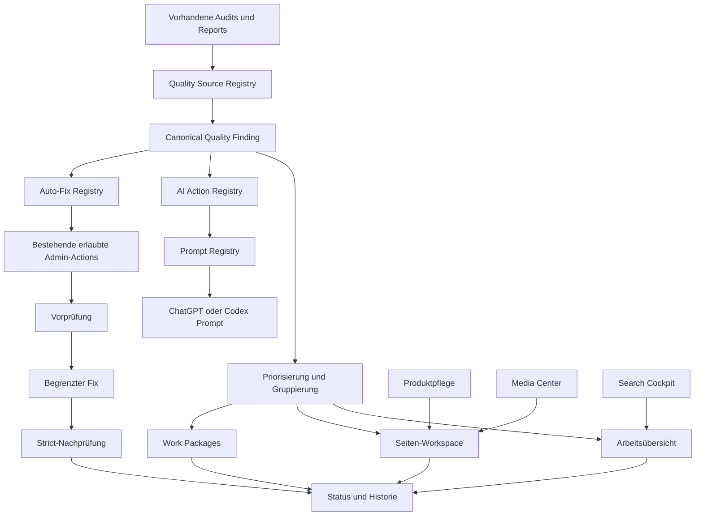

# SEO Copilot Architektur-Cleanup 1.0.0

Stand: 31. Juli 2026  
Basis: `fe54eeaaf6382a01a24ee906678847e8a9102b60`

## 1. Änderungsübersicht

Der Adminbereich wird von neun gleichrangigen Werkzeugen auf vier Arbeitskontexte reduziert:

1. **Arbeit**: tägliche Arbeitsübersicht, Findings, Aufgaben und Prompt Registry
2. **Search**: Search Cockpit und Topical Authority
3. **Produkte**: Seiten-Workspaces, Produktpflege und Media Center
4. **System**: Historie und nachvollziehbare Statusentwicklung

Die vorhandenen Routen bleiben erhalten. Sie sind keine gleichrangige Hauptnavigation mehr, sondern kontextbezogene Einstiege. Bestehende Produktpflege, Media-Funktionen, Work Packages, Auditquellen und die lokale Admin-API werden weiterverwendet.

Der tägliche Ablauf ist jetzt:

```text
Auditquellen
    ↓
einheitliches Finding
    ↓
begrenztes Arbeitspaket oder direkte Finding-Aktion
    ↓
Auto-Fix, AI Action oder manuelle Bearbeitung
    ↓
Strict-Audit und Build
    ↓
Status und Historie
```

## 2. Architekturdiagramm



### Schichten

| Schicht | Kanonische Quelle |
|---|---|
| Navigation und Admin-Grundlayout | `src/layouts/SeoAdminLayout.astro`, `src/styles/seo-admin.css` |
| Findings | `src/lib/seo-copilot/quality-operations.mjs` |
| Auditadapter | `scripts/quality-ops/sources.mjs` |
| Prompts | `src/lib/seo-copilot/prompt-registry.ts` |
| AI Actions | `src/lib/seo-copilot/ai-action-registry.mjs` |
| Auto-Fixes | `src/lib/seo-copilot/auto-fix-registry.mjs` |
| Status und Historie | vorhandener `seo-copilot/store.mjs` |
| Ausführung | vorhandener allowlist-basierter `search/action-service.mjs` |
| Findings-UI | `src/components/admin/SeoFindingList.astro` |
| Produktkontext | `src/pages/admin/seo/products/[slug].astro` |

## 3. Entfernte Doppelungen

1. `SeoWorkPackages` wird nicht mehr zugleich im Layout und in `advisor.astro` gerendert.
2. Das Search Cockpit ist keine zweite HTML-Anwendung mit eigenem Theme und eigener Grundnavigation mehr.
3. Karten-, Tabellen-, Filter-, Badge-, Metric-, Button- und Status-Grundstile liegen im gemeinsamen Admin-CSS.
4. Promptdefinitionen liegen nicht mehr verteilt in `templates.ts` und funktionsbezogenen Seiten.
5. Dasselbe physische Audit-JSON wird nicht mehr unter mehreren künstlichen Quellen erneut eingelesen.
6. `recommendedAction` und `recommendedSolution` werden auf ein kanonisches Lösungsfeld normalisiert. Der alte Name bleibt nur als Kompatibilitätsalias.
7. `autoFixAvailable` und `autoFixPossible` werden auf ein kanonisches Boolean normalisiert.
8. Auto-Fix-Abläufe werden nicht mehr zugleich in Finding-Validierung und Action-Service als fachliche Sonderlogik beschrieben.
9. Produktseite, Media, SEO, Journey, EEAT und Technik zeigen Findings nicht in getrennten Karten erneut. Bereichskarten zeigen nur Zähler; die vollständige Aufgabenansicht existiert einmal.
10. Prompt-, Tasks- und Advisor-Routen verwenden weiter denselben Work-Package-Baustein statt eigener Paketdarstellungen.

## 4. Neue gemeinsame Komponenten und Registries

| Baustein | Zweck |
|---|---|
| `seo-admin.css` | Tokens und gemeinsame Operations-Center-Komponenten |
| `SeoFindingList.astro` | Status, Auto-Fix, AI Actions und Finding-Details |
| `PromptRegistry.astro` | Sichtbare Registry-Übersicht |
| `prompt-registry.ts` | Einzige Pflegequelle aller Promptverträge |
| `ai-action-registry.mjs` | Finding-zu-Aktion-Auflösung |
| `finding-ai.ts` | Kontextgebundene Prompt-Erzeugung |
| `auto-fix-registry.mjs` | Deklarative, freigegebene Auto-Fix-Pläne |
| `products/index.astro` | Priorisierte Produktseiten-Workspaces |
| `products/[slug].astro` | Gemeinsamer Seitenarbeitsbereich |

## 5. Zusammengeführte Reports

Die bisherige Registry führte mehrere fachliche Namen auf denselben physischen Report zurück. Das erzeugte doppelte Extraktion und künstlich aufgeblähte Quellenzahlen.

Konsolidiert wurden insbesondere:

| Physischer Report | Frühere Mehrfachrollen | Neue Rolle |
|---|---|---|
| `seo-release/build-output-latest.json` | Technical SEO, Structured Data, JSON-LD, Build, Redirects, Sitemap, Canonicals, Robots | `technical-seo` |
| `content-quality/cannibalization-report.json` | Content Quality, Cannibalization, Trust | `cannibalization` |
| `content-quality/content-inventory.json` | EEAT, Author Coverage, Canonicals | `content-inventory` |
| `product-data-audit.json` | Product Governance, Product Coverage, Manufacturer Coverage | `product-data` |
| `comparison-platform/comparison-audit.json` | Comparison Governance, Structured Data | `comparison-audit` |
| `media-center-audit.json` | Images, Image Coverage | `media-center` |

Die fachliche Zuordnung geschieht anschließend im einheitlichen Finding-Klassifikator. Ein Report muss deshalb nicht mehrfach eingelesen werden.

Zusätzlich wird `reports/decision-journeys/latest.json` direkt in Quality Operations aufgenommen.

## 6. Neue AI Actions

Die Actions verwenden ausschließlich Prompt-IDs aus der zentralen Registry:

- Hero erstellen
- Thumbnail erstellen
- Gallery erstellen
- FAQ erweitern
- Information Gain erhöhen
- Expertenbox erzeugen
- Entscheidungsbaum erzeugen
- Journey verbessern
- interne Links verbessern
- UX analysieren
- CSS analysieren
- Performance analysieren
- Dark Mode analysieren
- Accessibility analysieren
- Vergleich verbessern
- Finding an Codex übergeben

Ein Finding enthält die Felder `aiActionIds`, `aiActionAvailable` und `codexSuitable`. Die Oberfläche erzeugt daraus kontextgebundene Prompts mit Datei, Route, Komponente, Auditquelle, Lösung und passenden Validierungen.

## 7. Migrationshinweise

### Finding-Modell

Das kanonische Modell enthält jetzt:

- `type`
- `priority`
- `category`
- `area`
- `file`
- `route`
- `component`
- `description`
- `recommendedSolution`
- `autoFixPossible`
- `aiActionAvailable`
- `aiActionIds`
- `codexSuitable`
- `status`

Kompatibilitätsfelder bleiben erhalten:

- `files`
- `urls`
- `recommendedAction`
- `autoFixAvailable`

Der nächste `quality-ops:sync` normalisiert bestehende Workspace-Findings automatisch. Es ist kein separater Datenmigrationslauf erforderlich.

### Navigation

Alte URLs bleiben gültig:

- `/admin/seo/advisor/`
- `/admin/seo/tasks/`
- `/admin/seo/prompts/`
- `/admin/seo/prices/`
- `/admin/seo/media/`
- `/admin/seo/topical-authority/`

Sie sind jetzt Unterbereiche der vier Hauptkontexte.

### Promptimporte

`templates.ts` bleibt als Kompatibilitäts-Export erhalten. Neue oder geänderte Promptdefinitionen dürfen nur in `prompt-registry.ts` angelegt werden.

### Auto-Fixes

Ein Auto-Fix benötigt:

1. eine Definition in `auto-fix-registry.mjs`
2. ausschließlich feste Runner im bestehenden `action-service.mjs`
3. explizite Bestätigung
4. Vorprüfung
5. fachlichen Strict-Audit
6. erneuten Quality-Operations-Sync
7. Historieneintrag

Eine generische Shell- oder Command-API wird nicht eingeführt.

### Produkt-Workspaces

Jede vorhandene Produktseite erhält eine statisch gebaute Admin-Route unter:

```text
/admin/seo/products/<slug>/
```

Die Route verwendet nur die vorhandene Product Collection und den bestehenden Copilot-Workspace. Es entsteht kein zweiter Store. Der Medienbestand wird beim Build aus den vorhandenen Produktordnern gelesen.

## 8. Validierungsprotokoll

Der Installer führt die Prüfungen in dieser Reihenfolge aus und schreibt das echte Ergebnis nach:

```text
apps/pfotentechnik/reports/seo-copilot/architecture-cleanup-validation-latest.json
```

Prüfpfad:

```bash
npm --workspace apps/pfotentechnik run test:seo-copilot
npm --workspace apps/pfotentechnik run quality-ops:sync
npm --workspace apps/pfotentechnik run design-system:check
npm --workspace apps/pfotentechnik run audit:technical-seo
npm --workspace apps/pfotentechnik run audit:internal-links:strict
npm --workspace apps/pfotentechnik run audit:decision-journeys:strict
npm --workspace apps/pfotentechnik run audit:content-quality:strict
npm --workspace apps/pfotentechnik run comparison:audit:strict
npm --workspace apps/pfotentechnik run seo:release:check:no-build
npm run build:pfotentechnik
```

Der Installer sammelt alle Resultate. Bei einem Fehler stellt er standardmäßig sämtliche geänderten Dateien aus dem Backup wieder her. Mit `--keep-on-failure` kann ein fehlgeschlagener Stand bewusst zur Diagnose behalten werden.

## Betriebsentscheidung

Nicht jede vorhandene Adminseite wurde zu einer neuen Komponente umgeschrieben. Die umfangreiche Produktpflege und das Media Center behalten ihre bewährte Domänenlogik. Sie werden durch Navigation, Produkt-Workspace und gemeinsame Tokens integriert. Ein pauschales Umschreiben hätte mehr Risiko als Wartungsgewinn erzeugt und wäre genau die Parallelentwicklung, die dieses Cleanup verhindern soll.
