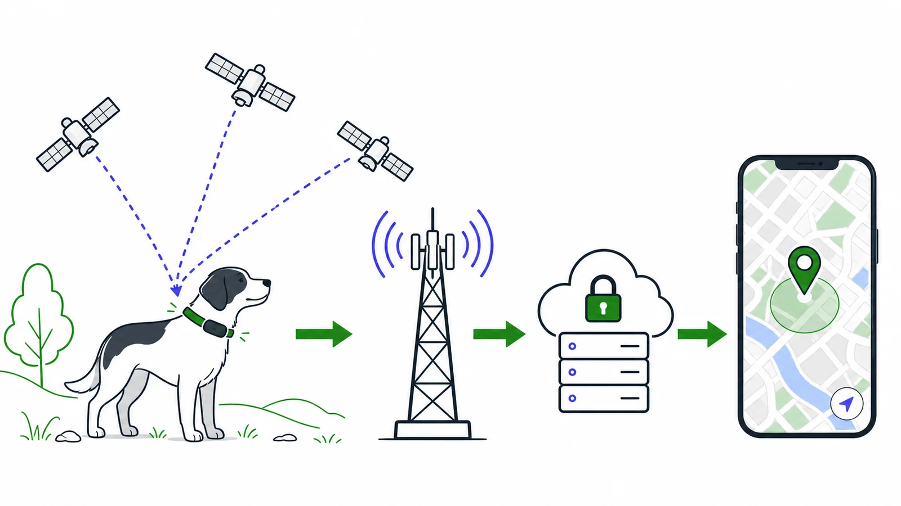
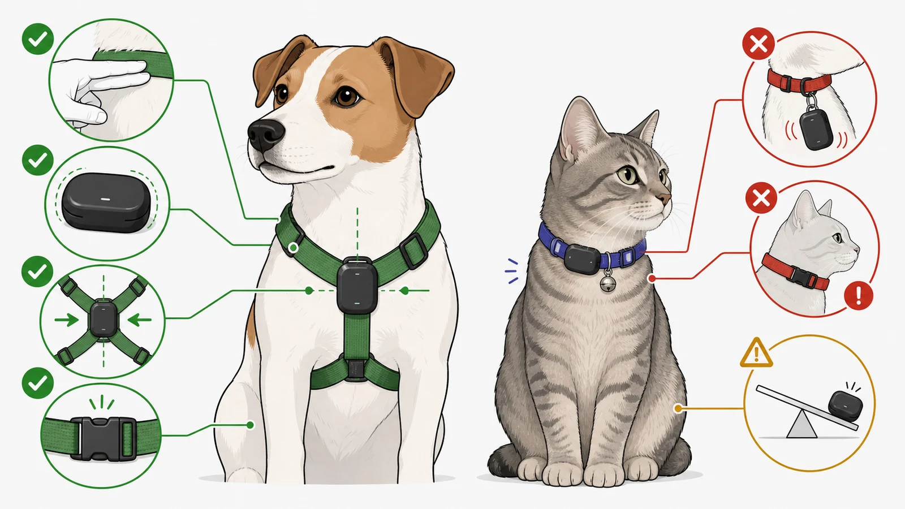
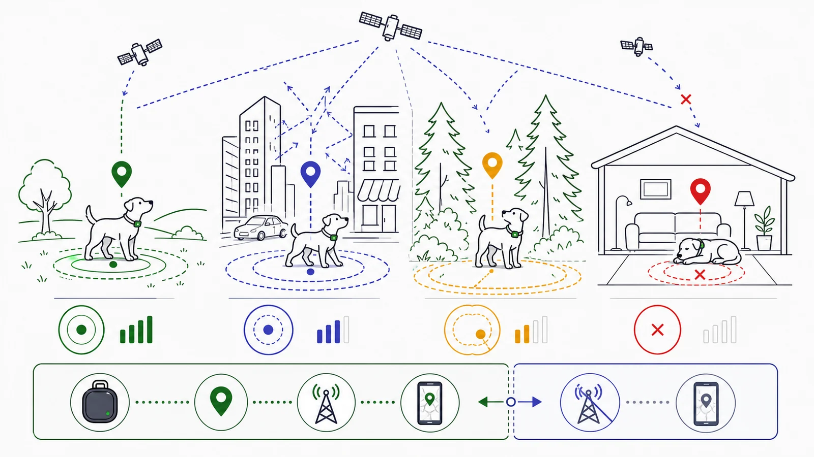
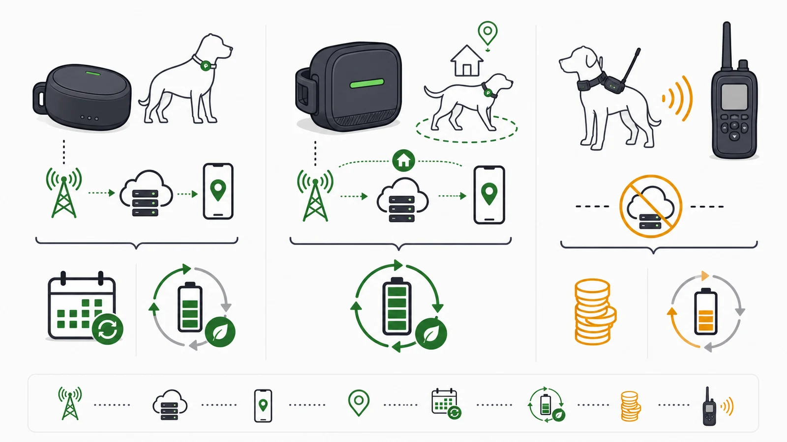

Ein GPS-Tracker ist kein einzelner Sensor, sondern eine **Kette aus Position, Übertragung und Anzeige**. Diese Unterscheidung löst die häufigsten Missverständnisse: Satelliten senden nicht direkt den Standort deiner Katze an dein Smartphone, und „unbegrenzte Reichweite“ beseitigt kein Mobilfunkloch.

## Welche Systeme gibt es?

Die drei Klassen unterscheiden sich vor allem durch ihren Übertragungsweg und damit durch ihre Ausfallgrenze.

| System | Position | Übertragung | Hauptgrenze |
|---|---|---|---|
| Mobilfunk-GPS | Satellitensysteme | SIM und Mobilfunk zur Cloud-App | Netz, Abo, Akku |
| VHF-Hundeortung | Satellitensysteme | direkter Funk zum Handgerät | feste Reichweite, Empfänger |
| Bluetooth-Tag | Nähe/Fremdgeräte-Netzwerk | Bluetooth | erreichbare Geräte, keine eigenständige Echtzeitkette |

Der Detailguide [GPS oder Bluetooth?](/gps-oder-bluetooth/) erklärt, warum ein AirTag nicht in die Produkt-Rankings aufgenommen wurde.

## Für wen lohnt sich ein Tracker?

Sinnvoll ist er bei realem Entlaufrisiko, Freigang, Jagdtrieb, wechselnder Betreuung oder unbekanntem Gelände. Weniger sinnvoll ist er, wenn das Tier das Gerät nicht sicher tragen kann oder die Lade- und Kontrollroutine im Alltag nicht zuverlässig funktioniert.

Ein Tracker ergänzt Identifikation und Training. Er ersetzt weder Mikrochip und Registrierung noch eine physische Sicherung oder Rückrufarbeit.

## Hund und Katze brauchen andere Prioritäten

Beim Hund helfen klare Herstellergrenzen nach Körpergewicht und Halsbandbreite. Beim Freigänger kommt die Sicherheitsöffnung hinzu: Ein Halsband, das nie aufgeht, kann beim Hängenbleiben gefährlicher sein als der Verlust des Trackers.

Die passende Geräteauswahl beginnt im [Hundevergleich](/vergleiche/beste-gps-tracker-fuer-hunde/) oder [Katzenvergleich](/vergleiche/beste-gps-tracker-fuer-katzen/). Für kleine Katzen trennt der [Kleinformatvergleich](/vergleiche/kleine-gps-tracker-fuer-katzen/) Geräte- und Gesamtgewicht.

## Reichweite und Genauigkeit richtig lesen

„Reichweite“ besteht aus zwei Fragen: Kann der Tracker seine Position bestimmen, und kann er sie übertragen? Freier Himmel hilft dem Satellitenempfang; unterstütztes Mobilfunknetz hilft der App-Verbindung. VHF braucht dagegen Funkkontakt zum Handgerät.

Vertiefung: [Wie genau sind GPS-Tracker?](/wie-genau-sind-gps-tracker/) und [Reichweite von GPS-Trackern](/reichweite-von-gps-trackern/).

## Akku und laufende Kosten

Der höchste Laufzeitwert ist selten der passende. Ein 70-g-Gerät mit sechs Wochen Herstellerlaufzeit gehört nicht an eine kleine Katze. Energie sparen Tracker häufig in bekannten WLAN-Zonen; Live-Tracking erhöht Mess- und Sendeaktivität.

Rechne **Gerät + Abo + Ersatzhalter + Ladekabel + mögliche Ersatzgeräte** über die geplante Nutzungszeit. Der [Abo-Guide](/warum-brauchen-gps-tracker-ein-abo/) und [Vergleich ohne Abo](/vergleiche/gps-tracker-ohne-abo/) zeigen, warum laufende Gebühren nicht die einzige Kostenform sind.

## Kaufberatung in sieben Schritten

Die Reihenfolge verhindert, dass App-Funktionen vor Tier-Fit und Systemgrenzen bewertet werden.

1. Entlaufrisiko und Suchszenario konkret benennen.
2. Tiergewicht, Halsumfang und Bandbreite messen.
3. Mobilfunkabdeckung oder VHF-Einsatzgebiet prüfen.
4. Gerätegewicht, Bauform und Sicherheitsöffnung bewerten.
5. Akkulaufzeit im tatsächlich genutzten Modus lesen.
6. Drei-Jahres-Kosten und Datenschutz prüfen.
7. Befestigung und Alarmablauf kontrolliert testen.

## Hersteller und Modelle

Vier Hersteller decken bewusst unterschiedliche Größen-, Kosten- und Übertragungskonzepte ab.

| Hersteller | Systemschwerpunkt | Modelle im Cluster |
|---|---|---|
| [Tractive](/hersteller/tractive/) | katzen- und hundespezifische Mobilfunktracker | CAT 6 Mini, DOG 6, DOG 6 XL |
| [Weenect](/hersteller/weenect/) | leichtes XS und robustes XT mit Rückrufsignalen | XS, XT |
| [PAJ GPS](/hersteller/paj-gps/) | 4G plus lange enthaltene Servicephase | PET Finder 4G Mini |
| [Garmin](/hersteller/garmin/) | VHF für Jagd- und Arbeitshunde | Alpha T 20, TT 25 |

## Wenn das Tier entläuft

Öffne die aktuelle Position, prüfe Zeitstempel und Akkustand, teile den Zugriff gezielt und bewege dich ruhig. Eine Linie auf der Karte kann hinter der Realität liegen. Für Hunde und Katzen gelten unterschiedliche Suchstrategien: [Hund entlaufen – GPS sinnvoll?](/hund-entlaufen-gps-sinnvoll/) und [Katze entlaufen – GPS sinnvoll?](/katze-entlaufen-gps-sinnvoll/).

## Datenschutz

Standortverläufe zeigen mehr als Tierbewegung: Sie können Wohnort, Tagesabläufe und Abwesenheiten offenlegen. Die Checkliste in [Datenschutz bei GPS-Trackern](/datenschutz-bei-gps-trackern/) deckt Kontoschutz, Familienfreigabe, App-Rechte, Verlauf und Löschung ab.

## Quellen

Technische Grundlagen stammen aus offiziellen Systemquellen; Produktwerte sind auf den einzelnen Modellseiten belegt.

- [GPS.gov – GPS Accuracy](https://www.gps.gov/gps-accuracy)
- [Bluetooth SIG – Understanding Bluetooth Range](https://www.bluetooth.com/learn-about-bluetooth/key-attributes/range/)
- Offizielle Produkt- und Supportquellen sind auf jeder [Produktseite](/vergleiche/beste-gps-tracker-fuer-hunde/) verlinkt.
