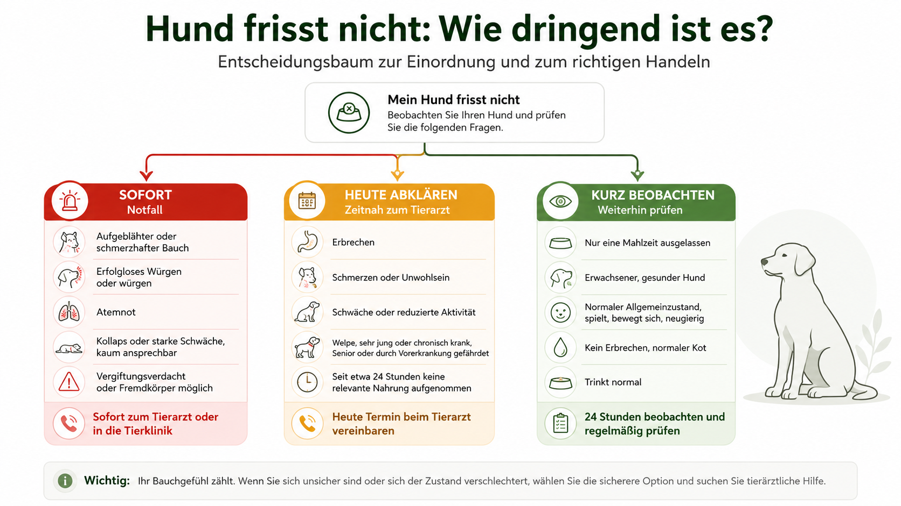
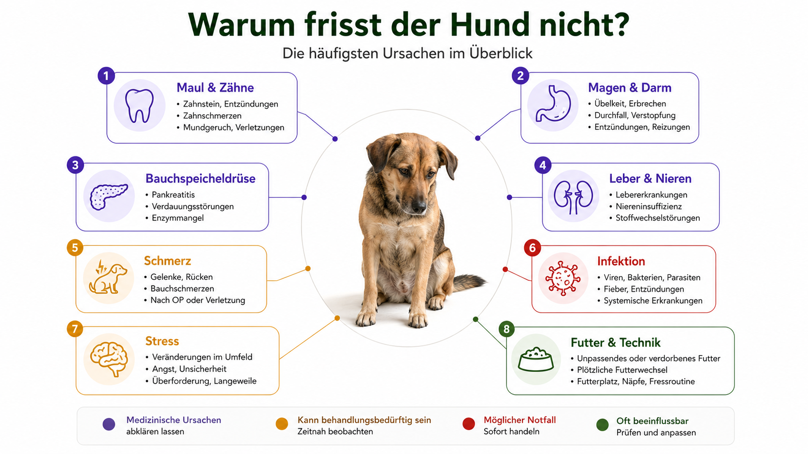
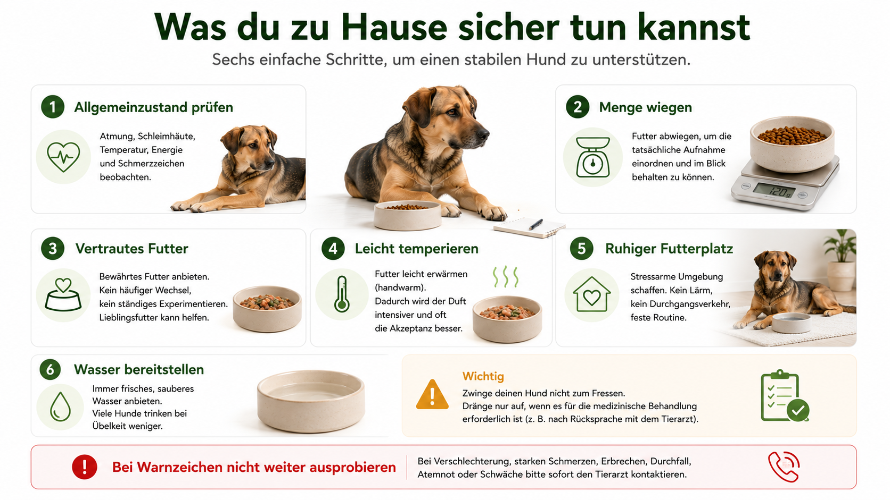
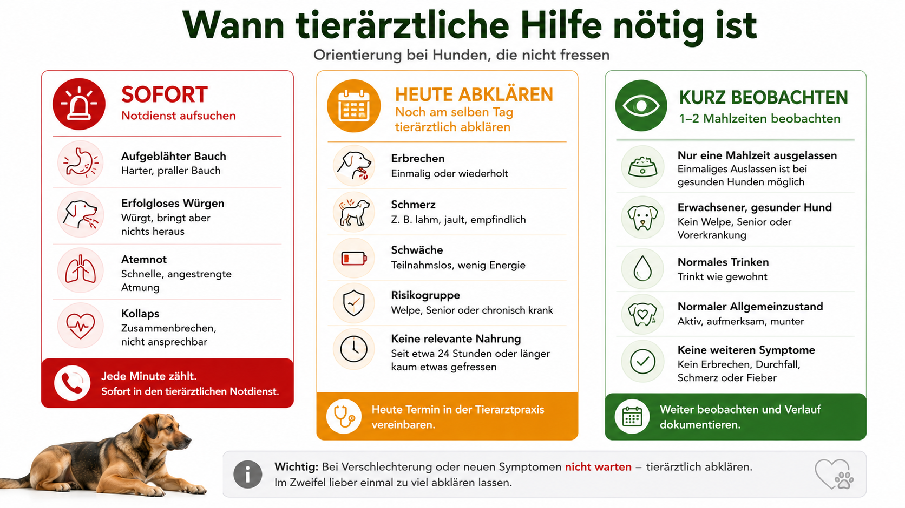

## Die kurze Antwort

Wenn ein Hund nicht frisst, ist die entscheidende Frage nicht zuerst, welches Futter besonders verlockend riecht. Wichtiger ist, **warum die Aufnahme sinkt und wie dringend die Situation ist**.

Appetitlosigkeit ist keine Diagnose. Sie kann nach einem ungewohnten Tag, Stress oder einer abrupten Futterumstellung auftreten. Sie kann aber ebenso durch Schmerzen, Übelkeit, Zahnprobleme, Infektionen, Erkrankungen von Magen, Darm, Leber, Nieren oder Bauchspeicheldrüse, einen Fremdkörper, eine Vergiftung oder eine Magendrehung ausgelöst werden.

Ein gesunder erwachsener Hund, der eine einzelne Mahlzeit auslässt, normal trinkt, aufmerksam bleibt und keine weiteren Beschwerden zeigt, kann für kurze Zeit kontrolliert beobachtet werden. Bleibt eine relevante Futteraufnahme länger als etwa 24 Stunden aus, sollte die Tierarztpraxis kontaktiert werden. Diese Zeitspanne ist kein allgemeiner Sicherheitswert. Bei Welpen, sehr kleinen Hunden, Senioren, trächtigen Hündinnen, Diabetes, bekannten Organerkrankungen oder zusätzlichen Symptomen ist deutlich früher Hilfe nötig.

Sofort in den tierärztlichen Notdienst gehören Hunde mit:

- aufgeblähtem oder rasch größer werdendem Bauch
- wiederholtem erfolglosem Würgen
- starker Unruhe, Speicheln und Kreislaufschwäche
- Atemnot
- Kollaps oder kaum vorhandener Reaktion
- sehr blassen, grauen oder blauen Schleimhäuten
- wiederholtem Erbrechen, besonders wenn Wasser nicht im Magen bleibt
- Blut im Erbrochenen oder größeren Blutmengen im Kot
- starken Bauchschmerzen
- Vergiftungsverdacht
- möglichem verschlucktem Fremdkörper
- Krampfanfällen
- rascher Verschlechterung

Zwinge den Hund nicht zum Fressen. Gib keine Humanmedikamente und keine übrig gebliebenen Tiermedikamente. Biete das vertraute Futter in einer kleinen Portion an, dokumentiere die tatsächliche Aufnahme und richte das weitere Vorgehen nach Allgemeinzustand und Begleitsymptomen aus.

AAHA nennt plötzliche Veränderungen des Appetits als relevantes Gesundheitszeichen und empfiehlt eine tierärztliche Abklärung, wenn ein Tier aufhört zu fressen oder ungewöhnlich wählerisch wird. VCA unterscheidet zwischen echter Appetitlosigkeit und Pseudoanorexie: Manche Hunde möchten fressen, können Futter aber wegen Problemen beim Aufnehmen, Kauen oder Schlucken nicht normal aufnehmen.

## Direkt zum passenden Problem

- [Der Hund frisst seit heute nichts](#wie-dringend-ist-die-situation)
- [Er geht zum Napf, frisst aber nicht](#er-geht-zum-napf-frisst-aber-nicht)
- [Er frisst Leckerli, aber kein Futter](#er-frisst-leckerli-aber-kein-futter)
- [Er frisst nicht und erbricht](#erbrechen-durchfall-und-bauchbeschwerden)
- [Der Bauch ist aufgebläht](#magendrehung-und-akuter-aufgeblähter-bauch)
- [Was kann ich zu Hause tun?](#was-du-zu-hause-sicher-tun-kannst)
- [Wann muss er zum Tierarzt?](#wann-tierärztliche-hilfe-nötig-ist)
- [Was ist bei Welpen oder Senioren anders?](#welpen-senioren-und-risikogruppen)

## Wie dringend ist die Situation?

Die Dauer allein reicht nicht zur Einschätzung. Ein Hund, der seit drei Stunden nicht frisst, aber erfolglos würgt und einen zunehmenden Bauchumfang hat, ist ein Notfall. Ein erwachsener Hund, der nach einem sehr aufregenden Tag eine Mahlzeit auslässt, normal trinkt und am nächsten Morgen wieder frisst, ist anders zu bewerten.

### Sofort in den tierärztlichen Notdienst

- aufgeblähter, gespannter oder rasch größer werdender Bauch
- wiederholtes erfolgloses Würgen
- starke Unruhe, Hecheln, Speicheln oder Kreislaufschwäche
- Kollaps oder Bewusstseinsveränderung
- Atemnot
- sehr blasse, graue oder blaue Schleimhäute
- wiederholtes Erbrechen mit Schwäche
- Wasser kann nicht behalten werden
- starker Bauchschmerz
- Gift- oder Fremdkörperverdacht
- schwarzer, teerartiger Kot oder größere sichtbare Blutmengen
- Krampfanfälle
- plötzlich gelähmte, stark schwache oder desorientierte Bewegungen
- rasche Verschlechterung innerhalb weniger Stunden

Die Kombination aus aufgeblähtem Bauch, Unruhe und erfolglosem Würgen ist besonders verdächtig auf eine Magendrehung. Dabei zählt Zeit. Nicht füttern, nicht auf eine spontane Besserung warten und nicht versuchen, den Bauch zu massieren.

### Noch heute abklären

- seit etwa 24 Stunden keine relevante Nahrungsaufnahme
- deutlich geringere Aufnahme als üblich mit Mattigkeit
- wiederholtes Erbrechen oder deutlicher Durchfall
- Schmerzen beim Kauen, Schlucken oder Beugen
- starkes Speicheln oder übler Maulgeruch
- Fieberverdacht
- ungewöhnlicher Rückzug
- auffällige Wasseraufnahme
- kaum oder kein Urin
- Gewichtsverlust
- neue Medikamenteneinnahme mit zeitlichem Zusammenhang
- bekannte chronische Erkrankung
- Senior oder sehr kleiner Hund mit deutlicher Futterverweigerung
- Welpe, der mehrere Mahlzeiten auslässt

### Nur kurz beobachten

Eine kurze kontrollierte Beobachtung kommt nur infrage, wenn alle Punkte zutreffen:

- erwachsener, bisher gesunder Hund
- nur eine Mahlzeit ausgelassen
- wach, ansprechbar und bewegungsfreudig
- normale Atmung
- kein Erbrechen
- kein Durchfall
- kein sichtbarer Schmerz
- Bauch weich und nicht vergrößert
- normale Wasseraufnahme
- normaler Urin- und Kotabsatz
- kein Gift- oder Fremdkörperverdacht
- keine relevante Vorerkrankung
- kurze Zeit später wieder erkennbare Futteraufnahme

„Beobachten“ bedeutet, den Verlauf aktiv zu kontrollieren. Es bedeutet nicht, den Napf zwei oder drei Tage unverändert stehen zu lassen.

## Frisst der Hund wirklich nichts?

Die Aussage „Er frisst nicht“ kann sehr Unterschiedliches bedeuten:

- Er hat eine Mahlzeit ausgelassen.
- Er frisst nur die Hälfte.
- Er nimmt ausschließlich Leckerli.
- Er kaut und spuckt wieder aus.
- Er frisst draußen, aber nicht aus dem Napf.
- Ein anderer Hund leert den Napf.
- Er nimmt nur Soße oder weiche Bestandteile auf.
- Er frisst nachts unbeobachtet.
- Der Futterautomat gibt gar keine vollständige Portion aus.

Diese Unterschiede sind medizinisch relevant. Ein Hund mit 60 Prozent seiner üblichen Tagesmenge ist anders zu bewerten als ein Hund, der seit 24 Stunden nichts geschluckt hat. Eine kleine Menge Leckerli beweist nicht, dass die Energieaufnahme ausreicht.

### So misst du die tatsächliche Aufnahme

1. Normale Tagesration in Gramm bestimmen.
2. Eine exakt abgewogene Portion anbieten.
3. Reste nach einer festgelegten Zeit wiegen.
4. Leckerli, Kauartikel und Tischreste mitzählen.
5. Verschüttetes oder verschlepptes Futter berücksichtigen.
6. Bei mehreren Tieren getrennt füttern.
7. Zeitpunkt und Menge notieren.

Eine Kamera kann zeigen, ob der Hund den Napf aufsucht. Sie ersetzt jedoch keine Mengenmessung. Bei automatischer Fütterung ist außerdem zu prüfen, ob die Portion tatsächlich ausgegeben wurde und nicht im Auslass hängen blieb.

## Appetitlosigkeit oder mechanisches Fressproblem?

VCA unterscheidet echte Anorexie von Pseudoanorexie. Bei echter Appetitlosigkeit fehlt der Antrieb zu fressen. Bei Pseudoanorexie ist Interesse vorhanden, der Hund kann das Futter aber nicht normal aufnehmen, kauen oder schlucken.

### Eher fehlender Appetit

- Hund ignoriert den Napf vollständig
- reagiert auch auf Lieblingsfutter kaum
- wirkt matt oder übel
- zieht sich zurück
- frisst weder weiches noch festes Futter
- zeigt zusätzlich Erbrechen, Fieber oder Schmerzen

### Eher Problem beim Aufnehmen oder Kauen

- geht erwartungsvoll zum Napf
- versucht zu fressen
- lässt Futter wieder fallen
- kaut nur auf einer Seite
- winselt oder zuckt beim Kauen
- reibt das Maul mit der Pfote
- speichelt
- bevorzugt plötzlich weiche Nahrung
- nimmt kleine Stücke aus der Hand, aber keine größeren Brocken

### Eher Schluckproblem

- wiederholtes Schlucken ohne normale Aufnahme
- Husten oder Würgen beim Fressen
- gestreckter Hals
- Futter oder Flüssigkeit kommt aus der Nase
- auffällige Atemgeräusche
- passives Hochkommen kurz nach dem Schlucken
- deutliche Panik oder Abbruch beim Fressversuch

Bei einem möglichen Schluckproblem darf nicht mit einer Spritze gefüttert werden. Futter oder Flüssigkeit kann in die Atemwege gelangen.

## Er geht zum Napf, frisst aber nicht

Dieses Verhalten ist besonders aufschlussreich. Es zeigt häufig, dass Hunger oder Interesse vorhanden ist, aber der Fressvorgang unangenehm oder unmöglich wird.

Mögliche Ursachen:

- Zahnschmerzen
- entzündetes Zahnfleisch
- abgebrochener Zahn
- Fremdkörper im Maul
- Verletzung der Zunge
- Übelkeit
- Schmerzen beim Senken des Kopfes
- Hals- oder Nackenschmerz
- Schluckstörung
- verstopfte Nase
- Futteraversion nach Übelkeit
- unangenehme Napfhöhe oder rutschender Napf

Achte auf das genaue Muster:

- Nimmt er Futter auf und lässt es fallen?
- Kaut er nur auf einer Seite?
- Leckt er Soße ab, lässt Stücke aber liegen?
- Zieht er nach dem ersten Bissen zurück?
- Speichelt er stärker als sonst?
- Riecht das Maul auffällig?
- Reagiert er empfindlich auf Berührung an Kiefer oder Hals?

Öffne das Maul nicht gewaltsam. Ein schmerzender Hund kann auch dann schnappen, wenn er normalerweise sehr freundlich ist. Tief sitzende Fremdkörper, Verletzungen hinter der Zunge und Zahnerkrankungen sind zu Hause oft nicht sicher erkennbar.

## Er frisst Leckerli, aber kein Futter

Das wird häufig als Beweis für Mäkeligkeit gewertet. Diese Schlussfolgerung ist zu einfach.

Ein Hund kann Leckerli nehmen, obwohl er krank ist, weil:

- kleine Mengen leichter toleriert werden
- stark riechende Stücke attraktiver sind
- weiche Snacks weniger Schmerzen verursachen
- Erwartung und Gewohnheit kurzfristig den Appetit überlagern
- das normale Futter mit Übelkeit verknüpft wurde
- Leckerli direkt aus der Hand angeboten werden
- die Tagesration bereits durch Snacks ersetzt wurde

Entscheidend ist nicht, ob überhaupt etwas aufgenommen wurde, sondern wie viel im Verhältnis zur normalen Tagesration. Drei kleine Leckerli können weniger als fünf Prozent des täglichen Energiebedarfs liefern.

### Wann es eher nach gelerntem Auswahlverhalten aussieht

- Allgemeinzustand ist vollständig normal.
- Hund frisst energiereiche Extras sofort.
- Das Verhalten besteht länger und folgt einem stabilen Muster.
- Nach jeder Ablehnung erscheint eine attraktivere Alternative.
- Gewicht und Aktivität bleiben stabil.
- Es bestehen keine Begleitsymptome.

Auch dann sollte eine plötzlich neu auftretende Futterselektion zunächst körperlich eingeordnet werden, besonders bei älteren Hunden oder wenn harte Bestandteile gemieden werden.

## Häufige Ursachen im Überblick

| Bereich | Beispiele | Mögliche Begleitzeichen |
|---|---|---|
| Maul und Zähne | Zahnfraktur, Parodontitis, Fremdkörper, Wunde | Speicheln, Mundgeruch, Futter fällt heraus |
| Magen und Darm | Gastritis, Fremdkörper, Verstopfung, Darmverschluss | Erbrechen, Bauchschmerz, veränderter Kot |
| Bauchspeicheldrüse | Pankreatitis | Gebetsstellung, Erbrechen, Bauchschmerz |
| Leber und Galle | Hepatitis, Gallenwegsprobleme | Gelbfärbung, Erbrechen, Müdigkeit |
| Nieren und Stoffwechsel | Nierenerkrankung, Addison, Diabetesentgleisung | verändertes Trinken, Schwäche, Erbrechen |
| Infektion und Entzündung | Fieber, Leptospirose, Atemwegsinfekt | Mattigkeit, Schmerz, erhöhte Temperatur |
| Schmerz | Arthrose, Verletzung, Rücken- oder Bauchschmerz | Schonhaltung, Unruhe, weniger Bewegung |
| Medikamente und Giftstoffe | Nebenwirkung, Vergiftung | Speicheln, Zittern, Erbrechen, Durchfall |
| Stress und Umgebung | Umzug, Tierpension, Konflikte, Lärm | Rückzug, Unruhe, selektives Fressen |
| Futter und Technik | verdorben, neue Rezeptur, Automat blockiert | Ablehnung einer Charge, leerer Napf |

Diese Tabelle dient der Orientierung. Das Verhalten allein erlaubt selten eine sichere Diagnose.

## Maul- und Zahnerkrankungen

Zahnerkrankungen werden leicht übersehen, weil viele Hunde trotz Schmerzen zum Napf gehen. Manche schlucken Trockenfutter nahezu unzerkaut. Andere wechseln plötzlich zu weichem Futter oder nehmen nur kleine Stücke.

Hinweise sind:

- Futter fällt aus dem Maul
- einseitiges Kauen
- starker Mundgeruch
- Blut am Spielzeug oder im Speichel
- Pfote am Maul
- Kopfscheu
- vermehrtes Speicheln
- Schwellung im Gesicht
- plötzliches Meiden harter Kauartikel
- Jaulen beim Gähnen oder Kauen

Ein Blick auf die Schneidezähne reicht nicht. Schmerzhafte Veränderungen sitzen häufig an Backenzähnen, unter Zahnstein oder unterhalb des Zahnfleischrandes. Eine vollständige Beurteilung kann eine Untersuchung unter Sedierung und Dentalröntgen erfordern.

## Übelkeit ohne Erbrechen

Ein Hund kann deutlich übel sein, ohne zu erbrechen. Typische Hinweise:

- Lippenlecken
- häufiges Schlucken
- Speicheln
- Grasfressen
- Unruhe
- gekrümmte Körperhaltung
- Geruch am Futter, dann Abwenden
- Schmatzen
- Aufstoßen
- Wechsel zwischen Interesse und Rückzug

Ständig neue Futtersorten anzubieten löst die Ursache nicht. Es kann dazu führen, dass mehrere Futtermittel mit Übelkeit verknüpft werden. Ein Appetitanreger allein ist ebenfalls keine sichere Lösung, wenn Schmerzen, ein Fremdkörper oder eine andere behandlungsbedürftige Ursache bestehen.

## Erbrechen, Durchfall und Bauchbeschwerden

Appetitverlust zusammen mit Magen-Darm-Symptomen ist häufig, aber nicht automatisch harmlos. Entscheidend sind Häufigkeit, Menge, Allgemeinzustand, Flüssigkeitsaufnahme und Schmerz.

### Dringend sind

- wiederholtes Erbrechen
- Wasser bleibt nicht im Magen
- Blut im Erbrochenen
- schwarzer, teerartiger Kot
- starke Bauchschmerzen
- aufgeblähter oder harter Bauch
- erfolgloses Würgen
- rasche Schwäche
- möglicher Fremdkörper
- sehr wässriger oder blutiger Durchfall
- gleichzeitige Futter- und Wasserverweigerung

Einmaliges Erbrechen bei einem sonst völlig munteren erwachsenen Hund ist anders zu bewerten als fünf Episoden innerhalb weniger Stunden. Kleine Hunde, Welpen und Senioren trocknen schneller aus.

### Erbrechen oder Regurgitieren?

Erbrechen ist ein aktiver Vorgang. Häufig gehen Übelkeit, Speicheln, Würgen und sichtbare Bauchpresse voraus. Regurgitieren geschieht meist passiver, oft kurz nach der Aufnahme. Das Futter ist häufig unverdaut und kann röhrenförmig aussehen.

Ein Video hilft der Tierarztpraxis bei der Unterscheidung. Wiederholtes Regurgitieren ist relevant, weil eine Erkrankung der Speiseröhre oder eine Schluckstörung dahinterstehen kann und das Risiko einer Aspirationspneumonie besteht.

## Magendrehung und akuter aufgeblähter Bauch

Die Magendrehung, medizinisch Gastric Dilatation-Volvulus, ist einer der wichtigsten Notfälle bei einem Hund, der plötzlich nicht frisst.

Typische Zeichen:

- plötzlich aufgeblähter oder gespannter Bauch
- erfolgloses Würgen
- starke Unruhe
- rastloses Aufstehen und Hinlegen
- Speicheln
- Hecheln
- Schmerz
- blasse Schleimhäute
- Schwäche oder Kollaps

Nicht jeder betroffene Hund zeigt alle Zeichen. Der Bauch kann bei tiefbrüstigen Hunden äußerlich weniger eindrucksvoll wirken. Warte nicht auf eine eindeutige sichtbare Aufblähung, wenn erfolgloses Würgen und Kreislaufzeichen auftreten.

### Was du nicht tun solltest

- kein Futter oder Wasser einflößen
- keine Bewegung erzwingen
- Bauch nicht massieren
- nicht auf eine telefonische Selbstdiagnose vertrauen
- nicht bis zum nächsten Morgen warten

Rufe den Notdienst an und fahre los. Eine Magendrehung kann nur tierärztlich diagnostiziert und behandelt werden.

## Fremdkörper und Darmverschluss

Hunde verschlucken unter anderem Socken, Spielzeugteile, Maiskolben, Knochen, Steine, Schnüre, Verpackungen und Stoffstücke. Ein Fremdkörper kann den Magen reizen oder den Darm teilweise beziehungsweise vollständig blockieren.

Mögliche Zeichen:

- plötzliches Erbrechen
- Futterverweigerung
- Bauchschmerz
- gekrümmte Haltung
- Unruhe
- fehlender oder geringer Kotabsatz
- Durchfall trotz Teilverschluss
- Speicheln
- wiederholtes Schlucken
- rasche Verschlechterung

Kotabsatz schließt einen Darmverschluss nicht aus. Material, das bereits hinter der Blockade lag, kann zunächst noch ausgeschieden werden. Ziehe nicht an sichtbaren Schnüren aus Maul oder After.

## Pankreatitis

Bei einer Entzündung der Bauchspeicheldrüse können Appetitverlust, Erbrechen, Schwäche, Dehydration, Durchfall und Bauchschmerz auftreten. Das MSD Veterinary Manual nennt diese Zeichen besonders bei schweren Verläufen.

Manche Hunde nehmen eine sogenannte Gebetsstellung ein: Vorderkörper tief, Hinterhand hoch. Diese Haltung ist nicht beweisend, kann aber auf Bauchschmerz hindeuten.

Pankreatitis lässt sich zu Hause weder sicher bestätigen noch ausschließen. Fettiges Futter ist keine geeignete „Lockmahlzeit“, wenn Bauchschmerzen oder Erbrechen bestehen.

## Nieren-, Leber- und Stoffwechselerkrankungen

Appetitminderung ist bei vielen inneren Erkrankungen ein frühes oder unspezifisches Zeichen.

### Nierenerkrankung

Mögliche Begleitzeichen:

- deutlich mehr oder weniger trinken
- häufiger oder seltener urinieren
- Erbrechen
- Gewichtsverlust
- Mundgeruch
- Schwäche
- Austrocknung

Bei fortgeschrittener Nierenerkrankung können urämische Stoffwechselprodukte Übelkeit und Erbrechen auslösen. Die Behandlung richtet sich nach Ursache, Hydratation, Elektrolyten und Nierenwerten.

### Leber- oder Gallenerkrankung

Mögliche Hinweise:

- gelbe Augen oder Schleimhäute
- dunkler Urin
- sehr heller Kot
- Erbrechen
- Gewichtsverlust
- ausgeprägte Müdigkeit
- vergrößerter oder schmerzhafter Bauch

Gelbfärbung ist ein dringendes Zeichen und gehört tierärztlich abgeklärt.

### Addison-Krise

Bei Morbus Addison können unspezifische Episoden aus Appetitverlust, Erbrechen, Durchfall und Schwäche auftreten. In einer Krise kann der Kreislauf kollabieren. Ein Hund mit bekannter Addison-Erkrankung und akuter Futterverweigerung braucht eine klare Notfallanweisung der behandelnden Praxis.

### Diabetes

Ein Hund mit Diabetes frisst häufig zunächst mehr und nimmt trotzdem ab. Bei einer Entgleisung kann der Appetit jedoch sinken. Futterverweigerung zusammen mit Erbrechen, Schwäche, Dehydration oder auffälliger Atmung ist dringend.

Die Insulindosis darf nicht nach einer allgemeinen Internetregel verändert werden. Kontaktiere die behandelnde Praxis oder den Notdienst.

## Infektionen, Fieber und Entzündungen

Viele Infektionen reduzieren den Appetit. Dazu gehören lokale Entzündungen, Atemwegsinfektionen, Gebärmuttervereiterung, Leptospirose, durch Zecken übertragene Erkrankungen und schwere systemische Infektionen.

Mögliche Begleitzeichen:

- Mattigkeit
- Fieber
- Zittern
- beschleunigte Atmung
- Schmerzen
- Husten
- Nasenausfluss
- Lahmheit
- vergrößerte Lymphknoten
- Erbrechen oder Durchfall

Warme Ohren oder eine trockene Nase beweisen kein Fieber. Eine zuverlässige Temperaturmessung erfolgt rektal. Zwinge einen schmerzhaften oder abwehrenden Hund nicht zur Messung.

## Schmerzen außerhalb des Verdauungstrakts

Appetitverlust kann durch Schmerzen entstehen, selbst wenn Magen und Darm gesund sind.

Mögliche Ursachen:

- Arthrose
- Rücken- oder Nackenschmerz
- Verletzung
- Abszess
- Harnwegsschmerz
- Operationsschmerz
- Ohrentzündung
- Tumorerkrankung
- Schmerz beim Senken des Kopfes

AAHA führt verminderte Aktivität und verminderten Appetit als mögliche Schmerzzeichen auf. Manche Hunde fressen aus der Hand oder aus einem erhöhten Napf, weil die Körperhaltung angenehmer ist.

Achte auf:

- steifen Gang
- Zögern beim Aufstehen
- Meiden von Treppen
- Abwehr beim Hochheben
- ungewöhnliches Hecheln
- nächtliche Unruhe
- gekrümmten Rücken
- weniger Kontakt
- veränderten Gesichtsausdruck

Ein höherer, stabiler Napf kann kurzfristig helfen, ersetzt aber keine Schmerzdiagnostik.

## Medikamente, Narkose und Impfungen

Appetitminderung kann zeitlich mit Medikamenten, einer Narkose oder einer Impfung zusammenfallen. Der zeitliche Zusammenhang beweist jedoch nicht automatisch die Ursache.

Dokumentiere:

- Name des Präparats
- Dosis
- Zeitpunkt der Gabe
- Beginn der Beschwerden
- Erbrechen oder Durchfall
- andere neue Symptome

Setze verordnete Medikamente nicht eigenmächtig ab. Einige Arzneimittel müssen ausgeschlichen werden, andere sind bei geringer Futteraufnahme besonders kritisch. Kontaktiere die behandelnde Praxis.

Nach einer Narkose kann leichte Müdigkeit am selben Tag vorkommen. Die konkrete Entlassungsanweisung geht vor. Wiederholtes Erbrechen, starke Schmerzen, Atemprobleme, extreme Müdigkeit, Blutung oder ausbleibender Urin sind keine normalen Beobachtungsbefunde.

## Vergiftungen

Viele Giftstoffe verursachen Appetitverlust, oft zusammen mit Erbrechen, Speicheln, Zittern, Durchfall, Schwäche oder neurologischen Auffälligkeiten.

Mögliche Auslöser:

- Medikamente für Menschen
- Schokolade
- Xylit
- Weintrauben oder Rosinen
- Zwiebeln und Knoblauch in relevanter Menge
- Rodentizide
- Schneckenkorn
- Reinigungsmittel
- Nikotinprodukte
- bestimmte Pflanzen
- Frostschutzmittel
- illegale Drogen

Bei Verdacht nicht abwarten. Verpackung, Produktname, geschätzte Menge und Zeitpunkt bereithalten. Kein Erbrechen auslösen, sofern die Tierarztpraxis oder Giftnotrufstelle dies nicht ausdrücklich anweist.

## Stress als Ursache: möglich, aber nicht bequem

Stress kann die Futteraufnahme reduzieren. Typische Auslöser:

- Umzug
- Tierpension
- Reise
- neue Menschen oder Tiere
- Trennung von einer Bezugsperson
- Lärm und Bauarbeiten
- Konflikte im Mehrhundehaushalt
- neuer Napf oder Futterplatz
- abrupt veränderte Routine

Stress sollte nicht vorschnell zur Hauptdiagnose werden. Schmerzen, Übelkeit oder eine beginnende Erkrankung können gleichzeitig bestehen.

### Hinweise auf einen starken Umwelteinfluss

- Hund frisst in ruhiger Umgebung, aber nicht im belebten Raum
- Aufnahme normalisiert sich nach Rückkehr nach Hause
- er zeigt gleichzeitig Unruhe, Hecheln oder Meideverhalten
- er frisst nachts oder unbeobachtet
- er wird am Napf von einem anderen Tier bedrängt

Bleibt die Aufnahme deutlich reduziert, gilt trotzdem die medizinische Abklärung.

## Futter und Futterplatz prüfen

Manchmal liegt das Problem tatsächlich am Angebot.

Prüfe:

- Mindesthaltbarkeit
- Geruch, Farbe und Konsistenz
- beschädigte Verpackung
- Lagerung und Feuchtigkeit
- neue Rezeptur oder Charge
- Rückrufmeldungen
- abrupten Futterwechsel
- verschmutzten Napf
- starken Reinigungsmittelgeruch
- rutschenden oder klappernden Napf
- Futterplatz neben lauten Geräten
- Konkurrenz durch andere Tiere
- zu große oder zu harte Kroketten
- blockierten Futterautomaten

### Futterautomat kontrollieren

Bei automatischer Fütterung kann eine technische Störung unbemerkt bleiben.

- Wurde wirklich Futter ausgegeben?
- Ist der Auslass frei?
- Ist Trockenfutter verklumpt?
- Stimmt die Uhrzeit?
- Ist der Behälter leer?
- Dreht der Rotor?
- Meldet die App Erfolg, obwohl nichts im Napf liegt?
- Frisst ein anderes Tier die Portion?

Eine App-Meldung dokumentiert meist nur einen technischen Vorgang. Sie beweist nicht, dass der Hund gefressen hat.

Mehr zur Auswahl der Futterart findest du im Ratgeber [Trockenfutter oder Nassfutter für Hunde?](/trockenfutter-oder-nassfutter-hund/). Bei technischen Problemen hilft die Anleitung [Futterautomat richtig reinigen](/futterautomat-richtig-reinigen/).

## Was du zu Hause sicher tun kannst

Häusliche Maßnahmen sind eine kurze Überbrückung bei einem stabilen Hund. Sie behandeln keine unbekannte Ursache.

### 1. Allgemeinzustand prüfen

Achte auf:

- Atmung
- Wachheit
- Bewegung
- Bauchumfang
- Schleimhautfarbe
- Erbrechen und Durchfall
- Schmerz
- Wasseraufnahme
- Urin- und Kotabsatz

Bei Warnzeichen nicht weiter mit Futter experimentieren.

### 2. Tatsächliche Menge dokumentieren

Notiere:

- letzte normale Mahlzeit
- normale Tagesration
- angebotene Menge
- Restmenge
- Leckerli und Kauartikel
- Erbrechen
- Wasseraufnahme
- Kot und Urin
- Medikamente
- neue Ereignisse

Grammangaben sind aussagekräftiger als „ein bisschen“.

### 3. Vertrautes Futter anbieten

Biete zunächst das Futter an, das der Hund normalerweise gut verträgt. Eine akute Futterverweigerung ist kein guter Zeitpunkt für eine radikale Umstellung.

Kleine Portionen sind sinnvoller als ein voller Napf, weil sie frisch bleiben und die Aufnahme leichter messbar ist.

### 4. Futter leicht temperieren

Nassfutter kann leicht erwärmt werden, damit der Geruch intensiver wird. Es darf nicht heiß sein. Nach dem Erwärmen gründlich umrühren und die Temperatur prüfen.

Trockenfutter kann bei einem Hund ohne Schluckproblem mit etwas warmem Wasser angefeuchtet werden. Bei Zahn- oder Schluckproblemen gehört die Ursache abgeklärt.

### 5. Ruhigen Futterplatz schaffen

- getrennt von anderen Tieren
- nicht im engen Durchgang
- abseits lauter Geräte
- rutschfeste Unterlage
- stabiler, sauberer Napf
- bei Nacken- oder Gelenkproblemen gegebenenfalls leicht erhöht

### 6. Wasser bereitstellen

Frisches Wasser muss verfügbar sein. Wenn der Hund nicht trinkt, wiederholt erbricht oder Wasser sofort wieder hochkommt, steigt die Dringlichkeit deutlich.

## Kleine Portionen statt Futterbuffet

Viele Halter stellen nacheinander Trockenfutter, Nassfutter, Wurst, Käse, Brühe und Leckerli bereit. Das erschwert die Beurteilung und kann eine Futteraversion ausweiten.

Besser:

- eine vertraute Sorte
- kleine frische Portion
- ruhige Beobachtung
- Restmenge messen
- nicht im Minutentakt wechseln

Ein Hund, der wegen Übelkeit mehrere stark riechende Futtermittel angeboten bekommt, kann diese später ebenfalls meiden.

## Was du nicht tun solltest

### Nicht zwangsernähren

Futter gegen Widerstand ins Maul zu drücken kann:

- zum Verschlucken führen
- Futter in die Atemwege bringen
- Stress und Abwehr verstärken
- eine Futteraversion fördern
- Schmerzen verschlimmern
- eine Schluckstörung übersehen

### Keine Humanmedikamente

Gib ohne tierärztliche Anweisung keine:

- Schmerzmittel
- Magenmittel
- Appetitanreger
- Antihistaminika
- Beruhigungsmittel
- Abführmittel
- hoch dosierten Vitaminpräparate

Ibuprofen, Naproxen, Paracetamol und andere Humanpräparate können für Hunde gefährlich oder tödlich sein.

### Keine übrig gebliebenen Tiermedikamente

Ein früher verordnetes Mittel passt nicht automatisch zur aktuellen Ursache. Dosis, Haltbarkeit, Wechselwirkungen und Organfunktion müssen berücksichtigt werden.

### Kein endloses Lockmittel-Wettrüsten

Sehr fettreiche, salzige oder gewürzte Lebensmittel können weitere Beschwerden auslösen. Bei Verdacht auf Pankreatitis sind fettreiche Extras besonders ungeeignet.

### Nicht über Tage auf „Mäkeligkeit“ testen

Ein kranker Hund kann zwischendurch Leckerli nehmen oder kurz spielen. Das schließt eine relevante Erkrankung nicht aus.

## Information Gain: Vier Stationen des Fressvorgangs beobachten

Die pauschale Aussage „frisst nicht“ verliert wichtige Informationen. Beobachte vier getrennte Stationen:

1. **Annäherung:** Geht der Hund zum Napf?
2. **Interesse:** Riecht, leckt oder sucht er Futter?
3. **Mechanik:** Kann er aufnehmen, kauen und schlucken?
4. **Verträglichkeit:** Bleibt das Futter im Magen?

Beispiele:

- Kein Annähern passt eher zu starkem Krankheitsgefühl, Angst oder ausgeprägter Übelkeit.
- Interesse ohne Aufnahme spricht eher für Maulschmerz, Übelkeit oder Schluckprobleme.
- Futter fällt heraus, wenn Kauen oder Greifen gestört ist.
- Passives Hochkommen direkt nach dem Schlucken weist eher auf Regurgitieren als auf Erbrechen hin.
- Erbrechen nach mehreren Stunden deutet auf ein anderes Muster als sofortiges Regurgitieren.

Diese Beobachtung ersetzt keine Untersuchung. Sie macht die Vorgeschichte aber wesentlich präziser.

## Information Gain: Aufnahme als Prozent der normalen Tagesmenge

„Weniger“ ist schwer vergleichbar. Eine Prozentangabe zeigt den Verlauf klarer.

### Berechnung

1. Normale Tagesmenge bestimmen.
2. Tatsächlich gefressene Menge messen.
3. Gefressene Menge durch normale Menge teilen.
4. Mit 100 multiplizieren.

Beispiel:

Normal: 400 Gramm Nassfutter pro Tag  
Tatsächlich: 100 Gramm  
100 ÷ 400 × 100 = 25 Prozent

Diese Rechnung ist kein medizinischer Grenzwert. Sie verhindert aber, dass eine geringe Restaufnahme überschätzt wird. Ein Hund, der mehrere Tage nur 20 bis 30 Prozent seiner normalen Ration frisst, ist nicht annähernd normal versorgt.

## Information Gain: Kalorien statt Napfvolumen

Bei Mischfütterung ist das Volumen besonders irreführend. 100 Gramm eines energiereichen Trockenfutters liefern oft wesentlich mehr Kalorien als 100 Gramm Nassfutter.

Für eine bessere Dokumentation:

- Energiegehalt auf der Verpackung notieren
- gefressene Gramm mit Kilokalorien pro 100 Gramm verrechnen
- Leckerli einbeziehen
- normale Energieaufnahme als Vergleich verwenden

Beispiel:

Trockenfutter: 380 kcal pro 100 g  
Gefressen: 25 g  
Aufnahme: 95 kcal

Diese Berechnung ersetzt keine tierärztliche Bedarfsermittlung. Sie zeigt aber, ob ein vermeintlich „halber Napf“ tatsächlich nur einen kleinen Anteil der üblichen Energie liefert.

## Information Gain: Appetit, Hunger und Belohnungsreaktion trennen

Ein Hund kann ein Leckerli annehmen, obwohl sein normaler Appetit gestört ist. Hochwertige Belohnungen lösen eine starke erlernte Reaktion aus. Das bedeutet nicht, dass Übelkeit oder Schmerz ausgeschlossen sind.

Praktisch sind drei getrennte Fragen:

- Frisst er seine normale Mahlzeit?
- Nimmt er stark belohnende Kleinstmengen?
- Frisst er genug, um seinen Bedarf annähernd zu decken?

Nur die dritte Frage beschreibt die Versorgung. Die ersten beiden helfen bei der Ursachenfindung.

## Welpen, Senioren und Risikogruppen

### Welpen

Welpen haben geringere Energiereserven und trocknen schneller aus. Sehr kleine Rassen können bei längerer Futterpause in eine Unterzuckerung geraten.

Dringend sind:

- mehrere ausgelassene Mahlzeiten
- Schwäche
- Zittern
- Taumeln
- ungewöhnliche Müdigkeit
- Erbrechen oder Durchfall
- aufgeblähter Bauch
- blasse Schleimhäute
- fehlende Gewichtszunahme

Bei einem jungen Welpen ist keine pauschale 24-Stunden-Beobachtung angemessen. Je jünger, kleiner und symptomatischer das Tier ist, desto früher muss die Praxis kontaktiert werden.

### Senioren

Appetitverlust ist keine normale Alterserscheinung. Bei älteren Hunden sind unter anderem häufiger:

- Zahnerkrankungen
- Nieren- oder Lebererkrankungen
- Tumorerkrankungen
- Arthrose und Rückenschmerz
- kognitive Veränderungen
- Nebenwirkungen mehrerer Medikamente
- verminderter Geruchssinn

Ein langsamer Rückgang über Wochen ist ebenso relevant wie eine akute Verweigerung. Regelmäßiges Wiegen hilft, schleichenden Gewichtsverlust früher zu erkennen.

### Sehr kleine Hunde

Sehr kleine Hunde haben im Verhältnis geringe Reserven. Bei gleichzeitigem Erbrechen, Durchfall oder Diabetes kann sich der Zustand rasch verschlechtern.

### Trächtige oder säugende Hündinnen

Der Energiebedarf ist erhöht. Futterverweigerung kann durch Übelkeit, Schmerz, Geburtskomplikationen, Entzündung der Gebärmutter oder Milchdrüsen sowie Stoffwechselstörungen begleitet sein. Bei Mattigkeit, Fieber, ungewöhnlichem Ausfluss, Zittern oder Krämpfen ist sofortige Hilfe nötig.

### Hunde mit Diabetes

Futteraufnahme und Insulin stehen in direktem Zusammenhang. Eine ausgefallene Mahlzeit erfordert eine individuelle Anweisung der behandelnden Praxis. Die Dosis nicht schematisch geben, halbieren oder auslassen.

### Hunde mit Nieren-, Leber- oder Herzerkrankung

Chronisch kranke Hunde können schneller entgleisen. Appetitminderung kann auf Übelkeit, Dehydration, Elektrolytstörungen, Medikamentennebenwirkungen oder eine Verschlechterung der Grunderkrankung hinweisen.

## Nach Operation oder Narkose

Leichte Müdigkeit am Operationstag kann vorkommen. Die Entlassungsanweisung der Praxis ist verbindlicher als allgemeine Internetangaben.

Kontaktiere die Praxis bei:

- vollständiger Futterverweigerung über die dort genannte Frist
- wiederholtem Erbrechen
- starken Schmerzen
- auffälliger Schwellung oder Blutung
- Atemproblemen
- extremer Müdigkeit
- aufgegangener Wunde
- fehlendem Urinabsatz
- deutlicher Verschlechterung

Gib nur verordnete Schmerzmittel. Humanpräparate sind ungeeignet.

## Mehrhundehaushalt

Konflikte am Futterplatz können subtil sein. Ein Hund muss nicht sichtbar angegriffen werden, um den Napf zu meiden.

Mögliche Zeichen:

- wartet, bis der andere Hund den Raum verlässt
- frisst nur aus der Hand oder nachts
- nähert sich geduckt
- bricht bei Blickkontakt ab
- wird im Durchgang blockiert
- frisst hastig und geht sofort weg
- verliert langsam Gewicht

### Praktische Prüfung

Füttere den betroffenen Hund vorübergehend in einem separaten ruhigen Raum. Verwende eine exakt abgewogene Portion und entferne Reste nach der Beobachtungszeit.

Frisst er getrennt, ist ein sozialer Einfluss wahrscheinlicher. Eine Erkrankung ist dadurch nicht ausgeschlossen.

## Kamera und Futtertechnik sinnvoll nutzen

Eine Kamera kann zeigen:

- welcher Hund zum Napf geht
- wie lange er dort bleibt
- ob er verdrängt wird
- ob der Automat ausgibt
- ob er nur schnuppert
- ob er kurz nach dem Fressen erbricht oder regurgitiert

Sie zeigt nicht sicher:

- wie viele Gramm geschluckt wurden
- ob Schmerzen bestehen
- ob Übelkeit vorliegt
- ob ein Fremdkörper vorhanden ist
- ob die aufgenommene Energiemenge reicht

Technik ist besonders nützlich, wenn sie eine konkrete Unsicherheit beseitigt. Sie ersetzt keine Untersuchung.

## Vor dem Tierarzttermin

Bereite vor:

- Zeitpunkt der letzten normalen Mahlzeit
- normale Tagesmenge
- aktuelle Aufnahme in Gramm
- Futterart und neue Charge
- Leckerli und Kauartikel
- Wasseraufnahme
- letzter Urin- und Kotabsatz
- Erbrechen oder Durchfall
- Video auffälliger Fressversuche
- Gewichtsverlauf
- Medikamente und Nahrungsergänzungen
- bekannte Erkrankungen
- mögliche Giftstoffe
- fehlende Spielzeugteile oder Stoffstücke
- kürzliche Veränderungen im Haushalt
- Reisen oder Aufenthalt in einer Tierpension

Bei Giftverdacht Verpackung oder Foto mitnehmen. Bei Erbrechen kann ein Foto der Menge und Zusammensetzung hilfreich sein.

## Was die Tierarztpraxis untersucht

Je nach Verlauf und Befund können sinnvoll sein:

- Allgemeinuntersuchung
- Gewicht, Körper- und Muskelzustand
- Hydratation
- Temperatur
- Maul- und Zahnkontrolle
- Abtasten des Bauches
- Blutuntersuchung
- Elektrolyte und Blutzucker
- Urinuntersuchung
- Röntgen
- Ultraschall
- Blutdruck
- Tests auf Infektionen
- weiterführende Zahnuntersuchung
- Kotuntersuchung

Nicht jeder Hund braucht sofort alle Untersuchungen. Die Auswahl richtet sich nach Alter, Symptomen, Vorerkrankungen und klinischem Befund.

## Behandlung

Die Behandlung verfolgt zwei Ziele:

1. Ursache behandeln.
2. Flüssigkeits- und Energieversorgung sichern.

Mögliche Maßnahmen:

- Schmerztherapie
- Behandlung von Übelkeit
- Flüssigkeitstherapie
- Zahnsanierung
- Behandlung einer Infektion
- Entfernung eines Fremdkörpers
- Operation bei Magendrehung oder Darmverschluss
- Therapie einer Grunderkrankung
- tierärztlich verordneter Appetitanreger
- unterstützte Ernährung
- Ernährungssonde

Ein Appetitanreger ersetzt keine Ursachenklärung. Ein Hund kann Hunger entwickeln und trotzdem wegen eines mechanischen Hindernisses nicht sicher fressen.

## Unterstützte Ernährung und Ernährungssonden

WSAVA betont bei hospitalisierten Hunden und Katzen die Bedeutung einer frühzeitigen Ernährungsbewertung. Mehrere Tage mit vollständiger oder teilweiser Anorexie müssen bei der Entscheidung über Ernährungsunterstützung berücksichtigt werden.

Eine Sonde klingt drastisch, kann aber eine kontrollierte Versorgung ermöglichen, ohne bei jeder Mahlzeit gegen das Tier zu arbeiten.

Mögliche Vorteile:

- berechenbare Energieaufnahme
- Medikamentengabe
- weniger Futterkampf
- geringeres Aspirationsrisiko als unkontrolliertes Eingeben, abhängig von Sondentyp und Situation
- Schutz vor weiterer Futteraversion
- Versorgung während die Ursache behandelt wird

Die Entscheidung über Art und Zeitpunkt trifft die Tierarztpraxis.

## Wenn der Hund nach dem Termin weiter nicht frisst

Kläre bei der Entlassung:

- welche Mindestmenge erwartet wird
- bis wann der Hund fressen sollte
- welche Medikamente wann gegeben werden
- was bei Erbrechen gilt
- wann erneut Kontakt nötig ist
- welcher Notdienst zuständig ist
- ob Wasser und Futter gemessen werden sollen
- ob eine spezielle Diät notwendig ist

Kontaktiere die Praxis früher, wenn sich der Zustand verschlechtert. Eine einmalige Untersuchung garantiert keinen harmlosen Verlauf.

## Praktischer 12-Stunden-Verlauf

Diese Struktur gilt nur für einen stabilen erwachsenen Hund ohne Warnzeichen. Sie ist keine Erlaubnis, bei Erbrechen, Schmerz, aufgeblähtem Bauch oder Schwäche zwölf Stunden zu warten.

### Stunde 0

- letzte normale Mahlzeit notieren
- Allgemeinzustand prüfen
- Bauch ansehen und vorsichtig beurteilen
- Urin und Kot kontrollieren
- Gift- und Fremdkörperrisiko prüfen
- kleine Portion vertrautes Futter anbieten

### Nach 2 bis 4 Stunden

- kleine frische Portion anbieten
- tatsächliche Aufnahme messen
- Verhalten am Napf beobachten
- Wasseraufnahme prüfen
- nicht zwangsernähren

### Nach 6 bis 8 Stunden

- bei weiter fehlender Aufnahme Praxis kontaktieren, besonders bei ungewöhnlichem Verhalten
- Videos und Notizen vorbereiten
- keine immer neuen Lockmittel einsetzen

### Spätestens bei etwa 24 Stunden

Ein erwachsener Hund ohne relevante Nahrungsaufnahme sollte untersucht werden. Für Welpen, Senioren, sehr kleine, chronisch kranke oder symptomatische Hunde gilt diese Frist nicht.

## Wann tierärztliche Hilfe nötig ist

### Sofort

- aufgeblähter Bauch und erfolgloses Würgen
- Atemnot
- Kollaps, Krampf oder Bewusstseinsstörung
- sehr blasse, graue oder blaue Schleimhäute
- starker Bauchschmerz
- wiederholtes Erbrechen mit Schwäche
- Gift- oder Fremdkörperverdacht
- größere Blutmengen oder schwarzer Kot
- rasche Verschlechterung

### Heute

- seit etwa 24 Stunden keine relevante Nahrung
- deutlich weniger als üblich mit schlechtem Allgemeinzustand
- wiederholtes Erbrechen oder Durchfall
- Maulschmerz oder starkes Speicheln
- Gewichtsverlust
- verändertes Trinken oder Urinieren
- Fieberverdacht
- Welpe, Senior oder chronisch kranker Hund mit reduzierter Aufnahme
- neue Medikamenteneinnahme mit Beschwerden

### Kurz beobachten

Nur bei einem erwachsenen, sonst gesunden und völlig unauffälligen Hund, der eine einzelne Mahlzeit auslässt und bald wieder normal frisst.

## Häufige Fehleinschätzungen

### „Er wird schon fressen, wenn er Hunger hat“

Kranke Hunde tun das nicht zuverlässig. Übelkeit, Schmerz oder ein Hindernis verschwinden nicht durch mehr Hunger.

### „Er nimmt Leckerli, also ist nichts Ernstes“

Eine Belohnungsreaktion sagt wenig über die ausreichende Tagesaufnahme aus.

### „Das ist nur Trotz“

Hunde verweigern Futter nicht aus moralischem Protest. Stress und erlerntes Auswahlverhalten sind möglich, müssen aber von Krankheit unterschieden werden.

### „Ein großer Hund kann problemlos mehrere Tage fasten“

Körpergröße schützt nicht vor Dehydration, Grunderkrankung, Darmverschluss oder Magendrehung.

### „Ich gebe etwas mit der Spritze“

Ohne Anleitung kann das gefährlich sein und eine Schluckstörung übersehen.

### „Der Automat meldet die Portion als ausgegeben“

Eine technische Meldung beweist weder, dass das Futter im Napf angekommen ist, noch dass der richtige Hund gefressen hat.

## Prävention und frühzeitiges Erkennen

Nicht jede Appetitlosigkeit lässt sich verhindern. Einige Probleme werden aber früher sichtbar, wenn Futteraufnahme und Gewicht nicht nur gefühlt beurteilt werden.

### Regelmäßig wiegen

- dieselbe Waage verwenden
- möglichst ähnliche Tageszeit
- Gewicht dokumentieren
- bei kleinen Hunden kleinere Veränderungen ernst nehmen
- bei Senioren engere Intervalle wählen

Ein einzelner Wert ist weniger aussagekräftig als der Trend.

### Normale Futtermenge kennen

Wer den Napf dauerhaft nachfüllt, erkennt einen schleichenden Rückgang spät. Portionierte Fütterung macht Veränderungen sichtbarer.

### Zahngesundheit kontrollieren lassen

Viele Zahnerkrankungen bleiben lange unbemerkt. Regelmäßige Kontrollen sind sinnvoll, besonders bei Mundgeruch, Zahnstein oder verändertem Kauen.

### Futter hygienisch lagern

- Originalverpackung oder sauberer, geeigneter Behälter
- kühl und trocken lagern
- Nassfutterreste zeitnah entfernen
- Näpfe regelmäßig reinigen
- verdächtige Chargen nicht weiterfüttern
- Futterautomaten auf Fettfilm, Feuchtigkeit und Blockaden prüfen

### Ressourcen trennen

In Mehrhundehaushalten helfen räumlich getrennte Futterplätze. Jeder Hund sollte ungestört fressen können.

### Technik nicht blind vertrauen

Kontrolliere regelmäßig:

- tatsächliche Portion
- Füllstand
- Blockaden
- Frische
- Fressverhalten
- Gewichtsverlauf

## Typische Fehleinschätzungen in der Praxis

| Situation | Sinnvolle Reaktion | Nicht sinnvoll |
|---|---|---|
| Eine Mahlzeit ausgelassen, sonst völlig normal | kleine vertraute Portion, kurz beobachten, Menge messen | sofort fünf neue Futtersorten |
| Interesse, aber Futter fällt heraus | Maul- und Zahnproblem zeitnah abklären | harte Kauartikel testen |
| Erbrechen und Futterverweigerung | Praxis kontaktieren, Verlauf dokumentieren | fettreiche Lockmittel |
| Aufgeblähter Bauch, erfolgloses Würgen | sofort Notdienst | abwarten oder Bauch massieren |
| Nur Leckerli, sonst kein Futter | Gesamtmenge berechnen, Ursache prüfen | Leckerli als volle Mahlzeit zählen |
| Welpe lässt mehrere Mahlzeiten aus | frühzeitig Praxis kontaktieren | 24 Stunden warten |
| Automat meldet Ausgabe, Napf bleibt leer | Mechanik und Portion direkt prüfen | App-Meldung als Fressnachweis werten |
| Stressverdacht, sonst stabil | ruhiger Futterplatz, kurze Beobachtung | körperliche Ursache dauerhaft ausschließen |

## Häufige Denkfehler

Viele Hundehalter interpretieren Futterverweigerung vorschnell.

| Annahme | Bessere Einordnung |
|---|---|
| „Er hat nur keine Lust.“ | Plötzliche Appetitlosigkeit ist immer zunächst ein Symptom, keine Charaktereigenschaft. |
| „Er nimmt Leckerli, also ist alles in Ordnung.“ | Kleine Belohnungen ersetzen keine ausreichende Energieaufnahme. |
| „Ich probiere einfach zehn Futtersorten.“ | Häufige Wechsel erschweren die Beurteilung und können Futteraversionen verstärken. |
| „Morgen wird es schon besser.“ | Bei Warnzeichen oder ausbleibender Aufnahme verschlechtert Abwarten häufig die Prognose. |

## Welche Ursachen sind tatsächlich häufig?

In der Praxis dominieren keine exotischen Erkrankungen. Häufig sind zunächst Zahnprobleme, Magen-Darm-Erkrankungen, Schmerzen, Stresssituationen oder Nebenwirkungen von Medikamenten. Schwerwiegende Ursachen wie Fremdkörper, Magendrehung oder Vergiftungen sind zwar seltener, müssen wegen ihres Risikos aber früh erkannt werden.

## Typischer Verlauf

- Erste Mahlzeit ausgelassen
- Allgemeinzustand prüfen
- Aufnahme in Gramm dokumentieren
- Warnzeichen beobachten
- Tierarztkontakt je nach Verlauf und Risikoprofil

## FAQ

### Mein Hund frisst seit heute Morgen nicht. Muss ich sofort zum Tierarzt?

Nicht zwingend, wenn es sich um einen gesunden erwachsenen Hund handelt, der nur eine Mahlzeit ausgelassen hat und vollständig unauffällig bleibt. Bei Erbrechen, Schmerz, aufgeblähtem Bauch, Schwäche, verändertem Trinken, Giftverdacht oder anderen Warnzeichen ist sofortige oder noch am selben Tag erfolgende Hilfe nötig. Bleibt die relevante Aufnahme bis etwa 24 Stunden aus, sollte er untersucht werden.

### Mein Hund frisst nicht, trinkt aber. Ist das weniger schlimm?

Trinken ist positiv, schließt eine Erkrankung aber nicht aus. Vermehrtes Trinken kann sogar auf Nieren-, Stoffwechsel- oder hormonelle Erkrankungen hinweisen. Dauer, Allgemeinzustand, Urin, Erbrechen und Futtermenge müssen gemeinsam bewertet werden.

### Mein Hund frisst nicht und schläft viel. Was bedeutet das?

Mehr Schlaf zusammen mit Futterverweigerung kann auf Schmerzen, Fieber, Übelkeit, Stoffwechselstörungen oder andere Erkrankungen hindeuten. Das sollte zeitnah tierärztlich eingeordnet werden.

### Mein Hund frisst nur Leckerli. Ist er einfach mäkelig?

Möglich, aber nicht bewiesen. Kleine, stark riechende oder weiche Snacks können trotz Übelkeit oder Zahnschmerz angenommen werden. Entscheidend ist die gesamte Energieaufnahme und ob das Verhalten neu ist.

### Warum frisst mein Hund aus der Hand, aber nicht aus dem Napf?

Mögliche Gründe sind Erwartung, Unsicherheit am Futterplatz, ein rutschender Napf, Nacken- oder Zahnschmerz sowie gelerntes Verhalten. Ein plötzlicher Wechsel sollte medizinisch eingeordnet werden.

### Kann Stress dazu führen, dass mein Hund nicht frisst?

Ja. Reisen, Tierpension, Umzug, Lärm, Trennung und Konflikte können die Aufnahme reduzieren. Hält die Futterverweigerung an oder treten weitere Symptome auf, darf Stress eine körperliche Abklärung nicht ersetzen.

### Soll ich das Futter stehen lassen?

Kleine frische Portionen sind meist sinnvoller. Sie erleichtern die Mengenmessung und verhindern, dass Nassfutter lange bei Raumtemperatur steht.

### Darf ich Hühnerbrühe anbieten?

Nur ungewürzt und ohne Zwiebel, Knoblauch, Lauch oder starke Salzung. Viele fertige Brühen sind ungeeignet. Brühe ersetzt weder eine ausgewogene Mahlzeit noch die Abklärung.

### Kann ich gekochtes Huhn und Reis geben?

Eine kleine, fettarme, ungewürzte Portion kann bei einem stabilen Hund kurzfristig akzeptiert werden, sofern keine tierärztliche Diät oder Unverträglichkeit dagegenspricht. Sie ist keine vollständige Dauerernährung und bei Erbrechen, Bauchschmerz oder Fremdkörperverdacht keine Selbstbehandlung.

### Hilft es, das Futter anzuwärmen?

Leichtes Erwärmen kann den Geruch verstärken. Das Futter darf nicht heiß sein. Wenn Übelkeit, Zahnschmerz oder eine Blockade die Ursache ist, löst Wärme das Problem nicht.

### Mein Hund frisst nach einer Impfung nicht. Ist das normal?

Eine leichte vorübergehende Müdigkeit kann vorkommen. Vollständige Futterverweigerung, wiederholtes Erbrechen, Gesichtsschwellung, Atemnot, Kollaps oder starke Schwäche müssen sofort abgeklärt werden.

### Mein Hund frisst nach einer Operation nicht. Wie lange darf ich warten?

Die Entlassungsanweisung der Praxis ist entscheidend. Kontaktiere die Praxis, wenn die dort genannte Frist überschritten wird oder Erbrechen, Schmerz, starke Müdigkeit, Blutung, Atemprobleme oder fehlender Urin auftreten.

### Kann Zahnschmerz die Ursache sein, obwohl mein Hund Leckerli nimmt?

Ja. Kleine oder weiche Leckerli können leichter aufgenommen werden. Einseitiges Kauen, Mundgeruch, Speicheln, Blut oder das Fallenlassen von Futter sprechen zusätzlich für ein Maulproblem.

### Was bedeutet es, wenn mein Hund Gras frisst und das Futter verweigert?

Grasfressen kann normales Verhalten sein, tritt aber auch bei Übelkeit auf. Zusammen mit Appetitverlust, Erbrechen oder Bauchschmerz sollte es nicht isoliert bewertet werden.

### Kann ein Futterautomat helfen?

Ein Automat kann feste Zeiten und portionierte Mengen unterstützen. Er hilft nicht gegen Schmerz, Übelkeit oder Krankheit. Die tatsächliche Ausgabe und Aufnahme müssen kontrolliert werden.

### Woran erkenne ich eine Magendrehung?

Verdächtig sind aufgeblähter Bauch, erfolgloses Würgen, Unruhe, Speicheln, Hecheln, Schmerz und Kreislaufschwäche. Das ist ein sofortiger Notfall.

### Darf ich meinen Hund mit einer Spritze füttern?

Nicht ohne tierärztliche Anleitung. Es besteht das Risiko, dass Futter eingeatmet wird oder eine Schluckstörung übersehen wird.

### Wann ist Appetitlosigkeit bei einem Welpen gefährlich?

Mehrere ausgelassene Mahlzeiten, Schwäche, Zittern, Taumeln, Erbrechen oder Durchfall sind bei Welpen früh abklärungsbedürftig. Sehr kleine Welpen können rasch unterzuckern.

### Kann eine neue Futtersorte Appetitlosigkeit auslösen?

Ein abrupter Wechsel kann Ablehnung oder Verdauungsbeschwerden verursachen. Verdorbenes Futter, eine Rezepturänderung oder ein ungewohnter Geruch sind ebenfalls möglich. Anhaltende Futterverweigerung sollte dennoch nicht nur der Sorte zugeschrieben werden.

### Wie erkenne ich, ob mein Hund genug gefressen hat?

Wiege die angebotene und verbleibende Menge und vergleiche sie mit der normalen Tagesration. Bei Mischfütterung ist zusätzlich der Energiegehalt hilfreich. Einzelne Leckerli gelten nicht als ausreichende Tagesaufnahme.

## Fazit

Ein Hund, der nicht frisst, braucht keine immer längere Reihe attraktiver Lockmittel. Er braucht eine nüchterne Einschätzung von Allgemeinzustand, Begleitsymptomen und tatsächlicher Futtermenge.

Prüfe zuerst auf Notfallzeichen: aufgeblähter Bauch, erfolgloses Würgen, Atemnot, Kollaps, starke Schmerzen, wiederholtes Erbrechen, Gift- oder Fremdkörperverdacht. In diesen Situationen zählt Zeit.

Bei einem stabilen erwachsenen Hund kann eine einzelne ausgelassene Mahlzeit kurz beobachtet werden. Bleibt eine relevante Aufnahme länger als etwa 24 Stunden aus, sollte die Tierarztpraxis kontaktiert werden. Für Welpen, Senioren, sehr kleine, chronisch kranke oder symptomatische Hunde gilt diese Frist nicht.

Biete vertrautes Futter in kleinen Portionen an, miss die Aufnahme, kontrolliere Wasser, Kot und Urin und beobachte den vollständigen Fressvorgang. Zwinge nichts ins Maul und gib keine Medikamente auf eigene Faust.

Frühes Handeln ist nicht übervorsichtig. Es verhindert, dass eine behandelbare Ursache durch Dehydration, Kreislaufprobleme oder Mangelversorgung komplizierter wird.

## Quellen

- [VCA Animal Hospitals: Anorexia in Dogs](https://vcahospitals.com/know-your-pet/anorexia-in-dogs)
- [VCA Animal Hospitals: Testing for Decreased Appetite with Listlessness](https://vcahospitals.com/know-your-pet/testing-for-decreased-appetite-with-listlessness)
- [VCA Animal Hospitals: Nutritional Support for the Canine Critical Care Patient](https://vcahospitals.com/know-your-pet/nutritional-support-for-the-canine-critical-care-patient)
- [AAHA: 10 Pet Health Signs You Should Never Ignore](https://www.aaha.org/resources/10-pet-health-signs-you-should-never-ignore/)
- [AAHA: Common Pet Pain Signs](https://www.aaha.org/resources/whats-wrong-common-pet-pain-signs/)
- [AAHA: Recognizing the Signs of Poisoning in Dogs](https://www.aaha.org/resources/recognizing-the-signs-of-poisoning-in-dogs/)
- [MSD Veterinary Manual: Disorders of the Stomach and Intestines in Dogs](https://www.msdvetmanual.com/dog-owners/digestive-disorders-of-dogs/disorders-of-the-stomach-and-intestines-in-dogs)
- [MSD Veterinary Manual: Pancreatitis in Dogs and Cats](https://www.msdvetmanual.com/digestive-system/the-exocrine-pancreas/pancreatitis-in-dogs-and-cats)
- [MSD Veterinary Manual: Drugs That Affect Appetite in Monogastric Animals](https://www.msdvetmanual.com/pharmacology/systemic-pharmacotherapeutics-of-the-digestive-system/drugs-that-affect-appetite-in-monogastric-animals)
- [WSAVA: Global Nutrition Guidelines](https://wsava.org/global-guidelines/global-nutrition-guidelines/)
- [WSAVA: Feeding Guide for Hospitalized Dogs and Cats](https://wsava.org/wp-content/uploads/2020/08/Feeding-Guide-for-Hospitalized-Dogs-and-Cats.pdf)
- [WSAVA: Nutritional Assessment Guidelines](https://wsava.org/wp-content/uploads/2020/01/WSAVA-Nutrition-Assessment-Guidelines-2011-JSAP.pdf)

> **Medizinischer Hinweis:** Dieser Ratgeber ersetzt keine tierärztliche Diagnose. Bei akuten Warnzeichen, deutlicher Verschlechterung oder Unsicherheit ist eine Tierarztpraxis beziehungsweise der tierärztliche Notdienst die richtige Anlaufstelle.
