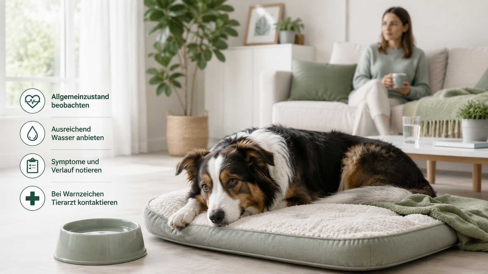
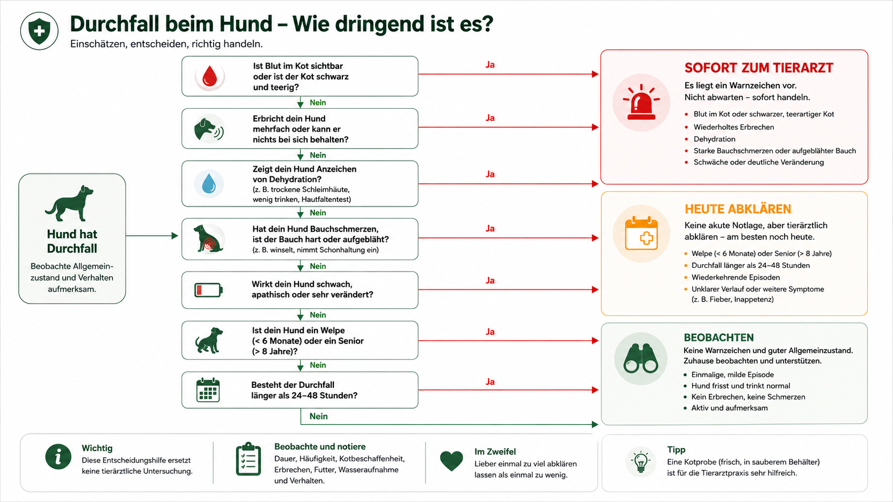
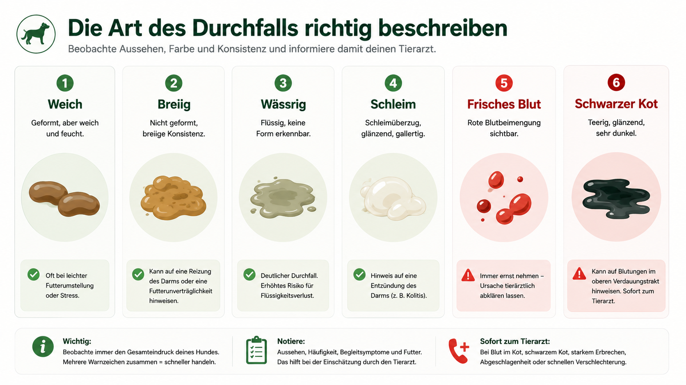
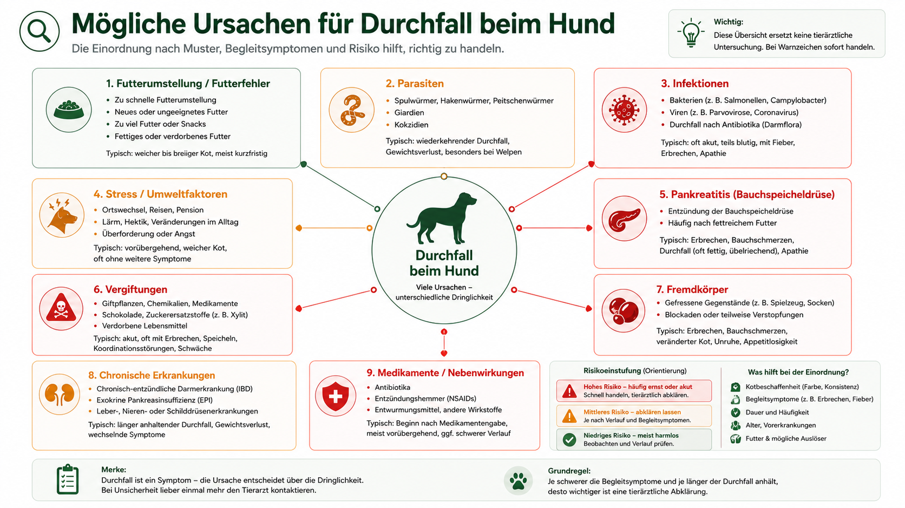
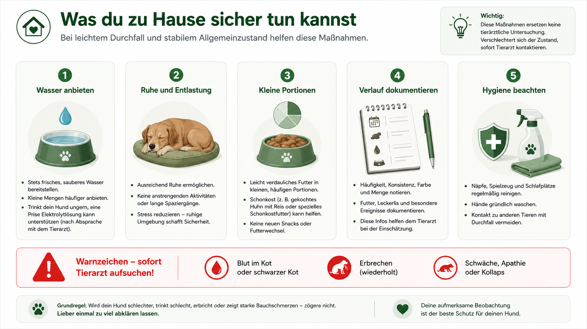
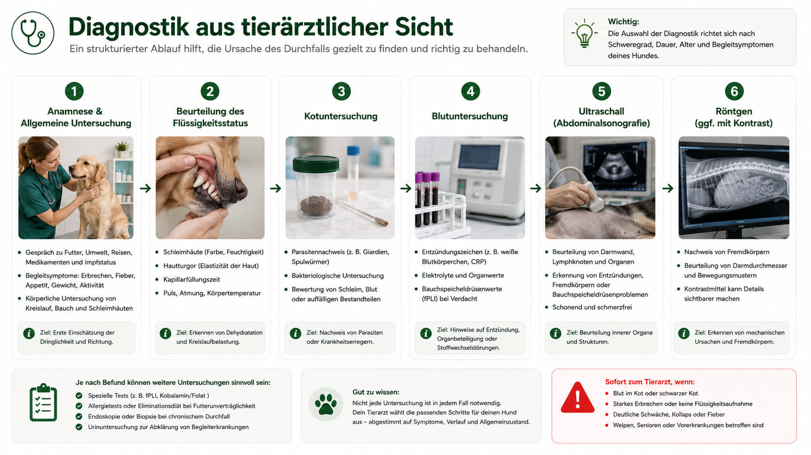
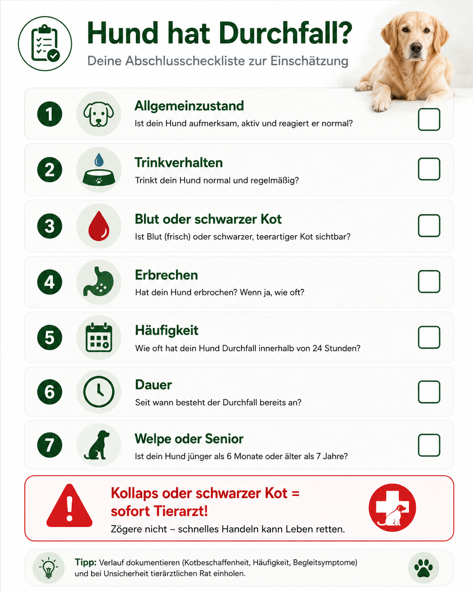

## Die kurze Antwort

Durchfall bedeutet, dass Kot weicher, wässriger, häufiger oder in größerer Menge als üblich abgesetzt wird. Er ist keine eigenständige Krankheit, sondern ein Symptom mit vielen möglichen Ursachen.

Ein gesunder erwachsener Hund, der einmal weichen Kot absetzt, normal frisst, trinkt und sich unverändert verhält, kann kurz kontrolliert beobachtet werden. Wiederholt sich der Durchfall, wird er wässrig oder kommen Erbrechen, Blut, Bauchschmerz, Futterverweigerung oder Mattigkeit hinzu, sollte die Tierarztpraxis kontaktiert werden.

**Sofort in den Notdienst** gehören Hunde mit Kollaps, starker Schwäche, blassen oder blauen Schleimhäuten, schwarzem teerartigem Kot, größeren Blutmengen, aufgeblähtem Bauch, schwerem Bauchschmerz, anhaltendem Erbrechen, Giftverdacht oder rascher Verschlechterung.

Welpen, sehr kleine Hunde, Senioren und chronisch kranke Tiere verlieren schneller Flüssigkeit und Reserven.

## Wann Durchfall ein Notfall ist

Sofortige Hilfe ist nötig bei:

- Kollaps oder fehlender Stehfähigkeit
- sehr blassen, grauen oder blauen Schleimhäuten
- schwarzem, teerartigem Kot
- größeren Mengen frischen Blutes
- anhaltendem Erbrechen
- Wasser bleibt nicht im Magen
- starkem oder zunehmendem Bauchschmerz
- aufgeblähtem Bauch
- Giftverdacht
- möglichem Fremdkörper
- rascher Verschlechterung

### Noch am selben Tag abklären

- mehrfach wässriger Durchfall
- Blut oder große Schleimmengen
- deutliche Mattigkeit
- Futterverweigerung
- Fieberverdacht
- Schmerzen beim Kotabsatz
- Gewichtsverlust
- Welpe, Senior oder chronisch kranker Hund
- Durchfall länger als ungefähr 24 Stunden

## Die Art des Durchfalls richtig beschreiben

| Merkmal | Beobachtung | Mögliche Bedeutung |
|---|---|---|
| weich geformt | Form noch erkennbar | leichte Verdauungsstörung möglich |
| breiig | keine klare Form | beschleunigte Darmpassage |
| wässrig | fast nur Flüssigkeit | hoher Flüssigkeitsverlust |
| Schleim | glasige Auflage | häufig Dickdarmreizung |
| frisches rotes Blut | Streifen oder Tropfen | häufig unterer Darm |
| schwarz und teerig | glänzend, sehr dunkel | mögliches verdautes Blut |

## Dünndarm oder Dickdarm?

| Eher Dünndarm | Eher Dickdarm |
|---|---|
| größere Kotmengen | kleine Mengen |
| weniger häufiger Absatz | sehr häufiger Drang |
| Gewichtsverlust eher möglich | Pressen und Dringlichkeit |
| schwarzer Kot möglich | frisches rotes Blut oder Schleim |
| Erbrechen häufiger begleitend | Unfälle im Haus häufiger |

## Ursachen nach Muster und Risiko

### Häufige Auslöser

- abrupter Futterwechsel
- ungewohnt fettes oder verdorbenes Futter
- Müll oder Essensreste
- Stress
- kurzfristige Darmreizung
- ungewohnte Kauartikel

### Medizinisch wichtige Ursachen

- Parasiten
- bakterielle oder virale Infektionen
- Pankreatitis
- chronische Enteropathie
- Nieren- oder Lebererkrankung
- Addison-Erkrankung
- Vergiftung
- Fremdkörper oder Teilverschluss
- Tumorerkrankung
- Nebenwirkung von Medikamenten

## Futterfehler und Umstellung

Ein plötzlicher Wechsel kann die Darmflora und Verdauung belasten. Trotzdem ist „Futterwechsel“ keine sichere Erklärung für starken oder anhaltenden Durchfall.

Eher passend sind ein klarer zeitlicher Zusammenhang, normaler Allgemeinzustand, kein Erbrechen, kein Blut und rasche Besserung.

Mehr zur Futterwahl findest du im Ratgeber [Trockenfutter oder Nassfutter für Hunde?](/trockenfutter-oder-nassfutter-hund/).

## Parasiten und Infektionen

Giardien, Rundwürmer, Hakenwürmer und Peitschenwürmer können Durchfall verursachen. Hakenwürmer können bei starkem Befall zu Blutverlust und Anämie führen.

Parvovirose betrifft besonders Welpen und ungeimpfte Hunde und kann mit Mattigkeit, Futterverweigerung, Erbrechen und blutigem Durchfall fortschreiten.

## Fremdkörper und Darmverschluss

Ein Fremdkörper kann trotz Durchfall oder Kotabsatz vorliegen. Bei einem Teilverschluss gelangt weiterhin etwas Darminhalt vorbei.

Warnzeichen sind Erbrechen, Bauchschmerz, Futterverweigerung, zunehmend geringe Kotmengen, ein möglicher Verschluckmoment und fehlende Erholung.

## Blutiger oder schwarzer Kot

Frisches rotes Blut deutet häufig auf eine Blutung im unteren Darm hin. Kleine Streifen können bei einer Dickdarmreizung auftreten. Größere Mengen, wiederholte Blutbeimengungen, wässriger Durchfall und Schwäche sind deutlich ernster.

Schwarzer, glänzender, teerartiger Kot kann verdautes Blut enthalten und gehört sofort abgeklärt.

## Was du zu Hause sicher tun kannst

Häusliche Maßnahmen sind nur für einen stabilen Hund ohne Warnzeichen geeignet.

### Wasser anbieten

Frisches Wasser sollte verfügbar bleiben. Mehrere kleine Trinkgelegenheiten können besser verträglich sein als hastiges Trinken großer Mengen. Wasser nicht gegen Widerstand eingeben.

### Futtermenge kontrollieren

Biete keine große, fettreiche oder stark gewürzte Mahlzeit an. Bei einem stabilen erwachsenen Hund können kleine, leicht verdauliche Portionen sinnvoll sein, wenn die Praxis nichts anderes empfiehlt.

Welpen, sehr kleine Hunde, Senioren und chronisch kranke Tiere sollten nicht pauschal fasten.

### Ruhe und Hygiene

- ruhiger Zugang nach draußen
- Kot sofort aufnehmen
- Näpfe reinigen
- Kontakt zu fremden Hunden reduzieren
- Hände gründlich waschen
- bei mehreren Tieren getrennte Beobachtung

### Was du nicht tun solltest

- Humanmedikamente geben
- alte Antibiotika verwenden
- Durchfallblocker ohne Anweisung einsetzen
- wiederholt neue Futtersorten testen
- bei Blut, Schwäche oder Erbrechen lange abwarten
- sichtbare Schnüre aus dem After ziehen

## Flüssigkeitsverlust und Dehydration

Wässriger Durchfall führt zu Verlust von Wasser und Elektrolyten. Hinweise auf Dehydration sind trockene oder klebrige Schleimhäute, deutlich weniger Urin, eingesunkene Augen, zunehmende Schwäche und schneller Puls.

Der Hautfaltentest ist ungenau und kann bei alten oder übergewichtigen Hunden irreführen.

## Verlauf messen statt schätzen

| Zeitpunkt | Konsistenz | Häufigkeit | Blut/Schleim | Allgemeinzustand |
|---|---|---:|---|---|
| 08:00 | breiig | 1 | nein | normal |
| 12:00 | wässrig | 2 | Schleim | leicht müde |
| 16:00 | wässrig | 2 | rote Streifen | frisst nicht |

## Kotprobe und Diagnostik

Für die Praxis sind eine möglichst frische Probe, ein sauberer dicht verschlossener Behälter, Zeitpunkt, Fotos, Medikamente und Entwurmungen hilfreich.

Je nach Verdacht folgen klinische Untersuchung, Kotuntersuchung, Blut- und Urinwerte sowie Röntgen oder Ultraschall.

## Behandlung

Die Behandlung richtet sich nach Ursache und Schweregrad. Möglich sind Flüssigkeitstherapie, Elektrolytausgleich, Behandlung von Übelkeit und Schmerzen, gezielte Parasitenbehandlung, angepasste Ernährung oder eine Operation bei Fremdkörper beziehungsweise Darmverschluss.

Antibiotika sind nicht bei jedem Durchfall angezeigt.

## Typische Denkfehler

| Denkfehler | Warum problematisch |
|---|---|
| „Ein bisschen Blut kann man ignorieren.“ | Menge und Allgemeinzustand entscheiden. |
| „Kot kommt noch, also kein Fremdkörper.“ | Teilverschlüsse können Durchfall zulassen. |
| „Er trinkt, also kann er nicht austrocknen.“ | Verluste können die Aufnahme übersteigen. |
| „Antibiotika helfen immer.“ | Viele Ursachen sind nicht bakteriell. |
| „Ein Futterwechsel erklärt alles.“ | Schwere Symptome passen nicht zu einer simplen Umstellung. |

## Entscheidungsbaum für die Dringlichkeit

1. **Kollaps, Atemnot, sehr blasse oder blaue Schleimhäute?**  
   Ja: sofort Notdienst.

2. **Schwarzer Kot, größere Blutmengen, starker Bauchschmerz oder aufgeblähter Bauch?**  
   Ja: sofort tierärztlich abklären.

3. **Wiederholtes Erbrechen oder Wasser bleibt nicht im Magen?**  
   Ja: noch heute, bei Schwäche sofort.

4. **Welpe, Senior, sehr kleiner oder chronisch kranker Hund?**  
   Ja: frühzeitig Praxis kontaktieren.

5. **Nur einmal weicher Kot und sonst völlig normal?**  
   Ja: kurz kontrolliert beobachten.

## Tierarzt-Checkliste

- [ ] Beginn und Anzahl der Episoden
- [ ] Konsistenz und Farbe
- [ ] Blut, Schleim oder Fremdmaterial
- [ ] Erbrechen und Wasseraufnahme
- [ ] Futterwechsel und mögliche Abfälle
- [ ] Medikamente und Vorerkrankungen
- [ ] Impf- und Entwurmungsstatus
- [ ] frische Kotprobe
- [ ] Fotos und Verlaufstabelle

## Abschlusscheckliste

- [ ] Allgemeinzustand geprüft
- [ ] Häufigkeit und Konsistenz dokumentiert
- [ ] Blut und schwarzen Kot bewertet
- [ ] Wasseraufnahme und Erbrechen beobachtet
- [ ] Alter und Vorerkrankungen berücksichtigt
- [ ] Fremdkörper- und Giftverdacht geprüft
- [ ] bei Warnzeichen sofort gehandelt

## Fazit

Durchfall ist häufig, aber nicht automatisch harmlos. Entscheidend sind Häufigkeit, Wassergehalt, Blut, Erbrechen, Bauchschmerz, Allgemeinzustand und Risikoprofil.

Ein einzelner weicher Kotabsatz bei einem fitten erwachsenen Hund kann kurz beobachtet werden. Wiederholter wässriger Durchfall, Blut, schwarzer Kot, Erbrechen, Schwäche oder Schmerzen gehören tierärztlich abgeklärt.

## Quellen

- [AAHA: Help! Is This a Pet Emergency?](https://www.aaha.org/resources/help-is-this-a-pet-emergency/)
- [AAHA: What Is My Pet’s Poop Telling Me?](https://www.aaha.org/resources/what-is-your-pets-poop-telling-you/)
- [VCA Animal Hospitals: Diarrhea in Dogs](https://vcahospitals.com/know-your-pet/diarrhea-in-dogs)
- [MSD Veterinary Manual: Introduction to Digestive Disorders of Dogs](https://www.msdvetmanual.com/dog-owners/digestive-disorders-of-dogs/introduction-to-digestive-disorders-of-dogs)
- [MSD Veterinary Manual: Disorders of the Stomach and Intestines in Dogs](https://www.msdvetmanual.com/dog-owners/digestive-disorders-of-dogs/disorders-of-the-stomach-and-intestines-in-dogs)

> **Medizinischer Hinweis:** Dieser Ratgeber ersetzt keine tierärztliche Diagnose.
