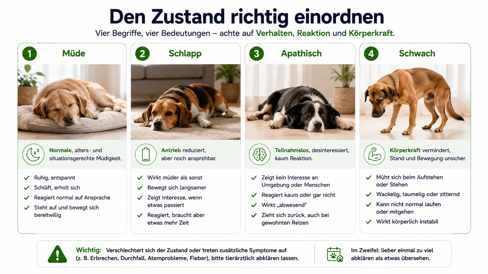
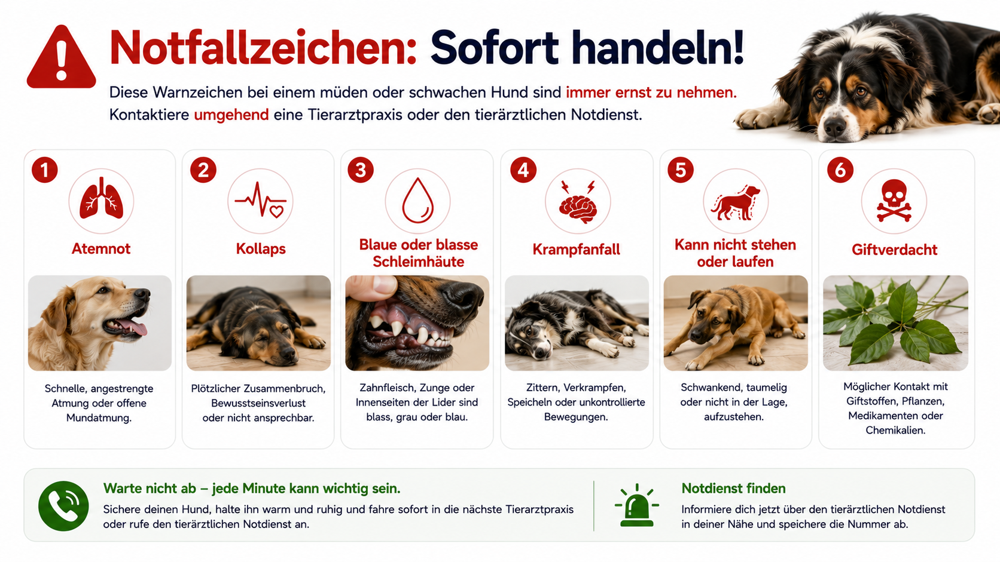
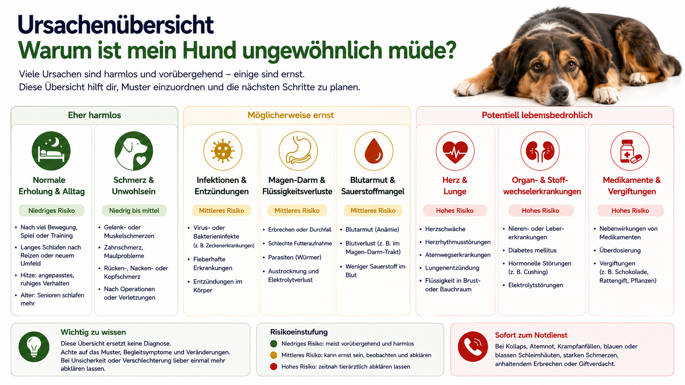
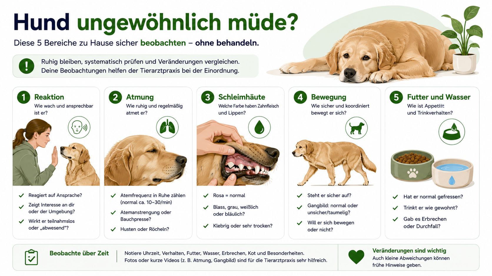
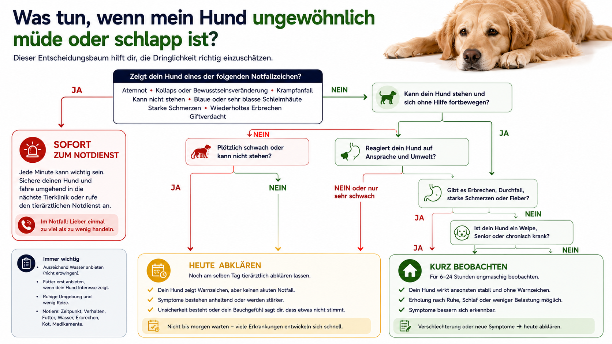
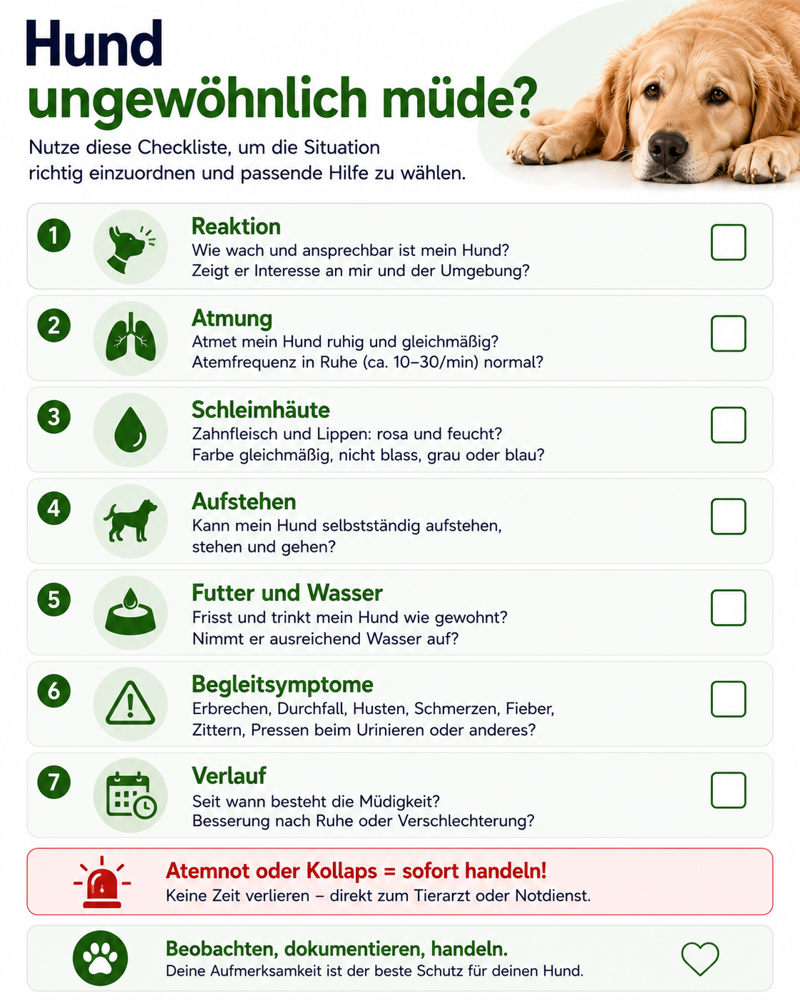

## Die kurze Antwort

Ein Hund, der nach einem langen Spaziergang, einer Reise, Hitze oder einem aufregenden Tag mehr schläft, ist nicht automatisch krank. Müdigkeit wird medizinisch relevant, wenn sie **neu, ungewöhnlich stark, anhaltend oder mit weiteren Symptomen verbunden** ist.

Besonders wichtig ist der Unterschied zwischen einem Hund, der entspannt schläft und sich normal wecken lässt, und einem Hund, der apathisch wirkt, kaum reagiert, nicht aufstehen kann oder sichtbar schwach ist.

**Sofort in den tierärztlichen Notdienst** gehören Hunde mit Atemnot, Kollaps, Krampfanfällen, sehr blassen oder blauen Schleimhäuten, aufgeblähtem Bauch, erfolglosem Würgen, starker Blutung, Giftverdacht, Hitzschlagverdacht oder rascher Verschlechterung.

Eine Abklärung am selben Tag ist sinnvoll, wenn die Müdigkeit zusammen mit Futterverweigerung, wiederholtem Erbrechen, deutlichem Durchfall, Fieberverdacht, Schmerzen, verändertem Trinken, Problemen beim Urinieren oder auffälliger Schwäche auftritt.

## Direkt zum passenden Problem

- [Ist mein Hund nur müde oder wirklich schlapp?](#müde-schlapp-apathisch-oder-schwach)
- [Welche Warnzeichen sind ein Notfall?](#wann-müdigkeit-ein-notfall-ist)
- [Welche Ursachen kommen infrage?](#ursachen-nach-muster-und-wahrscheinlichkeit)
- [Was kann ich zu Hause prüfen?](#was-du-zu-hause-sicher-prüfen-kannst)
- [Was untersucht die Tierarztpraxis?](#diagnostik-aus-tierärztlicher-sicht)
- [Wie unterscheidet sich Müdigkeit nach Alter?](#welpe-erwachsener-hund-und-senior)
- [Wie entscheide ich über die Dringlichkeit?](#entscheidungsbaum-für-die-dringlichkeit)

## Müde, schlapp, apathisch oder schwach?

Diese Begriffe werden im Alltag oft gleich verwendet. Für die Einordnung lohnt sich eine genauere Trennung.

| Beobachtung | Was damit gemeint ist | Typisches Beispiel |
|---|---|---|
| müde | erhöhtes Schlafbedürfnis, aber normale Reaktion | Hund schläft nach einer Wanderung länger |
| schlapp | weniger Aktivität und Motivation als üblich | Hund steht nur zögerlich zum Spaziergang auf |
| apathisch | deutlich verminderte Reaktion auf Umweltreize | Hund reagiert kaum auf Stimme oder Leckerli |
| schwach | körperliche Leistung oder Stabilität fehlt | Hund knickt ein, schwankt oder kann kaum stehen |
| bewegungsunwillig | Hund möchte wegen Schmerz oder Unwohlsein nicht laufen | Hund bleibt liegen, obwohl er wach ist |

Ein schlafender Hund kann tief entspannt sein und trotzdem sofort reagieren, wenn die Leine genommen wird. Ein apathischer Hund wirkt dagegen nicht nur müde, sondern ungewöhnlich schwer erreichbar.

## Das normale Verhalten als persönlicher Referenzwert

Es gibt keine feste Zahl, ab der ein Hund „zu viel“ schläft. Alter, Aktivität, Rasse, Wetter, Tagesablauf und Gesundheitszustand beeinflussen den Ruhebedarf.

Aussagekräftiger sind Veränderungen:

- schläft der Hund deutlich länger als sonst?
- steht er für Futter, Spaziergang oder Besuch noch auf?
- wirkt er nach dem Aufwachen normal?
- kann er sich flüssig bewegen?
- hat sich das Verhalten plötzlich verändert?
- bleibt die Müdigkeit über mehrere Ruhephasen bestehen?

Ein ruhiger Senior kann gesund sein. Ein sonst lebhafter Junghund, der plötzlich kaum reagiert, ist deutlich auffälliger.

## Wann Müdigkeit ein Notfall ist

Sofortige Hilfe ist nötig bei:

- Atemnot oder deutlich angestrengter Atmung
- Kollaps oder Bewusstlosigkeit
- blauen, grauen oder sehr blassen Schleimhäuten
- Krampfanfällen
- schwerem Taumeln oder fehlender Stehfähigkeit
- aufgeblähtem Bauch und erfolglosem Würgen
- Hitzschlagverdacht
- starker Blutung
- Giftverdacht
- plötzlicher Lähmung
- rascher Verschlechterung innerhalb kurzer Zeit

Nicht jeder Notfall beginnt dramatisch. Manche Hunde werden zuerst nur stiller, bevor Kreislauf, Atmung oder Bewusstsein sichtbar beeinträchtigt sind.

### Noch am selben Tag abklären

- Müdigkeit zusammen mit Futterverweigerung
- wiederholtes Erbrechen
- deutlicher Durchfall
- Schmerzen
- Fieberverdacht
- stark veränderte Wasseraufnahme
- kaum Urin oder Schmerzen beim Urinieren
- neuer Husten mit Leistungsschwäche
- auffällige Gewichtsabnahme
- neue neurologische Auffälligkeiten
- Müdigkeit nach neu begonnenen Medikamenten
- Welpe, Senior oder chronisch kranker Hund

Mehr zur Kombination aus Müdigkeit und fehlender Futteraufnahme findest du im Ratgeber [Hund frisst nicht](/hund-frisst-nicht/). Verändertes Trinkverhalten wird im Artikel [Hund trinkt zu wenig](/hund-trinkt-zu-wenig/) eingeordnet.

## Ursachen nach Muster und Wahrscheinlichkeit

Müdigkeit ist kein eigenständiges Krankheitsbild. Sie kann durch harmlose Belastung, Schmerzen, Infektionen, Kreislaufprobleme, Organerkrankungen, Medikamente oder Vergiftungen entstehen.

| Ursachengruppe | Typische Hinweise | Dringlichkeit |
|---|---|---|
| normale Erholung | klarer Auslöser, normale Reaktion, rasche Erholung | meist gering |
| Hitze oder ungewohnte Belastung | Hecheln, längere Ruhe, danach wieder normal | beobachten, bei Überhitzung sofort |
| Schmerz | Schonhaltung, Hecheln, Berührungsempfindlichkeit | zeitnah |
| Infekt oder Fieber | Wärmegefühl, Zittern, Appetitverlust, Rückzug | zeitnah |
| Magen-Darm-Erkrankung | Erbrechen, Durchfall, Bauchschmerz | je nach Verlauf |
| Blutarmut oder Blutverlust | blasse Schleimhäute, schnelle Atmung, Schwäche | hoch |
| Herz- oder Lungenerkrankung | Husten, Atemnot, geringe Belastbarkeit | hoch |
| Stoffwechsel- oder Organerkrankung | Gewichtsverlust, verändertes Trinken, Übelkeit | zeitnah |
| Medikamente | zeitlicher Zusammenhang, Sedierung | abhängig vom Präparat |
| Vergiftung | plötzlicher Beginn, Zittern, Erbrechen, neurologische Zeichen | häufig Notfall |

### Normale Erholung

Nach intensiver Bewegung, geistiger Auslastung, Reise, Tierarztbesuch oder ungewohnter Aufregung kann ein Hund vorübergehend mehr schlafen.

Eher beruhigend ist, wenn der Auslöser nachvollziehbar ist, der Hund normal reagiert, für Futter und Wasser aufsteht, sich koordiniert bewegt und nach der Ruhephase sein übliches Verhalten zeigt.

### Hitze und Überhitzung

Bei warmem Wetter reduzieren Hunde ihre Aktivität. Das ist sinnvoll. Problematisch wird es bei anhaltend starkem Hecheln, Taumeln, Erbrechen, sehr rotem oder sehr blassem Zahnfleisch, Verwirrtheit oder Kollaps.

Ein möglicher Hitzschlag ist ein Notfall. Der Hund muss aus der Hitze gebracht und kontrolliert gekühlt werden, während tierärztliche Hilfe organisiert wird. Eiskaltes Wasser und extremes Abkühlen sind ungeeignet.

### Schmerzen

Schmerz sieht nicht immer nach Jaulen aus. Viele Hunde werden still, schlafen mehr oder vermeiden Bewegung.

Hinweise sind ein steifer Gang, gekrümmter Rücken, Probleme beim Aufstehen, Meiden von Treppen, Hecheln ohne Hitze, nächtliche Unruhe, Abwehr beim Anfassen und eine veränderte Körperhaltung.

### Infektionen und Fieber

Infektionen können Müdigkeit, Futterverweigerung, Zittern, Husten, Nasenausfluss, Durchfall, Erbrechen oder Schmerzen verursachen.

Eine warme Nase oder warme Ohren beweisen kein Fieber. Die Körpertemperatur muss korrekt gemessen werden. Eine Messung gegen starken Widerstand ist jedoch nicht sinnvoll und kann Verletzungen verursachen.

### Magen-Darm-Erkrankungen

Erbrechen und Durchfall führen zu Flüssigkeits- und Elektrolytverlusten. Der Hund wirkt dann häufig müde, weil Kreislauf und Stoffwechsel belastet sind.

Wasser, das nicht im Magen bleibt, Blut im Erbrochenen oder Kot, starker Bauchschmerz und rasche Schwäche erhöhen die Dringlichkeit deutlich.

### Blutarmut und Blutverlust

Blasse Schleimhäute, schnelle Atmung, Leistungsabfall, Schwäche oder Kollaps können auf Blutarmut oder Blutverlust hinweisen.

Mögliche Ursachen reichen von innerer Blutung über Immunerkrankungen bis zu Parasiten oder chronischen Erkrankungen. Das lässt sich zu Hause nicht sicher unterscheiden.

### Herz und Lunge

Hunde mit Herz- oder Lungenerkrankungen können zunächst nur weniger belastbar wirken. Auffällig sind Husten, schnellere Atmung in Ruhe, Atemnot, bläuliche Schleimhäute, Kollaps bei Belastung und deutlich kürzere Spaziergänge.

### Stoffwechsel und Organe

Nieren-, Leber-, Hormon- und Stoffwechselerkrankungen können schleichend Müdigkeit verursachen. Hinweise sind Gewichtsverlust, verändertes Trinken, häufigerer oder seltener Urin, Erbrechen, Muskelschwäche oder ein langsamer Leistungsabfall.

### Medikamente und Sedierung

Beruhigungsmittel, Schmerzmittel, Antihistaminika und andere Präparate können müde machen. Entscheidend sind Dosis, Zeitpunkt und Begleitsymptome.

Verordnete Medikamente nicht eigenmächtig absetzen. Bei extremer Sedierung, Atemproblemen, Erbrechen, Kollaps oder ungewöhnlicher Reaktion sollte die Praxis sofort kontaktiert werden.

## Information Gain: Reaktionstest statt „Er schläft viel“

Ein kurzer Reaktionstest ersetzt keine Untersuchung, verbessert aber die Beschreibung.

Prüfe nacheinander:

1. Reagiert der Hund auf seinen Namen?
2. Öffnet er die Augen und nimmt Blickkontakt auf?
3. Hebt er den Kopf?
4. Steht er für einen vertrauten Reiz auf?
5. Geht er koordiniert?
6. Wirkt er nach dem Aufstehen normal wach?

Ein Hund, der tief schläft und danach normal reagiert, ist anders einzuordnen als ein Hund, der trotz starker Reize kaum reagiert.

## Was du zu Hause sicher prüfen kannst

### Atmung

Beobachte die Atmung in Ruhe. Sie sollte gleichmäßig und ohne sichtbare Anstrengung sein. Starkes Pumpen des Bauches, weit geöffnete Nüstern, gestreckter Hals, bläuliche Schleimhäute oder die Unfähigkeit, bequem zu liegen, sind Warnzeichen.

### Schleimhäute

Das Zahnfleisch sollte normalerweise rosa wirken. Sehr blasse, graue, gelbe oder blaue Schleimhäute sind auffällig. Bei pigmentiertem Zahnfleisch können unpigmentierte Bereiche an Lefze oder Augenlid hilfreicher sein.

### Bewegung

Lass den Hund nur kurz aufstehen, wenn er dazu in der Lage ist. Achte auf Schwanken, Einknicken, einseitige Belastung, steifen Gang, Schmerzreaktion und fehlende Koordination.

### Futter, Wasser, Urin und Kot

Dokumentiere die letzte normale Mahlzeit, tatsächliche Futtermenge, Wasseraufnahme, Erbrechen oder Durchfall, letzten Urinabsatz, auffällige Kotfarbe und Gewichtsveränderung.

### Temperatur

Eine rektale Temperaturmessung kann hilfreich sein, ist aber nicht bei jedem Hund sicher durchführbar. Bei starkem Widerstand, Schmerz oder Unsicherheit sollte darauf verzichtet werden.

## Typische Denkfehler

| Denkfehler | Warum er problematisch ist | Bessere Einordnung |
|---|---|---|
| „Er ist nur alt.“ | Neue Müdigkeit ist keine normale Alterserscheinung. | Veränderung zum bisherigen Seniorverhalten prüfen |
| „Die Nase ist trocken, also hat er Fieber.“ | Nasenfeuchtigkeit ist unzuverlässig. | Gesamtzustand und gemessene Temperatur bewerten |
| „Er wedelt noch, also ist alles okay.“ | Hunde können trotz Krankheit auf Ansprache reagieren. | Bewegung, Atmung und Begleitsymptome mitprüfen |
| „Er schläft, also hat er keine Schmerzen.“ | Schmerz führt häufig zu Rückzug und Ruhe. | Haltung, Gang und Berührungsempfindlichkeit beobachten |
| „Morgen ist es bestimmt besser.“ | Bei Kreislauf-, Atem- oder Giftproblemen kann Abwarten gefährlich sein. | Warnzeichen und Verlauf entscheiden lassen |

## Fallbeispiele

### Fall 1: Müdigkeit nach Belastung

Ein gesunder erwachsener Hund schläft nach einer langen Wanderung mehrere Stunden. Er reagiert auf Geräusche, trinkt, frisst und läuft später normal. Das passt zu Erholung.

### Fall 2: Müdigkeit mit Appetitverlust

Ein Senior schläft mehr, frisst nur die Hälfte und trinkt deutlich mehr als üblich. Der Verlauf besteht seit mehreren Tagen. Das passt nicht zu normaler Erholung. Organ- oder Stoffwechselerkrankungen müssen abgeklärt werden.

### Fall 3: Plötzliche Schwäche

Ein Hund steht nach dem Spaziergang nicht mehr auf, atmet schnell und hat blasse Schleimhäute. Das ist keine normale Müdigkeit, sondern ein Notfall.

## Welpe, erwachsener Hund und Senior

| Gruppe | Was häufiger vorkommt | Was besonders ernst ist |
|---|---|---|
| Welpe | Schlaf nach Spiel und Wachstum | schlechte Weckbarkeit, Zittern, Erbrechen, Durchfall |
| erwachsener Hund | Erholung nach Aktivität | plötzliche Apathie, Atemnot, Kollaps |
| Senior | längere Ruhephasen | neuer Leistungsabfall, Gewichtsverlust, verändertes Trinken |

### Welpen

Welpen schlafen viel. Entscheidend ist, ob sie zwischen den Schlafphasen lebhaft, interessiert und koordiniert sind. Ein Welpe, der schwer weckbar ist, nicht frisst, erbricht, Durchfall hat, zittert oder schwach wirkt, sollte früh untersucht werden.

### Senioren

Senioren ruhen oft mehr. Neue oder zunehmende Müdigkeit kann jedoch mit Schmerzen, Zahnproblemen, Herz-, Nieren-, Leber-, Hormon- oder Tumorerkrankungen zusammenhängen. „Alt sein“ ist keine Diagnose.

## Diagnostik aus tierärztlicher Sicht

Die Untersuchung richtet sich nach Verlauf und Befund.

### Anamnese

Wichtig sind Beginn und Dauer, plötzlicher oder schleichender Verlauf, Aktivitätsniveau, Futter- und Wasseraufnahme, Erbrechen, Durchfall, Urin, Kot, Medikamente, mögliche Gift- oder Fremdkörperkontakte, Vorerkrankungen, Reisen und Zecken.

### Klinische Untersuchung

Geprüft werden häufig Bewusstsein und Reaktion, Schleimhautfarbe, Herz und Lunge, Temperatur, Hydratation, Bauch, Schmerz, Gangbild und neurologischer Status.

### Labor und Bildgebung

Blutbild, Organwerte, Elektrolyte, Blutzucker und Entzündungswerte helfen, Blutarmut, Infektion, Dehydration, Stoffwechsel- und Organerkrankungen einzugrenzen. Je nach Verdacht kommen Urinuntersuchung, Hormontests, Röntgen oder Ultraschall hinzu.

## Verlauf dokumentieren

Eine kurze Verlaufstabelle hilft der Praxis mehr als die Aussage „seit ein paar Tagen müde“.

| Zeitpunkt | Reaktion | Futter/Wasser | Bewegung | Weitere Symptome |
|---|---|---|---|---|
| morgens | normal weckbar | halbe Portion | langsam | kein Erbrechen |
| mittags | schläft viel | trinkt mehr | steht zögerlich auf | hechelt |
| abends | wenig Reaktion | frisst nicht | schwankt | Zahnfleisch blass |

## Entscheidungsbaum für die Dringlichkeit

1. **Atemnot, Kollaps, Krampfanfall, blaue oder sehr blasse Schleimhäute?**  
   Ja: sofort Notdienst.

2. **Kann der Hund nicht stehen, schwankt stark oder reagiert kaum?**  
   Ja: unverzüglich tierärztlich abklären.

3. **Erbrechen, Durchfall, Schmerz, Fieberverdacht oder Futterverweigerung?**  
   Ja: noch am selben Tag.

4. **Welpe, Senior oder chronisch krank?**  
   Ja: niedrigere Schwelle zur Untersuchung.

5. **Klarer Auslöser und nach Ruhe wieder normal?**  
   Ja: kontrolliert beobachten.

6. **Müdigkeit hält an oder nimmt zu?**  
   Ja: tierärztlich abklären.

## Tierarzt-Checkliste

- [ ] Beginn und Verlauf der Müdigkeit
- [ ] Reaktion auf Stimme, Futter und Leine
- [ ] Fähigkeit aufzustehen und zu laufen
- [ ] Atmung in Ruhe
- [ ] Schleimhautfarbe
- [ ] Futter- und Wasseraufnahme
- [ ] Erbrechen, Durchfall, Urin und Kot
- [ ] Medikamente und Vorerkrankungen
- [ ] möglicher Gift-, Fremdkörper- oder Zeckenkontakt
- [ ] Videos von Gangbild, Atmung oder auffälligem Verhalten

## Abschlusscheckliste

- [ ] normale Müdigkeit von Apathie und Schwäche unterschieden
- [ ] Atmung und Schleimhäute geprüft
- [ ] Aufstehen und Gangbild beobachtet
- [ ] Futter, Wasser, Urin und Kot dokumentiert
- [ ] Alter und Vorerkrankungen berücksichtigt
- [ ] bei Warnzeichen sofort gehandelt
- [ ] bei anhaltender Veränderung Tierarztkontakt aufgenommen

## Fazit

Müdigkeit ist nur im Vergleich zum normalen Verhalten des Hundes sinnvoll zu bewerten. Ein Hund, der nach Belastung länger schläft, sich normal wecken lässt und danach wieder fit ist, braucht meist nur Erholung.

Auffällig wird Müdigkeit, wenn Reaktion, Bewegung, Atmung oder Kreislauf verändert sind oder weitere Symptome hinzukommen.

Atemnot, Kollaps, sehr blasse oder blaue Schleimhäute, Krampfanfälle, fehlende Stehfähigkeit, Giftverdacht und rasche Verschlechterung sind Notfälle.

## Quellen

- [AAHA: 10 Pet Health Signs You Should Never Ignore](https://www.aaha.org/resources/10-pet-health-signs-you-should-never-ignore/)
- [AAHA: Common Pet Pain Signs](https://www.aaha.org/resources/whats-wrong-common-pet-pain-signs/)
- [AAHA: Recognizing the Signs of Poisoning in Dogs](https://www.aaha.org/resources/recognizing-the-signs-of-poisoning-in-dogs/)
- [VCA Animal Hospitals: Testing for Decreased Appetite with Listlessness](https://vcahospitals.com/know-your-pet/testing-for-decreased-appetite-with-listlessness)
- [MSD Veterinary Manual: Overview of Anemia in Animals](https://www.msdvetmanual.com/circulatory-system/anemia/overview-of-anemia-in-animals)
- [MSD Veterinary Manual: Heatstroke in Dogs](https://www.msdvetmanual.com/dog-owners/metabolic-disorders-of-dogs/heatstroke-in-dogs)
- [MSD Veterinary Manual: Pain Assessment in Dogs](https://www.msdvetmanual.com/dog-owners/special-subjects-of-dogs/pain-assessment-in-dogs)
- [WSAVA: Global Pain Council Guidelines](https://wsava.org/global-guidelines/global-pain-council-guidelines/)

> **Medizinischer Hinweis:** Dieser Ratgeber ersetzt keine tierärztliche Diagnose. Bei akuten Warnzeichen, deutlicher Verschlechterung oder Unsicherheit ist eine Tierarztpraxis beziehungsweise der tierärztliche Notdienst die richtige Anlaufstelle.
