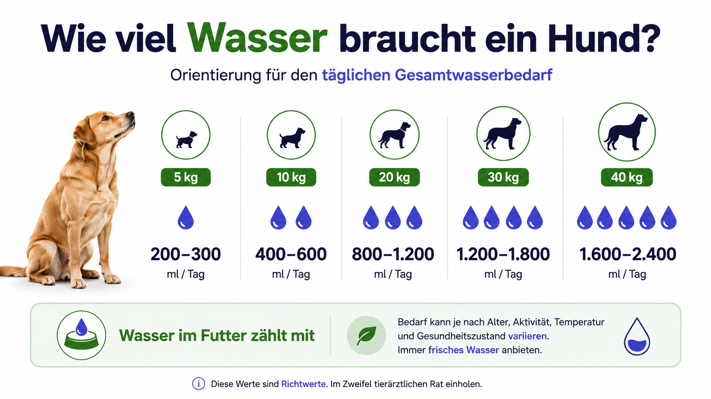
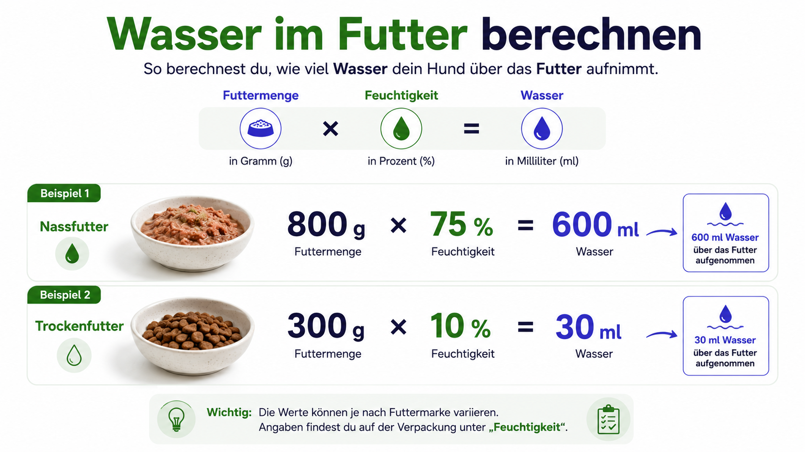
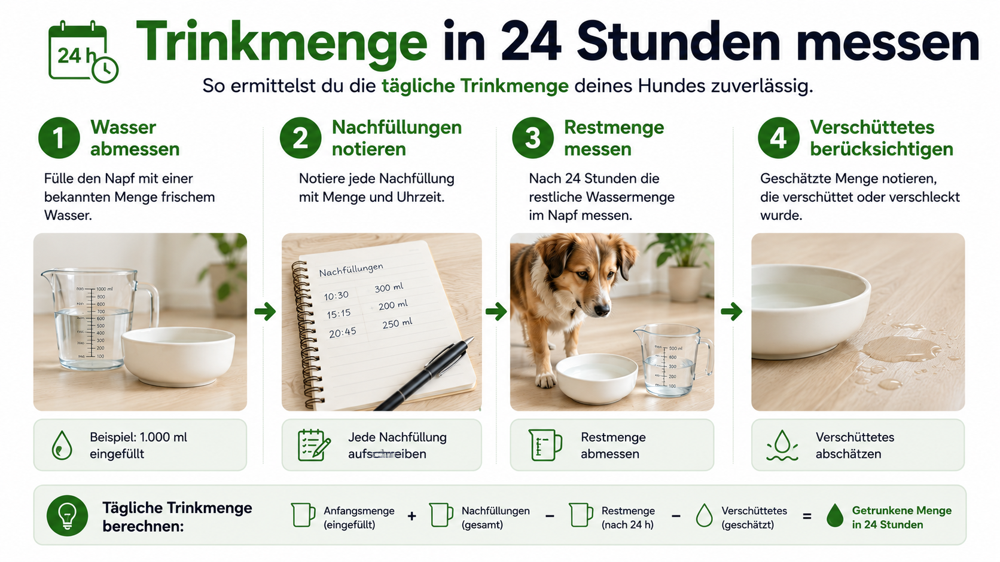
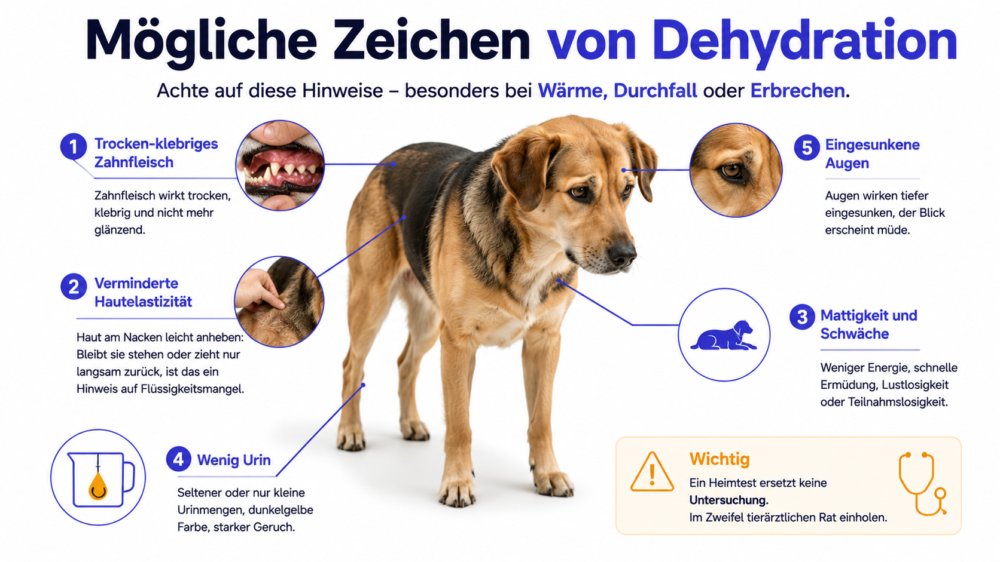
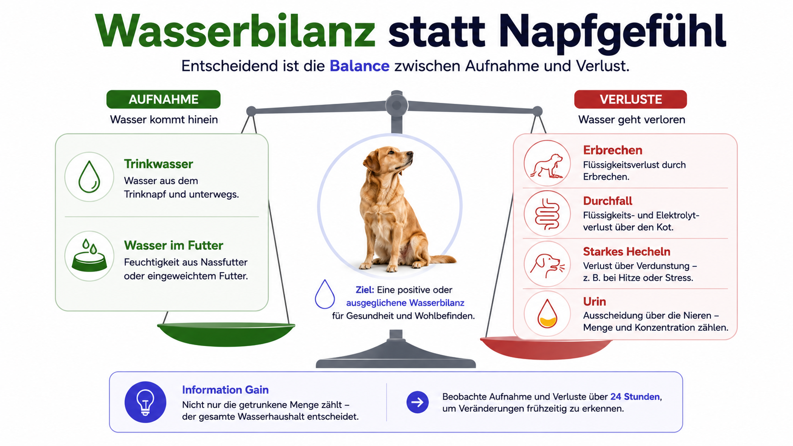
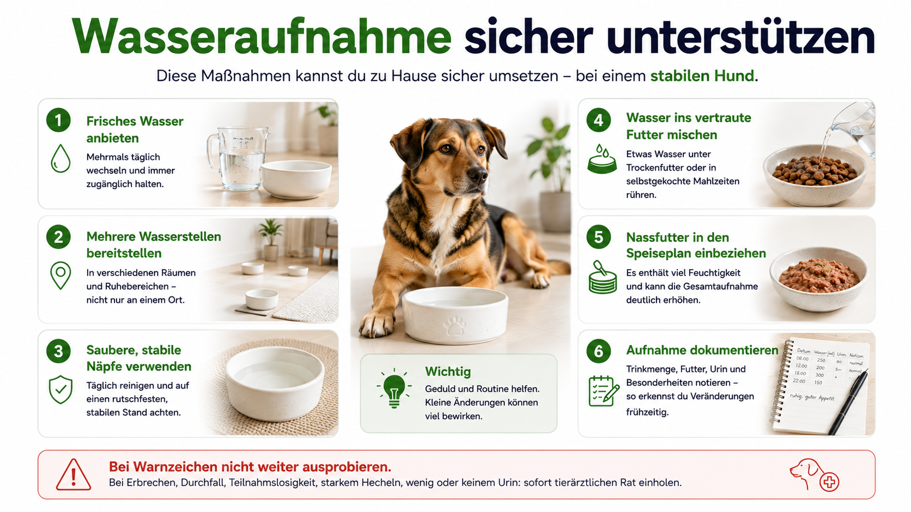
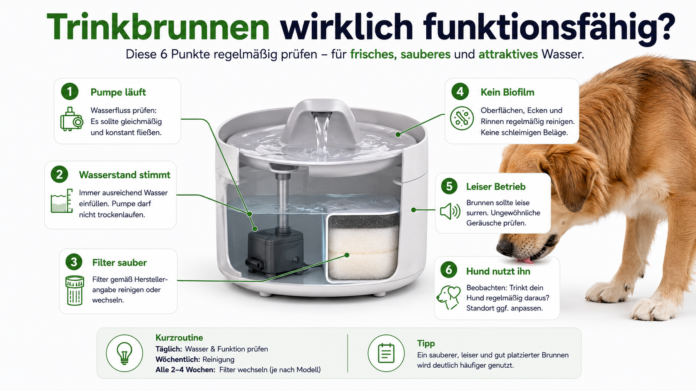
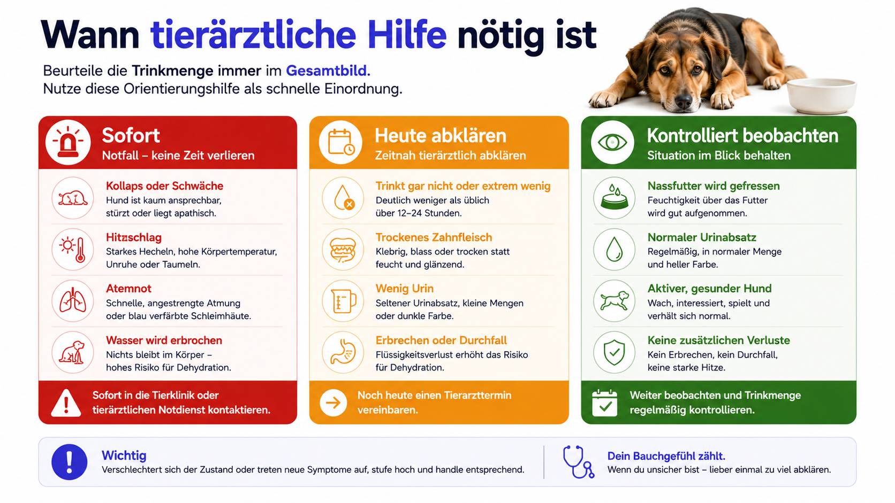
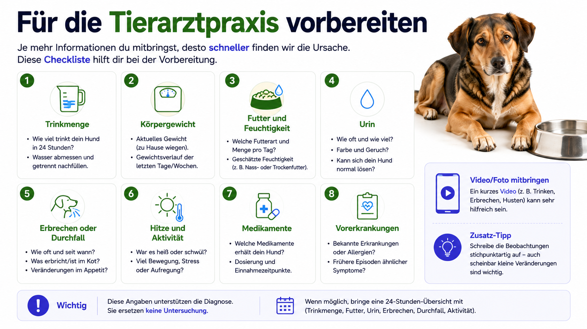
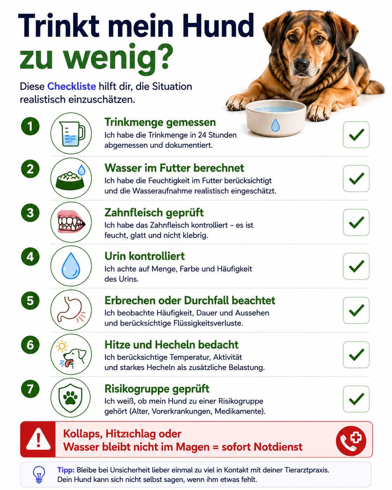

## Die kurze Antwort

Ein Hund, der selten am Wassernapf gesehen wird, trinkt nicht automatisch zu wenig. Entscheidend ist die **gesamte Wasseraufnahme**. Dazu gehören Trinkwasser, Wasser im Futter und zusätzlich aufgenommenes Wasser, etwa durch eingeweichtes Futter.

Als grobe Orientierung werden für gesunde erwachsene Hunde häufig etwa **40 bis 60 Milliliter Gesamtwasser pro Kilogramm Körpergewicht und Tag** verwendet. Ein Hund mit 20 Kilogramm Körpergewicht kommt damit ungefähr auf 800 bis 1.200 Milliliter. Das ist kein starrer Sollwert. Temperatur, Aktivität, Futterart, Alter, Erkrankungen und Medikamente können den Bedarf deutlich verändern.

Wichtiger als ein einzelner Messwert ist die Veränderung gegenüber dem normalen Muster des Hundes.

Noch am selben Tag tierärztlich abklären solltest du eine deutlich verringerte Wasseraufnahme zusammen mit Futterverweigerung, Erbrechen, Durchfall, trocken-klebrigem Zahnfleisch, deutlich weniger Urin, auffälliger Müdigkeit oder einer bekannten Nieren-, Herz- oder Stoffwechselerkrankung.

Sofortige Hilfe ist nötig bei Kollaps, Bewusstseinsveränderung, Atemnot, Hitzschlagverdacht, sehr blassen oder blauen Schleimhäuten sowie dann, wenn Wasser wiederholt erbrochen wird.

## Direkt zum passenden Problem

- [Wie viel Wasser braucht ein Hund?](#wie-viel-wasser-braucht-ein-hund)
- [Wie messe ich die Trinkmenge?](#trinkmenge-richtig-messen)
- [Woran erkenne ich Dehydration?](#woran-erkennt-man-dehydration)
- [Mein Hund trinkt gar nicht](#hund-trinkt-gar-nicht)
- [Mein Hund trinkt wenig, frisst aber Nassfutter](#nassfutter-und-sichtbare-trinkmenge)
- [Was kann ich zu Hause tun?](#was-du-zu-hause-sicher-tun-kannst)
- [Wann muss der Hund zum Tierarzt?](#wann-tierärztliche-hilfe-nötig-ist)

## Wie viel Wasser braucht ein Hund?

Der tägliche Wasserbedarf lässt sich nicht mit einer einzigen Zahl exakt festlegen. Für den Alltag ist ein Bereich sinnvoller als ein vermeintlich präziser Sollwert.

| Körpergewicht | Grobe tägliche Gesamtwasseraufnahme |
|---:|---:|
| 5 kg | etwa 200 bis 300 ml |
| 10 kg | etwa 400 bis 600 ml |
| 15 kg | etwa 600 bis 900 ml |
| 20 kg | etwa 800 bis 1.200 ml |
| 25 kg | etwa 1.000 bis 1.500 ml |
| 30 kg | etwa 1.200 bis 1.800 ml |
| 40 kg | etwa 1.600 bis 2.400 ml |

Diese Werte beziehen sich auf die gesamte Wasseraufnahme. Ein Hund mit Nassfutter muss einen erheblichen Teil davon nicht aus dem Napf trinken.

### Was den Bedarf erhöht

Hohe Temperaturen, körperliche Aktivität, starkes Hecheln, Fieber, Erbrechen und Durchfall erhöhen den Flüssigkeitsbedarf. Auch säugende Hündinnen sowie Hunde mit bestimmten Stoffwechsel- oder Nierenerkrankungen können mehr Wasser benötigen.

### Was die sichtbare Trinkmenge senkt

Ein hoher Nassfutteranteil, eingeweichtes Trockenfutter, kühle Umgebung oder geringere Aktivität können die sichtbare Napfaufnahme reduzieren. Mehrere Wasserstellen oder unbeobachtetes Trinken im Garten verfälschen die Wahrnehmung zusätzlich.

Die entscheidende Frage lautet deshalb nicht: „Wie oft habe ich meinen Hund trinken sehen?“, sondern: „Ist seine gesamte Wasserbilanz plausibel und stabil?“

## Trinkmenge und Gesamtwasser sind nicht dasselbe

Ein typisches Missverständnis entsteht bei Nassfutter.

Ein Hund frisst täglich 800 Gramm Nassfutter mit 75 Prozent Feuchtigkeit.

**800 g × 0,75 = 600 ml Wasser aus dem Futter**

Benötigt der Hund insgesamt ungefähr 1.000 Milliliter, fehlen rechnerisch noch etwa 400 Milliliter aus dem Napf oder anderen geeigneten Quellen.

Bei Trockenfutter sieht die Bilanz anders aus. 300 Gramm Trockenfutter mit 10 Prozent Feuchtigkeit liefern nur etwa 30 Milliliter Wasser. Der größte Teil des Bedarfs muss dann tatsächlich getrunken werden.

Mehr zur Einordnung findest du im Ratgeber [Trockenfutter oder Nassfutter für Hunde?](/trockenfutter-oder-nassfutter-hund/).

## Information Gain: Wasser aus dem Futter berechnen

Die Rechnung ist einfach:

**Futtermenge in Gramm × Feuchtigkeitsanteil = Wasser aus dem Futter in Millilitern**

| Futter | Menge | Feuchtigkeit | Wasser aus dem Futter |
|---|---:|---:|---:|
| Nassfutter | 500 g | 75 % | ca. 375 ml |
| Nassfutter | 800 g | 78 % | ca. 624 ml |
| Trockenfutter | 250 g | 10 % | ca. 25 ml |
| eingeweichtes Futter | 250 g + 300 ml Wasser | abhängig | mindestens 300 ml zusätzlich |

Ein Gramm Wasser entspricht im Alltag ungefähr einem Milliliter. Die Rechnung ist eine Näherung, aber deutlich aussagekräftiger als der reine Blick auf den Napf.

## Trinkmenge richtig messen

### Methode für einen einzelnen Hund

1. Morgens eine abgemessene Wassermenge einfüllen.
2. Jede Nachfüllung notieren.
3. Nach 24 Stunden das Restwasser messen.
4. Verschüttete Mengen grob berücksichtigen.
5. Wasser im Futter berechnen.
6. Das Ergebnis an mehreren vergleichbaren Tagen prüfen.

Beispiel:

- morgens 1.500 ml eingefüllt
- abends 300 ml nachgefüllt
- nach 24 Stunden 700 ml übrig
- sichtbare Aufnahme: 1.100 ml
- davon etwa 100 ml verschüttet
- geschätzte Trinkmenge: 1.000 ml

### Mehrere Hunde im Haushalt

Ein gemeinsamer Napf macht die Zuordnung fast unmöglich. Für eine zuverlässige Messung sind zeitweise getrennte Wasserstellen sinnvoll. Eine Kamera kann zeigen, welches Tier den Napf nutzt, misst aber keine exakte Menge.

Automatische Trinkbrunnen mit App können Anhaltspunkte liefern. Sie ersetzen keine Plausibilitätskontrolle, weil Pumpenbetrieb, Verdunstung oder Bewegungen am Gerät nicht automatisch einer aufgenommenen Wassermenge entsprechen.

### Freigang, Garten und Spaziergänge

Pfützen, Teiche, Gießkannen und fremde Näpfe verfälschen die Messung. Während einer gezielten 24-Stunden-Erfassung sollte der Zugang zu unbekannten Wasserquellen möglichst kontrolliert werden.

## Typische Messfehler

- Wasser aus Nassfutter wird nicht mitgerechnet.
- Verschüttetes Wasser gilt fälschlich als getrunken.
- Mehrere Tiere teilen einen Napf.
- Nachfüllungen werden nicht notiert.
- Wasser unterwegs bleibt unberücksichtigt.
- Ein laufender Trinkbrunnen wird mit tatsächlicher Nutzung gleichgesetzt.
- Ein einzelner Tag wird ohne Vergleich zum normalen Muster überbewertet.

Ein Messwert ist vor allem dann nützlich, wenn Futter, Aktivität und Außentemperatur am Vergleichstag ähnlich waren.

## Woran erkennt man Dehydration?

Dehydration bedeutet, dass der Körper mehr Flüssigkeit verliert als aufnimmt. Häufig gehen dabei auch Elektrolyte verloren.

Mögliche Hinweise sind:

- trockenes oder klebriges Zahnfleisch
- verminderte Hautelastizität
- Mattigkeit
- weniger Interesse an Futter
- eingesunkene Augen
- wenig oder dunkler Urin
- schneller Herzschlag
- schwacher Puls
- akuter Gewichtsverlust
- kühle Gliedmaßen bei Kreislaufproblemen

Kein einzelner Heimtest kann den Schweregrad zuverlässig bestimmen.

### Zahnfleisch prüfen

Normales Zahnfleisch ist meist feucht und glatt. Trockenes oder klebriges Zahnfleisch kann auf Flüssigkeitsmangel hinweisen. Die Beurteilung wird aber durch starkes Hecheln, Maulatmung, Zahnerkrankungen, Angst und bestimmte Medikamente erschwert.

Blasses, graues oder blaues Zahnfleisch ist kein bloßer Dehydrationshinweis. Es kann auf ein Kreislauf- oder Sauerstoffproblem hindeuten und gehört sofort tierärztlich abgeklärt.

### Hautfaltentest

Dabei wird Haut im Schulter- oder Rückenbereich vorsichtig angehoben und losgelassen. Verzögertes Zurückgleiten kann auf Flüssigkeitsmangel hinweisen.

Der Test ist unzuverlässiger bei alten, sehr dünnen oder übergewichtigen Hunden, bei Rassen mit lockerer Haut und bei Hauterkrankungen. Ein unauffälliger Hautfaltentest schließt Dehydration nicht sicher aus.

### Kapilläre Rückfüllzeit

Dabei wird kurz auf das Zahnfleisch gedrückt, bis es heller wird. Die Farbe sollte rasch zurückkehren. Der Test beurteilt eher die Durchblutung als die reine Gewebedehydration. Bei auffällig langsamer Rückfüllung, blassem Zahnfleisch oder Schwäche ist tierärztliche Hilfe nötig.

## Information Gain: Dehydration und Hypovolämie unterscheiden

**Dehydration** betrifft vor allem einen Flüssigkeitsmangel im Gewebe.

**Hypovolämie** bedeutet, dass das zirkulierende Blutvolumen zu niedrig ist. Das kann durch starke Flüssigkeitsverluste, Blutungen oder einen Schock entstehen.

Ein Hund kann dehydriert sein, ohne bereits im Schock zu sein. Umgekehrt kann eine akute Kreislaufstörung entstehen, bevor ein Halter deutliche Haut- oder Schleimhautveränderungen bemerkt.

Warnzeichen für eine mögliche Kreislaufstörung sind:

- sehr schnelle Herzfrequenz
- schwache Pulse
- blasse Schleimhäute
- verlängerte kapilläre Rückfüllzeit
- kalte Gliedmaßen
- starke Schwäche
- Kollaps

Diese Zeichen gehören nicht zu einer häuslichen Trinkstrategie, sondern in den tierärztlichen Notdienst.

## Information Gain: Wasserbilanz statt Napfgefühl

Die Wasserbilanz setzt sich aus zwei Seiten zusammen.

**Aufnahme**

- Trinkwasser
- Wasser im Futter
- zusätzlich eingerührtes Wasser

**Verluste**

- Urin
- Kot
- Hecheln
- Erbrechen
- Durchfall
- Fieber und erhöhte Verdunstung

Ein Hund kann trotz scheinbar normaler Trinkmenge austrocknen, wenn die Verluste stark steigen. Umgekehrt kann ein Hund mit Nassfutter kaum sichtbar trinken und dennoch ausreichend versorgt sein.

Diese Bilanz erklärt, warum die reine Napfmenge bei Erbrechen, Durchfall, Hitze oder starkem Hecheln zu kurz greift.

## Hund trinkt gar nicht

Vollständige Trinkverweigerung ist relevanter als eine nur leicht niedrigere Menge.

Mögliche Ursachen sind:

- Übelkeit
- Maul- oder Zahnschmerzen
- Schluckstörung
- starke Schwäche
- neurologische Erkrankung
- Fieber
- ungewohnter Geschmack oder Geruch des Wassers
- verschmutzter Napf
- technische Störung eines Trinkbrunnens
- Stress
- eingeschränkter Zugang

Wichtig ist die Kombination mit anderen Zeichen.

### Sofort handeln bei

- Wasser wird wiederholt erbrochen.
- Der Hund kollabiert oder ist kaum ansprechbar.
- Es besteht Atemnot.
- Es gibt einen Hitzschlagverdacht.
- Die Schleimhäute sind sehr blass, grau oder blau.
- Krampfanfälle treten auf.
- Der Hund zeigt starke Schwäche oder kann nicht sicher stehen.

### Noch heute abklären bei

- vollständiger Trinkverweigerung und schlechtem Allgemeinzustand
- gleichzeitigem Erbrechen oder Durchfall
- zusätzlicher Futterverweigerung
- trocken-klebrigem Zahnfleisch
- deutlich weniger Urin
- Welpen, Senioren oder chronisch kranken Hunden
- bekannten Nieren-, Herz- oder Stoffwechselerkrankungen

Eine pauschale Regel wie „24 Stunden ohne Wasser sind noch unproblematisch“ ist nicht belastbar. Bedarf, Reserven und Verluste unterscheiden sich zu stark.

## Nassfutter und sichtbare Trinkmenge

Ein Hund, der überwiegend Nassfutter frisst, kann selten am Wassernapf zu sehen sein. Das ist plausibel, wenn:

- die Gesamtwasseraufnahme rechnerisch ausreicht
- der Hund normal uriniert
- das Zahnfleisch feucht ist
- Allgemeinzustand und Aktivität normal sind
- keine Verluste durch Erbrechen oder Durchfall bestehen
- das Trinkverhalten nicht plötzlich verändert ist

Weniger plausibel ist es, wenn gleichzeitig die Futteraufnahme sinkt, der Urin deutlich abnimmt, das Zahnfleisch trocken wird oder der Hund schwach wirkt.

Der relevante Vergleich lautet nicht: „Trinkt er so viel wie ein Hund mit Trockenfutter?“, sondern: „Ist seine gesamte Wasserbilanz plausibel und stabil?“

## Trockenfutter und Wasseraufnahme

Trockenfutter enthält wenig Feuchtigkeit. Hunde müssen deshalb einen größeren Anteil ihres Bedarfs trinken.

Sinnvoll sind:

- jederzeit frei zugängliches Wasser
- ein ausreichend großer, stabiler Napf
- mehrere Wasserstellen bei großen Wohnungen oder Häusern
- täglicher Wasserwechsel
- zusätzliche Kontrolle bei Hitze und hoher Aktivität
- vorsichtiges Einweichen, sofern der Hund es verträgt

Eingeweichte Futterreste verderben schneller und sollten nicht lange stehen bleiben.

Wasser darf nicht rationiert werden, um häufiges Urinieren zu reduzieren. Starkes Trinken oder häufiges Urinieren kann medizinische Ursachen haben und gehört abgeklärt.

## Erbrechen und Durchfall

Erbrechen und Durchfall erhöhen den Flüssigkeitsverlust. Gleichzeitig trinken manche Hunde weniger oder erbrechen aufgenommenes Wasser erneut.

Dringend sind:

- wiederholtes Erbrechen
- Wasser bleibt nicht im Magen
- blutiger Durchfall
- schwarzer Kot
- starke Schwäche
- deutlicher Bauchschmerz
- Welpe oder sehr kleiner Hund
- deutlich reduzierter Urin
- trockene Schleimhäute

Wasser pauschal zu entziehen kann die Dehydration verschlimmern. Ob kleine Mengen angeboten werden dürfen oder eine medizinische Flüssigkeitstherapie nötig ist, hängt vom Zustand des Hundes ab. Bei wiederholtem Erbrechen gehört diese Entscheidung in tierärztliche Hände.

## Hitze und Hitzschlag

Hunde verlieren über das Hecheln Wasser. Bei hohen Temperaturen, körperlicher Belastung und schlechter Abkühlung kann das Risiko rasch steigen.

Warnzeichen sind:

- extremes Hecheln
- sehr rote oder später blasse Schleimhäute
- Taumeln
- Erbrechen oder Durchfall
- Verwirrtheit
- Schwäche
- Kollaps
- Krampfanfälle

Hitzschlag ist ein Notfall. Den Hund aus der Hitze bringen, mit kühlem, nicht eiskaltem Wasser beginnen zu kühlen und sofort tierärztliche Hilfe organisieren. Kein Eisbad und kein erzwungenes Trinken bei Bewusstseinsstörung.

## Ursachen nach Situation

| Situation | Mögliche Erklärung | Sinnvoller nächster Schritt |
|---|---|---|
| Wenig Trinken bei Nassfutter, Hund fit | viel Wasser über das Futter | Gesamtwasser berechnen und Verlauf beobachten |
| Plötzliche Trinkverweigerung | Übelkeit, Schmerz, Fieber, Stress oder Zugangsproblem | Begleitsymptome prüfen und bei Auffälligkeit heute abklären |
| Wenig Trinken plus wenig Urin | mögliche Dehydration oder Harnproblem | zeitnah tierärztlich untersuchen lassen |
| Wasser wird erbrochen | Magen-Darm-Erkrankung, Fremdkörper, Vergiftung oder andere akute Ursache | sofortige Abklärung |
| Wenig Trinken nach Zahnbehandlung | Maulschmerz oder Schluckbeschwerden | behandelnde Praxis kontaktieren |
| Hund nutzt Brunnen nicht | Geräusch, Geruch, Biofilm, falsche Höhe oder fehlende Gewöhnung | normalen Napf zusätzlich anbieten und Technik prüfen |
| Senior trinkt plötzlich weniger | Schmerz, Schwäche, Übelkeit, kognitive oder organische Ursache | frühzeitig untersuchen lassen |
| Hund trinkt plötzlich deutlich mehr | Stoffwechsel-, Nieren- oder Hormonproblem möglich | Menge messen und tierärztlich abklären |

Die Tabelle ersetzt keine Diagnose. Sie hilft, Beobachtungen in eine sinnvolle Reihenfolge zu bringen.

## Maul, Zähne und Schlucken

Ein Hund kann Durst haben und trotzdem nicht trinken, wenn das Trinken schmerzt.

Mögliche Hinweise:

- Annäherung an den Napf, aber kein Trinken
- Zurückzucken beim Kontakt mit Wasser
- einseitiges Kauen
- Speicheln
- Maulgeruch
- Futter fällt aus dem Maul
- Husten oder Würgen beim Trinken
- veränderte Kopfhaltung
- sichtbare Schwellung

Nicht selbst tief im Maul nach Fremdkörpern suchen, wenn der Hund Schmerzen hat oder sich wehrt. Verletzungs- und Bissgefahr sind erheblich.

Bei Schluckproblemen darf Wasser nicht mit einer Spritze ins Maul gedrückt werden. Es kann in die Atemwege gelangen.

## Erkrankungen, die das Trinken verändern können

### Nierenerkrankungen

Bei Nierenerkrankungen trinken Hunde häufig mehr, weil die Nieren den Urin schlechter konzentrieren. In späteren oder komplizierten Phasen können Übelkeit, Erbrechen und geringe Aufnahme trotzdem zu Dehydration führen.

### Diabetes mellitus

Typisch sind häufig vermehrtes Trinken und Urinieren. Sinkt die Aufnahme plötzlich bei gleichzeitigem Erbrechen oder Schwäche, kann eine Entgleisung vorliegen.

### Addison-Erkrankung

Mögliche Zeichen sind wiederkehrende Mattigkeit, Erbrechen, Durchfall, Appetitverlust und Dehydration. In einer Krise kann der Kreislauf zusammenbrechen.

### Herzerkrankungen

Bei Herzerkrankungen ist eigenmächtiges „Vieltrinkenlassen“ ebenso problematisch wie Wasserentzug. Flüssigkeitszufuhr und Medikamente müssen zur individuellen Situation passen.

### Fieber und Infektionen

Fieber kann den Bedarf erhöhen. Gleichzeitig trinken manche Hunde wegen Übelkeit, Schmerzen oder Schwäche weniger.

### Medikamente

Entwässernde Medikamente erhöhen häufig den Urinabsatz. Andere Medikamente können Übelkeit, Müdigkeit oder Geschmacksveränderungen auslösen. Medikamente nie ohne Rücksprache absetzen oder dosieren.

## Unterschiede nach Alter und Risikogruppe

| Gruppe | Warum genauer beobachten? | Niedrigere Schwelle für Abklärung |
|---|---|---|
| Welpe | kleine Reserven, rascher Flüssigkeitsverlust bei Durchfall oder Erbrechen | reduzierte Aufnahme plus Mattigkeit, Durchfall oder Erbrechen |
| gesunder erwachsener Hund | meist stabilere Reserven | deutliche Abweichung vom Normalverhalten oder Begleitsymptome |
| Senior | häufiger Nieren-, Herz-, Zahn- oder Stoffwechselprobleme | neue Veränderung ohne klare harmlose Erklärung |
| sehr kleiner Hund | geringe absolute Flüssigkeitsreserve | wiederholtes Erbrechen oder rasche Schwäche |
| chronisch kranker Hund | geringe Kompensationsreserve, Medikamente beeinflussen Bilanz | jede deutliche Veränderung früh mit der Praxis besprechen |
| säugende Hündin | hoher Flüssigkeitsbedarf | sinkende Aufnahme, Schwäche oder unzureichende Versorgung der Welpen |

Eine geringe Wasseraufnahme ist bei einem gesunden erwachsenen Hund ohne weitere Auffälligkeiten anders einzuordnen als bei einem Welpen mit Durchfall oder einem Senior mit Nierenerkrankung.

## Information Gain: Typische Fehleinschätzungen

### „Mein Hund war heute nicht am Napf, also ist er dehydriert“

Nicht zwingend. Nassfutter, mehrere Wasserstellen oder unbeobachtetes Trinken können die Beobachtung erklären. Entscheidend sind Gesamtwasser, Verlauf, Urin und Allgemeinzustand.

### „Der Hautfaltentest war normal, also ist alles in Ordnung“

Nicht zuverlässig. Alter, Körperbau und Hautbeschaffenheit beeinflussen das Ergebnis. Ein normaler Test schließt eine relevante Störung nicht aus.

### „Ein Trinkbrunnen garantiert mehr Wasseraufnahme“

Nein. Manche Hunde mögen bewegtes Wasser, andere meiden Geräusche oder Vibrationen. Entscheidend ist die tatsächliche Nutzung.

### „Bei Erbrechen darf überhaupt kein Wasser angeboten werden“

Eine pauschale Regel ist riskant. Wiederholtes Erbrechen von Wasser ist ein Grund für rasche tierärztliche Abklärung. Eigenständiger Wasserentzug kann die Situation verschlechtern.

### „Wenig Urin bedeutet, dass der Hund einfach weniger trinken muss“

Wenig Urin kann auf Dehydration, Kreislaufprobleme oder ein Harnwegsproblem hinweisen. Wasser zu rationieren wäre die falsche Reaktion.

## Was du zu Hause sicher tun kannst

Diese Maßnahmen sind nur für einen wachen, stabilen Hund ohne Notfallzeichen gedacht:

1. Frisches Wasser in einem sauberen, geruchsneutralen Napf anbieten.
2. Einen zweiten Napf an einem ruhigen Ort aufstellen.
3. Napfmaterial und Standort prüfen.
4. Bei vertrautem Futter etwas Wasser untermischen, sofern keine Schluckprobleme bestehen.
5. Nassfutter in die Gesamtbilanz einrechnen.
6. Trinkmenge, Futter, Urin und Begleitsymptome dokumentieren.
7. Bei fehlender Besserung oder neuen Symptomen nicht weiter experimentieren, sondern die Praxis kontaktieren.

### Napf und Standort

Manche Hunde meiden einen Napf, wenn er rutscht, stark riecht, zu tief ist oder an einem unruhigen Ort steht.

Prüfe:

- sauber und frei von Spülmittelgeruch
- stabil und rutschfest
- groß genug für die Schnauze
- nicht direkt neben Futterresten oder stark riechenden Reinigungsmitteln
- jederzeit erreichbar
- bei mehreren Tieren ohne Blockade durch ein anderes Tier

### Wasser schmackhafter machen

Bei einem stabilen Hund kann leicht temperiertes Wasser oder etwas zusätzliches Wasser im vertrauten Futter helfen. Brühe ist wegen Salz, Zwiebeln, Knoblauch und Gewürzen keine pauschal sichere Lösung. Unbekannte Zusätze sind unnötig und erschweren die Beurteilung.

### Was du nicht tun solltest

- Wasser mit einer Spritze gegen Widerstand eingeben
- Wasser rationieren
- stark gewürzte Brühe anbieten
- Humanmedikamente geben
- bei wiederholtem Erbrechen immer neue große Mengen anbieten
- Warnzeichen mit einem neuen Trinkbrunnen „behandeln“
- bei Schluckproblemen Futter oder Flüssigkeit erzwingen

## Trinkbrunnen und Wasserspender

Ein Trinkbrunnen kann bei einzelnen Hunden die Wasseraufnahme erleichtern. Er ist aber nur sinnvoll, wenn der Hund ihn tatsächlich nutzt und das Gerät hygienisch funktioniert.

Prüfe:

- Pumpe läuft ohne Aussetzer.
- Wasserstand liegt im vorgesehenen Bereich.
- Filter und Leitungen sind sauber.
- Es gibt keinen Biofilm oder unangenehmen Geruch.
- Geräusch und Vibrationen schrecken den Hund nicht ab.
- Die Trinkfläche ist gut erreichbar.
- Ein normaler Wassernapf bleibt als Alternative verfügbar.

Technik liefert bestenfalls Hinweise. Eine App-Meldung wie „Gerät aktiv“ ist kein Nachweis dafür, dass der Hund ausreichend getrunken hat.

Für die Auswahl eines Geräts sind leichte Reinigung, leiser Betrieb, stabile Bauweise und gut verfügbare Ersatzfilter wichtiger als eine möglichst umfangreiche App.

## Entscheidungsbaum: Was ist jetzt sinnvoll?

1. **Ist der Hund kollabiert, stark geschwächt, verwirrt, kurzatmig oder besteht Hitzschlagverdacht?**  
   Ja: sofort Notdienst.  
   Nein: weiter zu 2.

2. **Erbricht der Hund Wasser wiederholt oder kann er nicht sicher schlucken?**  
   Ja: sofort tierärztlich abklären. Nichts erzwingen.  
   Nein: weiter zu 3.

3. **Trinkt der Hund gar nicht und zeigt zusätzlich Futterverweigerung, Durchfall, wenig Urin oder trockenes Zahnfleisch?**  
   Ja: noch heute untersuchen lassen.  
   Nein: weiter zu 4.

4. **Frisst der Hund Nassfutter, ist aktiv, uriniert normal und zeigt keine Verluste?**  
   Ja: Gesamtwasser berechnen und kontrolliert beobachten.  
   Nein: weiter zu 5.

5. **Ist die Veränderung neu, deutlich oder betrifft sie einen Welpen, Senior oder chronisch kranken Hund?**  
   Ja: frühzeitig Praxis kontaktieren.  
   Nein: Trinkmenge über 24 Stunden messen, Wasserstellen prüfen und Verlauf dokumentieren.

Der Entscheidungsbaum hilft bei der Dringlichkeit. Er ersetzt keine Untersuchung.

## Wann tierärztliche Hilfe nötig ist

### Sofort in den Notdienst

- Kollaps oder Bewusstseinsveränderung
- Atemnot
- Hitzschlagverdacht
- Wasser wird wiederholt erbrochen
- sehr blasse, graue oder blaue Schleimhäute
- Krampfanfälle
- starke Schwäche oder unsicheres Stehen
- deutliche Kreislaufzeichen

### Noch am selben Tag abklären

- vollständige Trinkverweigerung
- wenig Trinken zusammen mit Erbrechen oder Durchfall
- deutlich weniger Urin
- trocken-klebriges Zahnfleisch
- zusätzliche Futterverweigerung
- Schmerzen beim Trinken oder Schluckprobleme
- Welpe, Senior oder chronisch kranker Hund
- auffällige Veränderung nach Medikamentenbeginn

### Kontrolliert beobachten

Das ist nur vertretbar, wenn der Hund wach und aktiv ist, normal uriniert, keine Verluste hat, Nassfutter frisst und die errechnete Gesamtwasseraufnahme plausibel bleibt.

## Vor dem Tierarzttermin

Bereite möglichst diese Angaben vor:

- [ ] gemessene Trinkmenge der letzten 24 Stunden
- [ ] Körpergewicht
- [ ] Futterart und Futtermenge
- [ ] Wassergehalt des Futters
- [ ] Beginn und Verlauf der Veränderung
- [ ] Urinmenge und Häufigkeit
- [ ] Erbrechen oder Durchfall
- [ ] Hecheln, Hitze und Aktivität
- [ ] Medikamente
- [ ] bekannte Erkrankungen
- [ ] Video von auffälligem Trinken oder Schlucken
- [ ] aktuelle Gewichtsveränderung

Diese Informationen helfen der Praxis, zwischen verringerter Aufnahme, erhöhten Verlusten und einer organischen Ursache zu unterscheiden.

## Was die Tierarztpraxis untersuchen kann

Je nach Situation können sinnvoll sein:

- Allgemeinuntersuchung
- Beurteilung von Schleimhäuten und Kreislauf
- Körpergewicht und Temperatur
- Kontrolle von Maul, Zähnen und Rachen
- Blutuntersuchung
- Elektrolyte
- Nieren- und Leberwerte
- Blutzucker
- Urinuntersuchung
- Ultraschall oder Röntgen
- Prüfung auf Fremdkörper, Entzündung oder Schmerzen

Nicht jede Untersuchung ist bei jedem Hund erforderlich. Die Auswahl richtet sich nach Alter, Begleitsymptomen, Vorerkrankungen und Verlauf.

## Entscheidungsmatrix

| Situation | Sinnvolle Reaktion | Nicht sinnvoll |
|---|---|---|
| Hund mit Nassfutter trinkt wenig, ist aber fit | Gesamtwasser berechnen, Urin und Verlauf beobachten | nur den Napfstand bewerten |
| Hund trinkt gar nicht und frisst ebenfalls nicht | heute Praxis kontaktieren | ohne Kontrolle bis zum nächsten Tag warten |
| Wasser wird wiederholt erbrochen | sofortige Abklärung | große Mengen erneut anbieten |
| Zahnfleisch trocken und Hund matt | heute untersuchen lassen | nur einen Trinkbrunnen aufstellen |
| Hund trinkt unterwegs nicht | ruhige Pause, vertrauter Napf, kleine Angebote | Wasser rationieren |
| Hund trinkt plötzlich sehr viel | Menge messen, Urin dokumentieren, abklären | Wasser entziehen |
| Brunnen läuft, Hund nutzt ihn nicht | Reinigung, Geräusch und alternative Schale prüfen | Pumpenstatus als Trinknachweis werten |
| Welpe mit Durchfall trinkt wenig | frühzeitig Tierarztpraxis kontaktieren | pauschal 24 Stunden beobachten |

## Abschlusscheck: Trinkt mein Hund wirklich zu wenig?

- [ ] Trinkmenge über 24 Stunden gemessen
- [ ] Wasser im Futter berechnet
- [ ] weitere Wasserquellen berücksichtigt
- [ ] Zahnfleisch und Allgemeinzustand geprüft
- [ ] Urinmenge und Häufigkeit beobachtet
- [ ] Erbrechen, Durchfall, Hitze und Hecheln eingeordnet
- [ ] Alter, Medikamente und Vorerkrankungen berücksichtigt
- [ ] bei Notfallzeichen sofort gehandelt

Die Checkliste soll keine zweite Diagnoseebene schaffen. Sie bündelt nur die entscheidenden Beobachtungen vor der nächsten Handlung.

## Fazit

Wenig sichtbares Trinken ist nicht automatisch ein Flüssigkeitsmangel. Wasser aus Nassfutter, eingeweichtem Futter und anderen kontrollierten Quellen zählt zur Gesamtaufnahme.

Aussagekräftig wird die Beobachtung erst zusammen mit Urinmenge, Zahnfleisch, Aktivität, Futteraufnahme, Flüssigkeitsverlusten und dem normalen Verhalten des Hundes.

Wasser nicht erzwingen und nicht rationieren. Bei vollständiger Trinkverweigerung, trocken-klebrigem Zahnfleisch, deutlich weniger Urin oder schlechtem Allgemeinzustand gehört der Hund noch am selben Tag untersucht. Kollaps, Hitzschlagverdacht, Atemnot oder wiederholtes Erbrechen von Wasser sind Notfälle.

## Quellen

- [AAHA: 2024 Fluid Therapy Guidelines, General Principles](https://www.aaha.org/resources/2024-aaha-fluid-therapy-guidelines-for-dogs-and-cats/section-2-general-fluid-therapy-principles/)
- [AAHA: Fluids for Replacement and Maintenance](https://www.aaha.org/resources/2024-aaha-fluid-therapy-guidelines-for-dogs-and-cats/section-3-fluids-for-replacement-and-maintenance/)
- [AAHA: Fluid Therapy for Pets](https://www.aaha.org/resources/fluid-therapy-for-pets/)
- [MSD Veterinary Manual: The Fluid Resuscitation Plan in Animals](https://www.msdvetmanual.com/therapeutics/fluid-therapy/the-fluid-resuscitation-plan-in-animals)
- [MSD Veterinary Manual: Maintenance Fluid Plan in Animals](https://www.msdvetmanual.com/therapeutics/fluid-therapy/maintenance-fluid-plan-in-animals)
- [MSD Veterinary Manual: Vomiting in Dogs](https://www.msdvetmanual.com/dog-owners/digestive-disorders-of-dogs/vomiting-in-dogs)
- [MSD Veterinary Manual: Renal Dysfunction in Dogs and Cats](https://www.msdvetmanual.com/urinary-system/noninfectious-diseases-of-the-urinary-system-in-small-animals/renal-dysfunction-in-dogs-and-cats)
- [VCA Animal Hospitals: Gastroenteritis in Dogs](https://vcahospitals.com/know-your-pet/gastroenteritis-in-dogs)
- [WSAVA: Global Nutrition Guidelines](https://wsava.org/global-guidelines/global-nutrition-guidelines/)

> **Medizinischer Hinweis:** Dieser Ratgeber ersetzt keine tierärztliche Diagnose. Bei akuten Warnzeichen, deutlicher Verschlechterung oder Unsicherheit ist eine Tierarztpraxis beziehungsweise der tierärztliche Notdienst die richtige Anlaufstelle.
