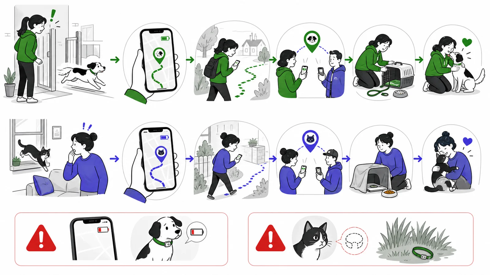

Eine Katze kann wenige Meter vom Kartenpunkt entfernt **vollständig unsichtbar** sein. GPS verkleinert das Gebiet; die eigentliche Nahsuche bleibt leise und systematisch.

## Nahbereich statt Pin-Mitte

Kontrolliere mit Erlaubnis Garagen, Keller, Schuppen, Fahrzeuge, Hecken und Hohlräume. Nutze mehrere Updates als Korridor. Ein einzelner Punkt ist keine exakte Aussage über Höhe, Versteck oder Zugänglichkeit.

Bei Kitten, alten oder kranken Katzen sowie Hinweisen auf Unfall, Sturz oder Verletzung gilt: sichere den Fundort, gefährde dich nicht selbst und kontaktiere unverzüglich eine Tierarztpraxis beziehungsweise den tierärztlichen Notdienst. GPS ersetzt keine medizinische Notfallversorgung.

## Sicherheitshalsband richtig interpretieren

Öffnet es sich, hat es seine Schutzaufgabe erfüllt. Verändere den Verschluss nicht, um Trackerverlust zu verhindern. Die sichere Vorbereitung steht in [GPS-Tracker richtig befestigen](/gps-tracker-richtig-befestigen/).

Passende Modelle vergleicht [Beste GPS-Tracker für Katzen](/vergleiche/beste-gps-tracker-fuer-katzen/). Die Kartenunsicherheit erklärt [Wie genau sind GPS-Tracker?](/wie-genau-sind-gps-tracker/).

## Quellen

Die Such- und Registrierungshinweise folgen den offiziellen TASSO-Empfehlungen.

- [TASSO – Katze entlaufen](https://www.tasso.net/Service/Wissensportal/Katze/Katze-entlaufen)
- [TASSO – Tier vermisst melden](https://www.tasso.net/Tierregister/Tier-vermisst/Tier-vermisst-melden)
- [TASSO – Kennzeichnung und Registrierung](https://www.tasso.net/Tierschutz/verantwortungsvolle-tierhaltung/leben-mit-katze/kennzeichnung-und-registrierung-wohnungskatzen)
