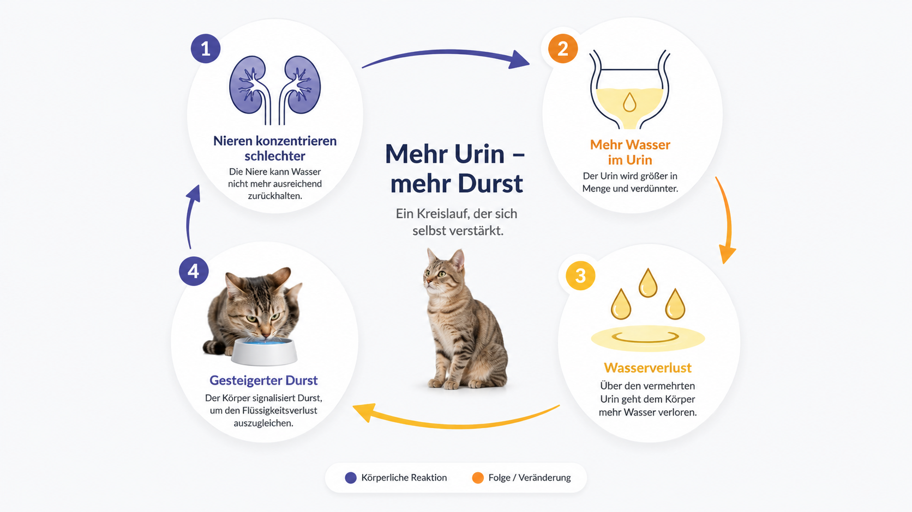
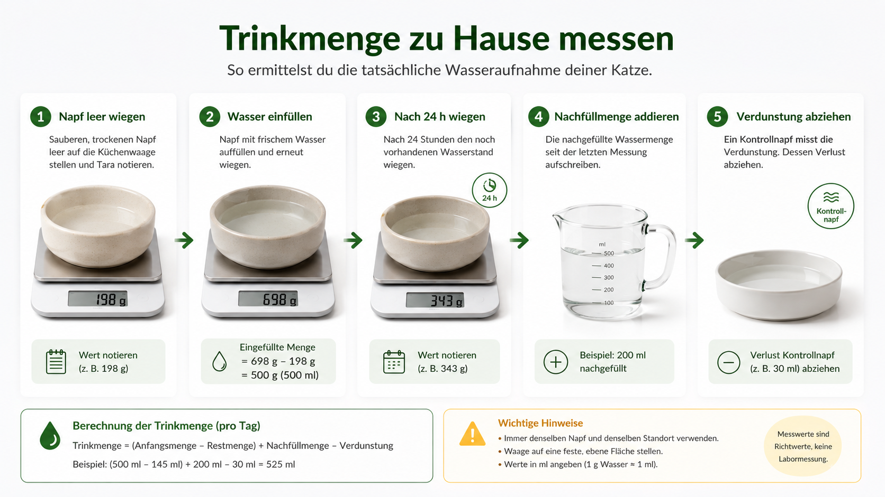
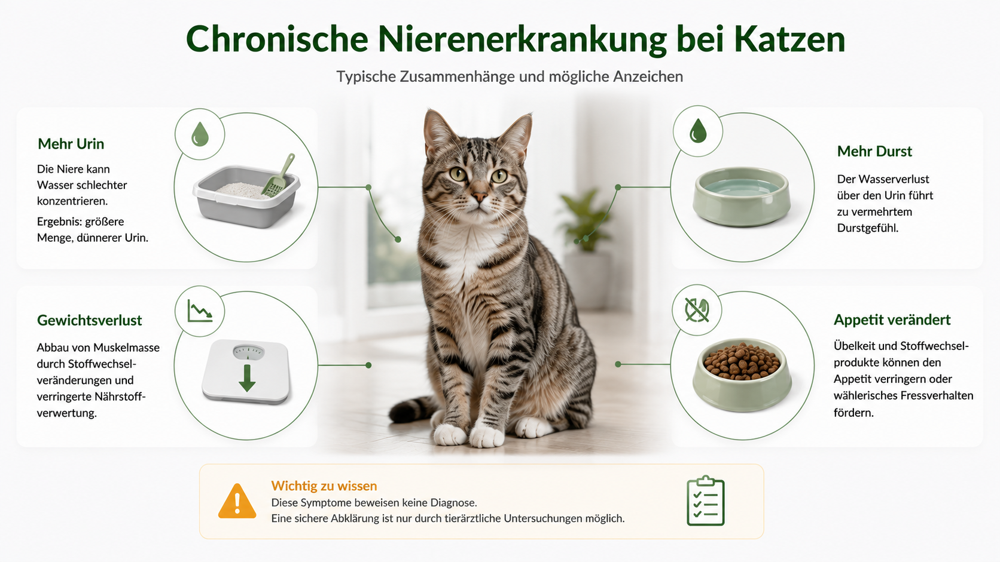
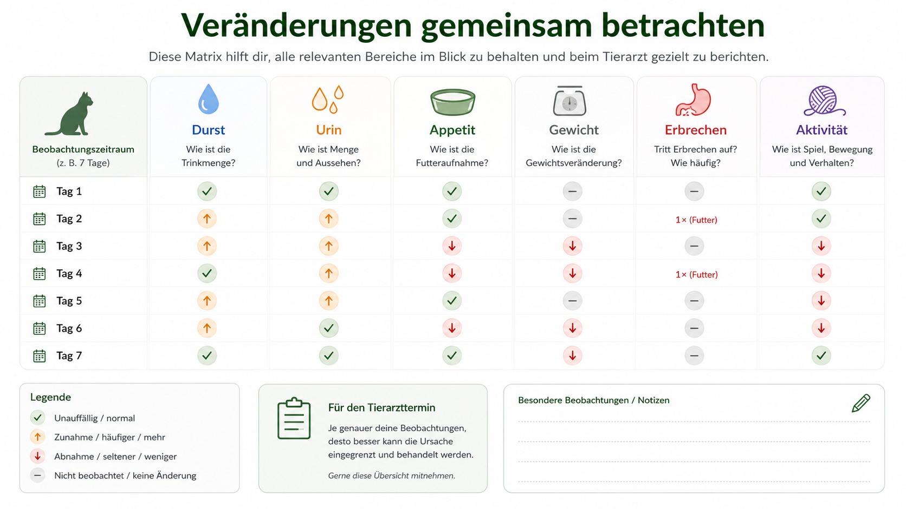
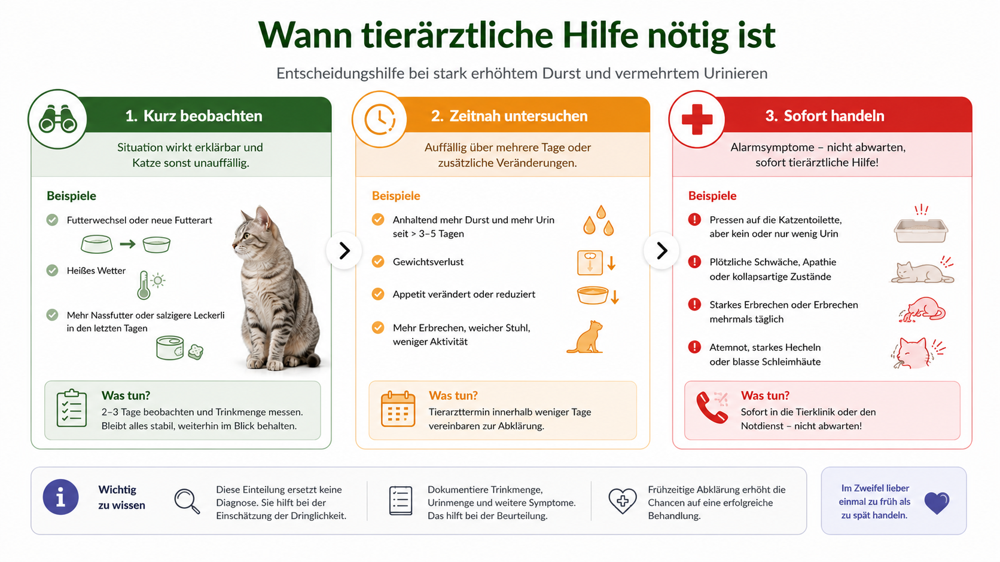
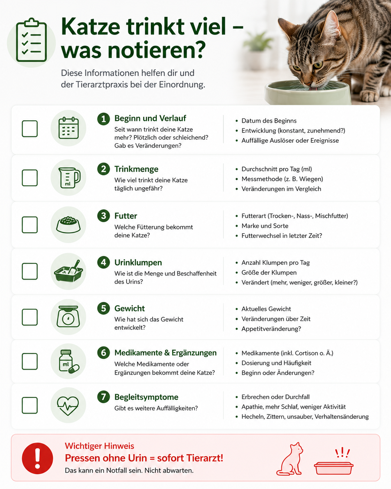

## Die kurze Antwort

Trinkt eine Katze plötzlich oder dauerhaft deutlich mehr als sonst, sollte das nicht als harmlose Eigenart abgetan werden.

Mehr Durst kann nach einem Wechsel auf Trockenfutter, bei Hitze oder nach sehr salzhaltigem Futter auftreten.

Eine deutliche und anhaltende Veränderung kann aber auch zu einer chronischen Nierenerkrankung, Diabetes mellitus, Schilddrüsenüberfunktion, Medikamentenwirkung oder anderen Erkrankungen passen.

Besonders wichtig ist die Kombination aus Trinken und Urinieren.

Viele betroffene Katzen trinken mehr, weil sie über den Urin mehr Wasser verlieren.

Achte deshalb nicht nur auf den Wassernapf, sondern auch auf größere oder häufigere Urinklumpen, Gewichtsverlust, Appetitveränderung, Erbrechen, Schwäche und Verhaltensänderungen.

Eine einmalige Beobachtung beweist nichts.

Ein klarer Trend über mehrere Tage oder zusätzliche Symptome gehört tierärztlich abgeklärt.

## Direkt zum passenden Problem

- [Die Katze trinkt plötzlich viel](#katze-trinkt-ploetzlich-viel)
- [Trinken und Urinieren nehmen gemeinsam zu](#warum-trinken-und-urinieren-oft-gemeinsam-zunehmen)
- [Alte Katze trinkt viel](#alte-katze-trinkt-viel)
- [Mögliche Nierenerkrankung](#chronische-nierenerkrankung)
- [Möglicher Diabetes](#diabetes-mellitus)
- [Mögliche Schilddrüsenüberfunktion](#schilddruesenueberfunktion)
- [Trinkmenge messen](#trinkmenge-zu-hause-messen)
- [Wann zum Tierarzt?](#wann-tierarztliche-hilfe-noetig-ist)

## Was bedeutet Polydipsie?

Polydipsie ist der medizinische Begriff für übermäßig gesteigerten Durst beziehungsweise eine erhöhte Wasseraufnahme.

Häufig tritt sie zusammen mit Polyurie auf.

Polyurie bedeutet eine erhöhte Urinmenge.

Diese beiden Symptome gehören zusammen, weil der Körper Wasserverluste ausgleichen muss.

Die Katze trinkt also nicht zwingend „zu viel aus Gewohnheit“.

Sie kann trinken, weil ihre Nieren mehr Wasser ausscheiden oder weil Stoffwechselveränderungen die Urinproduktion erhöhen.

Polydipsie ist keine Diagnose.

Sie ist ein Hinweis, der zusammen mit Futter, Urin, Gewicht, Medikamenten und Laborwerten beurteilt wird.

## Warum Trinken und Urinieren oft gemeinsam zunehmen

Die Nieren regulieren, wie viel Wasser im Körper bleibt und wie stark der Urin konzentriert wird.

Wenn diese Konzentrationsfähigkeit nachlässt, wird mehr verdünnter Urin ausgeschieden.

Die Katze verliert Wasser.

Als Ausgleich entsteht mehr Durst.

Dieser Kreislauf ist typisch für mehrere Erkrankungsgruppen.

Dazu gehören unter anderem:

- chronische Nierenerkrankung
- Diabetes mellitus
- Schilddrüsenüberfunktion
- bestimmte Lebererkrankungen
- Störungen des Kalziumhaushalts
- Erkrankungen der Gebärmutter bei unkastrierten Katzen
- Nebenwirkungen bestimmter Medikamente

Nicht jede viel trinkende Katze hat eine dieser Erkrankungen.

Die Kombination aus großen Urinklumpen und starkem Durst ist aber ein guter Grund für eine Untersuchung.

## Katze trinkt plötzlich viel

Ein abrupter Anstieg ist besonders auffällig.

Prüfe zunächst, ob sich äußere Bedingungen verändert haben:

- Wechsel von Nassfutter zu Trockenfutter
- neue Futtersorte
- wärmeres Wetter
- Heizungsluft
- neue Medikamente
- Kortisonbehandlung
- entwässernde Medikamente
- salzhaltige Leckerli
- neue Wasserstelle
- Trinkbrunnen
- mehr Aktivität

Auch wenn eine plausible Veränderung vorliegt, sollte ein sehr starker oder anhaltender Anstieg nicht vorschnell erklärt werden.

Zeitlicher Zusammenhang ist ein Hinweis, kein Beweis.

Notiere den Beginn so genau wie möglich.

Für die Tierarztpraxis ist wichtig, ob die Veränderung innerhalb von Stunden, Tagen oder Monaten entstanden ist.

## Wann viel Trinken normal sein kann

Mehr sichtbares Trinken ist nicht automatisch krankhaft.

### Nach Wechsel auf Trockenfutter

Trockenfutter liefert deutlich weniger Wasser als Nassfutter.

Darum muss mehr Wasser direkt aufgenommen werden.

### Bei Wärme

An warmen Tagen kann die Wasseraufnahme steigen.

Starkes Hecheln, Schwäche oder Teilnahmslosigkeit sind jedoch nicht normal.

### Nach mehr Aktivität

Spiel und Bewegung können kurzfristig Durst auslösen.

### Bei Laktation

Säugende Katzen haben einen erhöhten Bedarf.

### Nach sehr salzhaltigem Futter

Salz kann Durst verstärken.

Absichtliches Zufüttern von Salz ist keine sichere Trinkstrategie.

### Nach neuen Medikamenten

Einige Medikamente erhöhen Durst und Urinproduktion.

Sie dürfen nicht eigenmächtig abgesetzt werden.

Normal bedeutet hier: erklärbar, vorübergehend und ohne weitere Auffälligkeiten.

Bleibt die Veränderung bestehen, braucht sie eine Abklärung.

## Wann viel Trinken eher auffällig ist

Auffällig ist eine Wasseraufnahme besonders dann, wenn sie:

- neu ist
- täglich anhält
- deutlich zunimmt
- mit großen Urinklumpen einhergeht
- nachts häufiger auftritt
- mit Gewichtsverlust verbunden ist
- zusammen mit Erbrechen auftritt
- mit Schwäche oder Rückzug verbunden ist
- trotz normaler Umgebung zunimmt
- bei einer älteren Katze erstmals auftritt

Auch das Suchen ungewöhnlicher Wasserquellen kann auffallen.

Beispiele sind Toiletten, Dusche, Wasserhahn, Pflanzenuntersetzer oder Gläser.

Das Verhalten beweist keine Erkrankung.

Es kann aber zeigen, dass der Durst stärker geworden ist.

## Wie viel ist zu viel?

Ein allgemeiner Grenzwert wirkt präzise, ist im Alltag aber leicht missverständlich.

Der Wasserbedarf hängt von Körpergewicht, Futterfeuchte, Umgebung, Aktivität und Erkrankungen ab.

Richtwerte beziehen sich meist auf die gesamte Wasseraufnahme aus Futter und Trinkwasser.

Eine Nassfutterkatze kann am Napf wenig trinken.

Eine Trockenfutterkatze muss deutlich mehr direkt trinken.

Deshalb ist eine persönliche Basislinie oft hilfreicher als ein einzelner Universalwert.

### Praktische Bewertung

Vergleiche:

- heutige Trinkmenge mit früheren Tagen
- Futterart
- Futtermenge
- Raumtemperatur
- Zahl und Größe der Urinklumpen
- Körpergewicht
- Appetit
- Verhalten

Eine deutliche Abweichung vom eigenen Normalbereich ist relevant, auch wenn kein pauschaler Grenzwert überschritten wurde.

## Trinkmenge zu Hause messen

Wiegen ist meist genauer als das Ablesen einer Skala.

Ein Gramm Wasser entspricht näherungsweise einem Milliliter.

### Vorgehen

1. Leeren, trockenen Napf wiegen.
2. Wasser einfüllen.
3. Gesamtgewicht notieren.
4. Nach 24 Stunden erneut wiegen.
5. Nachfüllmengen addieren.
6. Verschüttetes Wasser berücksichtigen.
7. Verdunstung abschätzen.
8. Messung mehrere Tage wiederholen.

### Kontrollnapf

Stelle einen zweiten Napf mit derselben Wassermenge in denselben Raum.

Er muss für die Katze unzugänglich sein.

Sein Gewichtsverlust zeigt ungefähr die Verdunstung.

Ziehe diesen Wert vom Verlust des Trinknapfs ab.

Das ist keine klinische Messung.

Es verbessert aber die Alltagsschätzung.

## Trinkbrunnen richtig messen

Bei einem Brunnen ist die Messung schwieriger.

Wasser bleibt in Pumpe, Leitungen und Filter.

Zusätzlich gibt es Verdunstung und Spritzer.

### Sinnvolles Vorgehen

- Brunnen vollständig auf denselben Füllstand bringen
- Gesamtgewicht dokumentieren, sofern die Waage geeignet ist
- Nachfüllmengen notieren
- Filterwechsel und Reinigungstage markieren
- sichtbare Spritzverluste berücksichtigen
- täglich zur gleichen Zeit messen

Ein Füllstandssensor liefert meist nur eine grobe Orientierung.

Ein Brunnenbesuch bedeutet außerdem nicht automatisch, dass viel getrunken wurde.

Manche Katzen beobachten oder berühren das Wasser nur.

## Gesamtwasser aus Futter und Napf

Die sichtbare Trinkmenge ist nur ein Teil der Gesamtaufnahme.

### Näherungsformel

Wasser aus Futter in Millilitern ≈ Futtermenge in Gramm × Feuchtigkeitsanteil.

Beispiel:

200 Gramm Nassfutter mit 80 Prozent Feuchtigkeit liefern rechnerisch ungefähr 160 Milliliter Wasser.

60 Gramm Trockenfutter mit 8 Prozent Feuchtigkeit liefern ungefähr 5 Milliliter.

Die Rechnung zeigt die Größenordnung.

Sie ist keine exakte klinische Bilanz.

Nicht gefressene Reste, Schwankungen im Feuchtigkeitsgehalt und Messfehler müssen berücksichtigt werden.

Mehr zum gegenteiligen Problem findest du im Ratgeber [Woran erkennt man, dass eine Katze zu wenig trinkt?](/woran-erkennt-man-dass-die-katze-zu-wenig-trinkt/).

## Was das Katzenklo verrät

Das Katzenklo ist bei starkem Durst besonders wichtig.

### Hinweise auf mehr Urin

- größere Klumpen
- häufigere Klumpen
- schneller verbrauchtes Streu
- Urin außerhalb der Toilette
- häufigeres Aufsuchen
- sehr heller oder verdünnt wirkender Urin

Mehr Urin heißt nicht automatisch, dass die Katze nur „gut trinkt“.

Es kann bedeuten, dass der Körper Wasser nicht ausreichend zurückhält.

### Verwechslungsgefahr

Viele kleine Klumpen mit Pressen und Schmerzen sprechen eher für ein Problem der unteren Harnwege als für klassische Polyurie.

Kein oder kaum Urin trotz Pressen ist ein Notfall.

Das gilt besonders für Kater.

## Chronische Nierenerkrankung

Chronische Nierenerkrankungen gehören zu den häufigen Ursachen von vermehrtem Trinken und Urinieren bei älteren Katzen.

Die Nieren verlieren zunehmend die Fähigkeit, Urin stark zu konzentrieren.

Dadurch wird mehr Wasser ausgeschieden.

Die Katze versucht, den Verlust durch Trinken auszugleichen.

### Mögliche Begleitzeichen

- Gewichtsverlust
- schlechterer Appetit
- Erbrechen
- Übelkeit
- Mundgeruch
- Müdigkeit
- Muskelabbau
- stumpferes Fell
- Verstopfung
- hoher Blutdruck

Frühe Stadien können wenig auffällig sein.

Eine Diagnose erfolgt nicht allein über Durst.

Blut, Urin, Blutdruck und gegebenenfalls Bildgebung werden gemeinsam beurteilt.

Das Cornell Feline Health Center beschreibt gesteigerten Durst und vermehrtes Urinieren als typische mögliche Zeichen chronischer Nierenerkrankung.

Quelle: [Cornell Feline Health Center – Chronic Kidney Disease](https://www.vet.cornell.edu/departments-centers-and-institutes/cornell-feline-health-center/health-information/feline-health-topics/chronic-kidney-disease).

## Diabetes mellitus

Bei Diabetes mellitus bleibt zu viel Glukose im Blut.

Überschreitet die Glukose die Rückhaltefähigkeit der Nieren, gelangt sie in den Urin.

Glukose zieht Wasser mit sich.

Dadurch steigt die Urinmenge und anschließend der Durst.

### Typische mögliche Kombination

- viel Trinken
- viel Urin
- Gewichtsverlust
- anfangs guter oder gesteigerter Appetit
- später schlechter Appetit
- Schwäche
- stumpfes Fell
- Hinterhandschwäche

Nicht jede Katze zeigt alle Zeichen.

Bei Erbrechen, Futterverweigerung, starker Schwäche oder auffälliger Atmung ist rasche Hilfe nötig.

Die Diagnose erfolgt über Untersuchung, Blut- und Urinwerte.

Quelle: [Cornell Feline Health Center – Feline Diabetes](https://www.vet.cornell.edu/departments-centers-and-institutes/cornell-feline-health-center/health-information/feline-health-topics/feline-diabetes).

## Schilddrüsenüberfunktion

Eine Schilddrüsenüberfunktion tritt besonders bei älteren Katzen auf.

Der Stoffwechsel läuft beschleunigt.

### Mögliche Zeichen

- Gewichtsverlust
- gesteigerter Appetit
- Unruhe
- mehr Aktivität
- lautes Miauen
- Erbrechen
- Durchfall
- schneller Herzschlag
- mehr Trinken
- mehr Urin

Manche Katzen wirken anfangs ungewöhnlich lebhaft.

Das kann die Erkrankung verdecken.

Andere wirken schwach und appetitlos.

Die Diagnose erfolgt unter anderem über Schilddrüsenwerte im Blut.

Quelle: [Cornell Feline Health Center – Hyperthyroidism in Cats](https://www.vet.cornell.edu/departments-centers-and-institutes/cornell-feline-health-center/health-information/feline-health-topics/hyperthyroidism-cats).

## Weitere mögliche Ursachen

### Medikamente

Kortikosteroide und entwässernde Medikamente können Durst und Urinmenge erhöhen.

### Lebererkrankungen

Bestimmte Leberprobleme können die Wasseraufnahme verändern.

### Erhöhter Kalziumspiegel

Hyperkalzämie kann vermehrtes Trinken und Urinieren auslösen.

### Infektionen

Einige Infektionen beeinflussen Allgemeinzustand, Nieren oder Stoffwechsel.

### Gebärmuttervereiterung

Bei unkastrierten Katzen kann eine Pyometra lebensbedrohlich sein.

Mögliche Zeichen sind Durst, Mattigkeit, Fieber, Ausfluss oder ein vergrößerter Bauch.

### Seltene hormonelle Ursachen

Störungen der Wasserregulation sind möglich, aber deutlich seltener.

Die Ursachenliste zeigt, warum eine Diagnose anhand des Napfes nicht möglich ist.

## Alte Katze trinkt viel

Mehr Durst sollte bei einer alten Katze nicht als normale Alterserscheinung abgetan werden.

Gerade im höheren Alter steigen die Risiken für:

- chronische Nierenerkrankung
- Schilddrüsenüberfunktion
- Diabetes
- Bluthochdruck
- Tumorerkrankungen
- Medikamentennebenwirkungen

Zusätzliche Hinweise sind Gewichtsverlust, Muskelabbau, verändertes Fell, Unruhe, Erbrechen oder größere Urinklumpen.

Eine früh erkannte Erkrankung lässt sich häufig besser behandeln oder kontrollieren als eine spät erkannte.

Regelmäßige Seniorenkontrollen sind deshalb sinnvoll.

## Junge Katze trinkt viel

Auch junge Katzen können auffällig viel trinken.

Häufigere harmlose Erklärungen sind Aktivität, Wärme und Trockenfutter.

Erkrankungen sind trotzdem möglich.

Dazu gehören Diabetes, angeborene Nierenprobleme, Infektionen und seltene hormonelle Störungen.

Bei einem Kitten sind zusätzlich Wachstum, Futtermenge und Durchfall wichtig.

Junge Tiere können sich bei Flüssigkeitsverlust schneller verschlechtern.

## Futterwechsel als Ursache

Ein Wechsel von Nassfutter zu Trockenfutter verändert die sichtbare Trinkmenge oft deutlich.

Das ist physiologisch plausibel.

Trotzdem sollte geprüft werden:

- Wann erfolgte der Wechsel?
- Wie groß ist der Trockenfutteranteil?
- Frisst die Katze dieselbe Energiemenge?
- Sind die Urinklumpen größer?
- Gibt es Gewichtsverlust?
- Bestehen weitere Symptome?

Ein Futterwechsel darf nicht zur Standarderklärung für jede neue Polydipsie werden.

Zeitlicher Zusammenhang und Allgemeinzustand entscheiden.

## Medikamente und Nahrungsergänzung

Notiere alle Medikamente, auch wenn sie nicht direkt mit Durst verbunden erscheinen.

Dazu gehören:

- Kortison
- Diuretika
- Schilddrüsenmedikamente
- Insulin
- Schmerzmittel
- Blutdruckmedikamente
- Nahrungsergänzung
- Elektrolytlösungen

Setze nichts eigenmächtig ab.

Einige Medikamente müssen schrittweise verändert werden.

Die Tierarztpraxis benötigt Wirkstoff, Dosis, Beginn und letzte Gabe.

## Hitze und Umgebung

Wärme kann die Wasseraufnahme erhöhen.

Katzen regulieren ihre Temperatur jedoch nicht in erster Linie durch starkes Hecheln wie Hunde.

### Warnzeichen bei Hitze

- starkes Hecheln
- Speicheln
- Schwäche
- Taumeln
- Erbrechen
- sehr rote oder sehr blasse Schleimhäute
- Kollaps

Dann ist sofortige Hilfe nötig.

Stelle mehrere saubere Wasserstellen bereit.

Direkte Sonne und überhitzte Räume vermeiden.

Ein stark erhöhter Durst über kühlere Tage hinaus sollte nicht allein mit Sommerwetter erklärt werden.

## Verhalten und Stress

Stress kann Trinkverhalten verändern.

Manche Katzen trinken weniger.

Andere suchen häufiger bestimmte Wasserstellen auf.

Mögliche Auslöser:

- Umzug
- neue Katze
- neues Baby
- Bauarbeiten
- veränderte Möbel
- Konflikte
- neuer Napf
- neuer Brunnen
- geänderte Fütterungszeit

Eine körperliche Ursache muss bei anhaltendem starkem Durst trotzdem ausgeschlossen werden.

„Psychisch“ ist keine sichere Ausschlussdiagnose.

## Mehrkatzenhaushalt

In einem Mehrkatzenhaushalt ist die individuelle Zuordnung schwierig.

Eine Katze kann viel trinken, während eine andere kaum Zugang hat.

### Beobachtungsmöglichkeiten

- mehrere räumlich getrennte Wasserstellen
- Kamera
- zeitweise getrennte Räume
- individuelle Näpfe
- gewogene Wassermengen
- mehrere Katzenklos
- unterschiedliche Streuart oder Position

Trennung darf nicht so stressig sein, dass sie das Verhalten verfälscht.

Bei deutlichen Symptomen wird nicht erst tagelang gemessen.

## Information Gain: Persönliche Basislinie

Eine persönliche Basislinie verbessert die Einschätzung.

An drei bis sieben normalen Tagen werden dokumentiert:

- sichtbare Trinkmenge
- Futterart
- Futtermenge
- Urinklumpen
- Gewicht
- Raumtemperatur
- Aktivität

Wichtig ist die Spannweite.

Eine Katze trinkt nicht jeden Tag exakt gleich viel.

Später lässt sich ein neuer Trend besser erkennen.

Eine Basislinie ersetzt keine Untersuchung bei akuten Warnzeichen.

## Information Gain: Durchschnitt aus mehreren Tagen

Ein einzelner Messwert ist anfällig für Fehler.

Berechne besser einen Durchschnitt aus drei bis fünf Tagen.

### Beispiel

| Tag | Gemessene Trinkmenge |
|---|---:|
| 1 | 90 ml |
| 2 | 110 ml |
| 3 | 100 ml |
| 4 | 160 ml |
| 5 | 170 ml |

Die ersten drei Tage ergeben ungefähr 100 Milliliter.

Die letzten beiden Tage zeigen einen deutlichen Anstieg.

Das Muster ist relevanter als ein isolierter Wert von 160 Millilitern.

## Information Gain: Urinklumpen fotografisch vergleichen

Fotos helfen, Größenveränderungen objektiver zu verfolgen.

Lege einen neutralen Vergleichsgegenstand neben den Klumpen, ohne ihn zu berühren.

Nutze immer dieselbe Perspektive.

Notiere Datum und Uhrzeit.

Bei klumpender Streu ist die Größe nur eine Näherung.

Streumenge, Klumpenbildung und mehrere Toilettengänge beeinflussen das Ergebnis.

Fotos ersetzen keine Urinmessung.

## Information Gain: Gewicht als Frühwarnsignal

Wiege die Katze wöchentlich, wenn vermehrter Durst auffällt.

### Methode

1. Transportbox leer wiegen.
2. Katze in der Box wiegen.
3. Differenz berechnen.
4. Datum notieren.
5. Dieselbe Waage verwenden.

Gewichtsverlust trotz gutem Appetit kann bei Diabetes oder Schilddrüsenüberfunktion auftreten.

Gewichtsverlust mit schlechtem Appetit passt auch zu Nieren- oder anderen Erkrankungen.

Der Trend ist wichtiger als eine einzelne kleine Schwankung.

## Information Gain: Kamera sinnvoll nutzen

Eine Kamera kann zeigen:

- welche Katze trinkt
- wann sie trinkt
- wie lange sie an der Wasserstelle bleibt
- ob sie nur spielt
- ob eine andere Katze blockiert
- ob nächtliches Trinken zunimmt

Sie misst keine Milliliter.

Sie erkennt keine Erkrankung.

Sie ergänzt das Protokoll.

## Begleitsymptome systematisch dokumentieren

Notiere täglich:

- Trinkmenge
- Urinklumpen
- Futtermenge
- Appetit
- Gewicht
- Erbrechen
- Durchfall
- Aktivität
- Medikamente
- besondere Ereignisse

Diese Kombination hilft, Ursachen einzugrenzen.

Beispiele:

- Durst + große Urinklumpen + Gewichtsverlust
- Durst + guter Appetit + Gewichtsverlust
- Durst + Erbrechen + schlechter Appetit
- Durst + neue Kortisongabe
- Durst + Futterwechsel

Keines dieser Muster beweist eine Diagnose.

## Wann tierärztliche Hilfe nötig ist

### Sofort

- Pressen ohne Urin
- Kollaps
- schwere Schwäche
- auffällige Atmung
- wiederholtes Erbrechen mit Teilnahmslosigkeit
- Krampfanfälle
- starke Schmerzen
- Bewusstseinsstörung
- Verdacht auf Vergiftung

### Noch am selben Tag

- starker Durst mit Futterverweigerung
- starker Durst mit Erbrechen
- deutlicher Gewichtsverlust
- sehr große Urinmengen
- bekannte Diabeteserkrankung mit Verschlechterung
- bekannte Nierenerkrankung mit Schwäche
- unkastrierte Katze mit Fieber oder Ausfluss

### Zeitnah

- neue Veränderung über mehrere Tage
- schleichend zunehmender Durst
- größere Urinklumpen
- nächtliches Trinken
- Gewichtsverlust
- verändertes Verhalten
- wiederkehrende Auffälligkeit

## Was die Tierarztpraxis wahrscheinlich prüft

Die Auswahl der Untersuchungen hängt von Alter, Verlauf und Begleitsymptomen ab.

Möglich sind:

- Allgemeinuntersuchung
- Gewicht und Körperzustand
- Schleimhäute
- Herzfrequenz
- Blutdruck
- Bauchabtastung
- Blutbild
- Blutchemie
- Nierenwerte
- Glukose
- Elektrolyte
- Kalzium
- Schilddrüsenwert
- Urinuntersuchung
- spezifisches Uringewicht
- Urinkultur
- Ultraschall
- Röntgen

Trinkmenge allein reicht für keine Diagnose.

## Warum eine Urinprobe wichtig ist

Die Urinuntersuchung zeigt unter anderem, wie stark der Urin konzentriert ist.

Sie kann Hinweise liefern auf:

- Glukose
- Protein
- Blut
- Entzündung
- Bakterien
- Kristalle
- Konzentrationsfähigkeit der Nieren

Eine Probe aus dem Katzenklo ist nicht für jede Untersuchung gleich geeignet.

Verunreinigungen und Lagerung beeinflussen das Ergebnis.

Kläre mit der Praxis, ob und wie eine Probe mitgebracht werden soll.

## Warum Blutwerte allein nicht reichen

Blutwerte werden zusammen mit Urin, Untersuchung und Verlauf interpretiert.

Dehydration kann bestimmte Werte verändern.

Muskelmasse beeinflusst Kreatinin.

Stress kann bei Katzen den Blutzucker erhöhen.

Schilddrüsenwerte können in Grenzbereichen liegen.

Darum ist die Gesamtschau wichtiger als ein einzelner Laborwert.

## Was Sie nicht tun sollten

### Wasser begrenzen

Eine viel trinkende Katze darf nicht absichtlich weniger Wasser bekommen.

Das kann Dehydration verschlimmern.

### Medikamente absetzen

Nicht ohne tierärztliche Rücksprache.

### Salz zufüttern

Keine sichere Standardstrategie.

### Diagnose aus dem Internet ableiten

Symptome überschneiden sich stark.

### Wochenlang nur messen

Bei anhaltender Veränderung ist Untersuchung sinnvoller.

### Trinkbrunnen als Behandlung nutzen

Ein Brunnen behandelt keine Nieren-, Hormon- oder Stoffwechselerkrankung.

## Wasserstellen während der Abklärung

Wasser muss jederzeit frei verfügbar bleiben.

Biete:

- mehrere saubere Näpfe
- ruhige Standorte
- gut erreichbare Gefäße
- rutschfeste Unterlagen
- Wasser in mehreren Räumen
- bei Bedarf zusätzlich einen Brunnen

Entferne eine vertraute Wasserquelle nicht abrupt.

Eine Katze mit starkem Durst braucht zuverlässigen Zugang.

Mehr über unterschiedliche Wasserpräferenzen findest du unter [Warum Katzen lieber fließendes Wasser trinken](/warum-katzen-fliessendes-wasser-trinken/).

## Trinkbrunnen: hilfreich, aber diagnostisch begrenzt

Ein Brunnen kann dazu führen, dass die Katze häufiger zur Wasserstelle geht.

Das kann an Bewegung, Geräusch, Standort oder Form liegen.

Es sagt nicht, warum sie Durst hat.

### Während einer Messphase

- Brunnenfüllstand dokumentieren
- Spritzer berücksichtigen
- Pumpe reinigen
- Filterwechsel notieren
- bekannte Näpfe parallel lassen

Ein neuer Brunnen während einer laufenden Diagnose kann die Vergleichbarkeit verändern.

Deshalb sollte die Umstellung dokumentiert werden.

## Häufige Fehler

| Fehler | Warum problematisch | Bessere Lösung |
|---|---|---|
| Viel Trinken als gesund bewerten | kann Verlust ausgleichen | Urin und Begleitsymptome prüfen |
| Nur einen Tag messen | hohe Schwankung möglich | mehrere Tage dokumentieren |
| Trockenfutter als einzige Erklärung | Erkrankung kann parallel bestehen | Verlauf und Untersuchung |
| Alter als Ursache nennen | Alter ist keine Diagnose | Seniorenkontrolle |
| Wasser wegstellen | Dehydrationsrisiko | freien Zugang sichern |
| Nur auf den Napf schauen | Futterwasser fehlt | Gesamtaufnahme berechnen |
| Große Urinklumpen ignorieren | Polyurie möglich | dokumentieren und abklären |
| Brunnenbesuche zählen | Besuch ist keine Menge | wiegen und beobachten |

## Praktisches Protokoll

| Datum | Wasser | Futter | Urinklumpen | Gewicht | Auffälligkeiten |
|---|---:|---|---|---:|---|
| 15.07. | 110 ml | Nassfutter 180 g | 3 normal | 4,8 kg | unauffällig |
| 16.07. | 165 ml | Nassfutter 170 g | 4 groß | 4,75 kg | nachts häufiger am Napf |
| 17.07. | 190 ml | Nassfutter 150 g | 5 groß | 4,7 kg | weniger Appetit |

Das Beispiel zeigt einen Trend.

Es beweist keine Ursache.

Die Kombination aus mehr Wasser, größeren Urinklumpen, weniger Futter und Gewichtsverlust ist jedoch ein guter Grund für eine zeitnahe Untersuchung.

## FAQ zur Praxis

### Meine Katze trinkt viel, frisst aber normal. Ist das harmlos?

Nicht automatisch.

Bei Diabetes oder Schilddrüsenüberfunktion kann der Appetit zunächst normal oder erhöht sein.

### Meine Katze trinkt viel und nimmt ab. Was kann dahinterstecken?

Unter anderem Nierenkrankheit, Diabetes und Schilddrüsenüberfunktion.

Die Kombination gehört untersucht.

### Meine Katze trinkt viel und erbricht.

Erbrechen erhöht den Flüssigkeitsverlust und kann bei mehreren Erkrankungen auftreten.

Bei wiederholtem Erbrechen oder schlechtem Allgemeinzustand noch am selben Tag abklären.

### Meine Katze trinkt viel und uriniert neben das Klo.

Große Urinmengen können das Katzenklo schneller verschmutzen.

Auch Schmerzen, Stress und Harnwegserkrankungen sind möglich.

### Meine Katze trinkt nachts viel.

Nächtliches Trinken kann vorher unbemerkt gewesen sein.

Ist es neu oder deutlich mehr, sollte es dokumentiert werden.

### Meine Katze trinkt viel nach Kortison.

Kortison kann Durst und Urinmenge erhöhen.

Die Behandlung nicht eigenmächtig verändern.

### Meine Katze trinkt viel aus dem Wasserhahn.

Das kann Vorliebe oder gesteigerter Durst sein.

Achte auf Gesamtmenge und andere Wasserquellen.

### Muss ich sofort zum Tierarzt?

Bei akuten Warnzeichen sofort.

Bei einer neuen, anhaltenden Veränderung zeitnah.

### Kann ich die Trinkmenge begrenzen?

Nein.

Wasser muss frei verfügbar bleiben.

### Hilft mehr Nassfutter?

Es kann die Gesamtwasseraufnahme erhöhen.

Es behandelt aber nicht die Ursache von starkem Durst.

## Quellen

- [Cornell Feline Health Center – Chronic Kidney Disease](https://www.vet.cornell.edu/departments-centers-and-institutes/cornell-feline-health-center/health-information/feline-health-topics/chronic-kidney-disease)
- [Cornell Feline Health Center – Feline Diabetes](https://www.vet.cornell.edu/departments-centers-and-institutes/cornell-feline-health-center/health-information/feline-health-topics/feline-diabetes)
- [Cornell Feline Health Center – Hyperthyroidism in Cats](https://www.vet.cornell.edu/departments-centers-and-institutes/cornell-feline-health-center/health-information/feline-health-topics/hyperthyroidism-cats)
- [International Renal Interest Society – IRIS Guidelines](https://www.iris-kidney.com/guidelines/)
- [MSD Veterinary Manual – Polyuria and Polydipsia](https://www.msdvetmanual.com/)
- [International Cat Care – Encouraging your cat to drink](https://icatcare.org/advice/how-to-encourage-your-cat-to-drink/)

## Praktische Checkliste

Vor dem Tierarzttermin notieren:

- seit wann die Katze mehr trinkt
- geschätzte oder gemessene Menge
- Nass- oder Trockenfutter
- Futtermenge
- Zahl und Größe der Urinklumpen
- Gewichtsverlauf
- Appetit
- Erbrechen oder Durchfall
- Aktivität
- Medikamente
- bekannte Erkrankungen
- neue Futter- oder Umweltveränderungen

## Fazit

Eine Katze, die deutlich mehr trinkt als sonst, gleicht möglicherweise einen erhöhten Wasserverlust aus.

Darum gehören Trinkmenge und Urinmenge zusammen betrachtet.

Harmlose Erklärungen wie Wärme oder ein Wechsel auf Trockenfutter sind möglich.

Eine neue oder anhaltende Veränderung kann aber auch zu chronischer Nierenerkrankung, Diabetes mellitus, Schilddrüsenüberfunktion oder Medikamentenwirkungen passen.

Messe nicht nur Wasser.

Dokumentiere Futter, Urinklumpen, Gewicht, Appetit, Verhalten und Medikamente.

Begrenze den Wasserzugang niemals.

Bei Gewichtsverlust, Erbrechen, Schwäche, Futterverweigerung oder auffälligem Urinabsatz ist eine zeitnahe Untersuchung nötig.

Pressen ohne Urin, Kollaps oder schwere Schwäche sind Notfälle.
