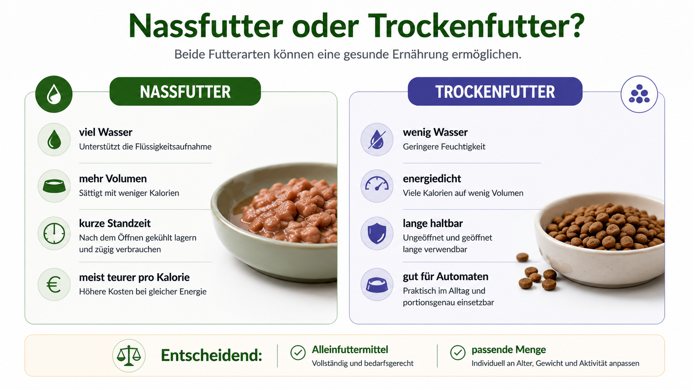
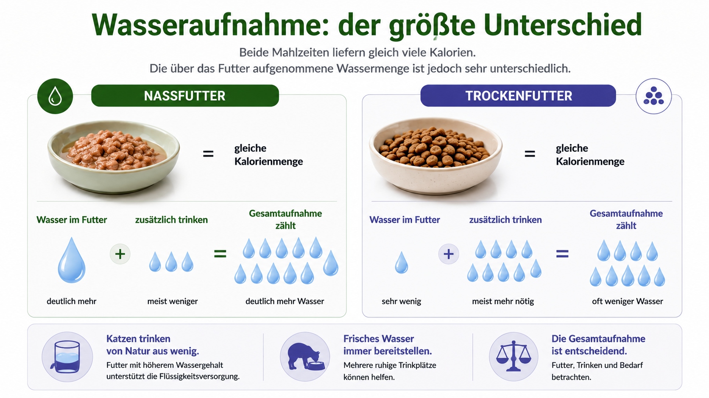
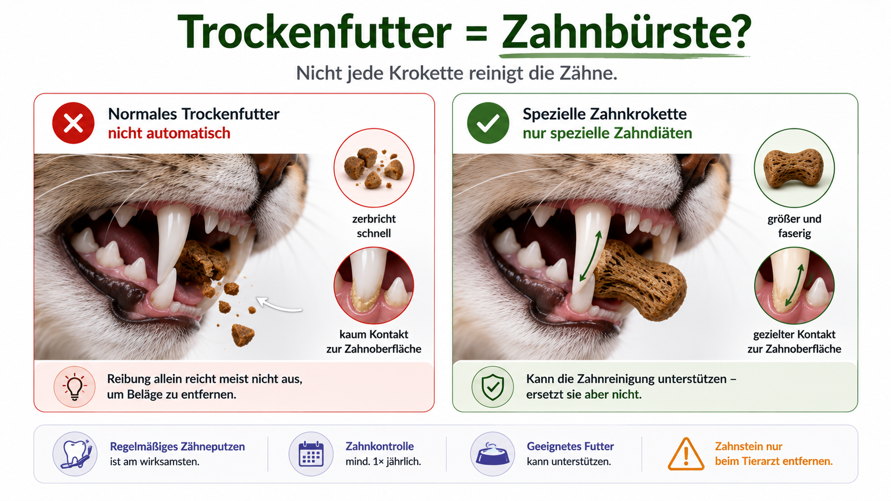
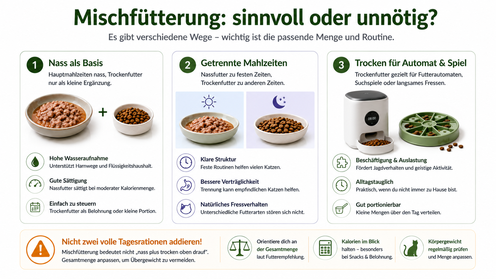
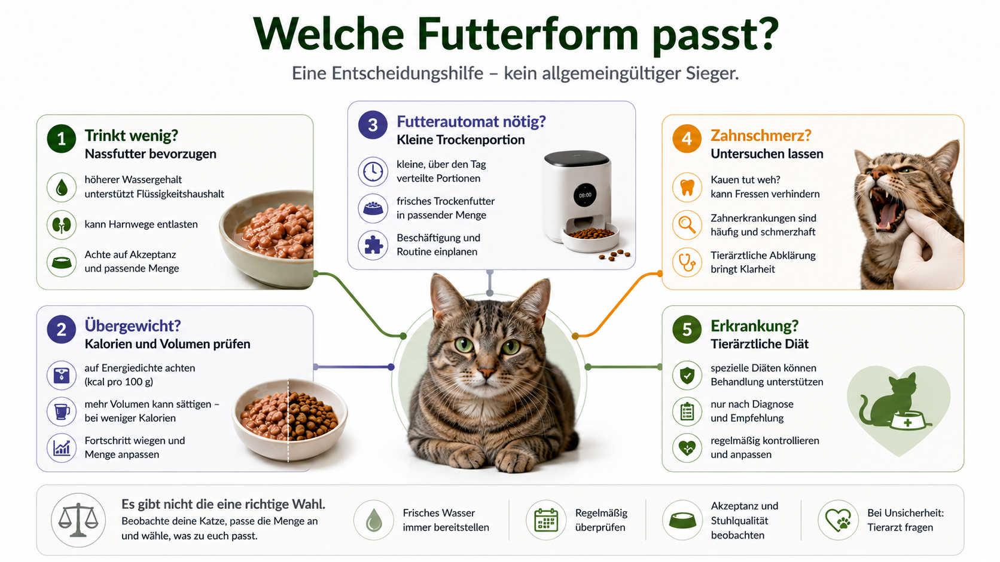
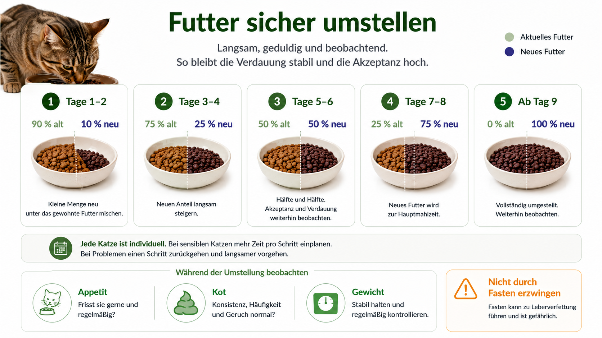

## Die kurze Antwort

Für die meisten gesunden Katzen sind sowohl ein geeignetes Nassfutter als auch ein geeignetes Trockenfutter grundsätzlich möglich.

Die entscheidende Frage lautet nicht nur, ob das Futter trocken oder nass ist. Wichtiger ist:

- Ist es ein bedarfsdeckendes Alleinfuttermittel?
- Passt es zu Alter, Aktivität und Gesundheitszustand?
- Wie viele Kalorien nimmt die Katze tatsächlich auf?
- Trinkt sie ausreichend?
- Bleiben Gewicht, Kot, Urin und Allgemeinzustand stabil?
- Kann die Fütterung im Alltag zuverlässig umgesetzt werden?

Nassfutter hat einen klaren physiologischen Vorteil: Es enthält viel Wasser.

Trockenfutter hat praktische Vorteile: Es ist länger haltbar, lässt sich leicht abwiegen und funktioniert gut in Futterautomaten oder Intelligenzspielzeugen.

Der häufigste Fehler liegt nicht in der Futterart selbst, sondern in zu großen Portionen, unbemerktem Dauerzugang, zusätzlichen Snacks und einer falschen Umrechnung zwischen Nass- und Trockenfutter.

## Das Urteil in einem Satz

**Nassfutter ist für viele Katzen die unkompliziertere Basis, weil es die Flüssigkeitsaufnahme verbessert. Gutes Trockenfutter kann trotzdem Teil oder sogar alleinige Grundlage einer bedarfsdeckenden Fütterung sein, wenn Menge, Wasseraufnahme und Gesundheit stimmen.**

## Direkt zum passenden Thema

- [Unterschiede im Überblick](#trockenfutter-und-nassfutter-im-direkten-vergleich)
- [Wasseraufnahme](#wasseraufnahme-der-groesste-unterschied)
- [Übergewicht](#kaloriendichte-und-uebergewicht)
- [Zahngesundheit](#reinigt-trockenfutter-die-zaehne)
- [Mischfütterung](#mischfuetterung-sinnvoll-oder-unnoetig)
- [Kitten](#kitten)
- [Senioren](#senioren)
- [Harnwege und Nieren](#harnwege-nieren-und-diabetes)
- [Futterautomat](#welches-futter-fuer-futterautomaten)
- [Umstellung](#futter-sicher-umstellen)
- [Entscheidungshilfe](#welches-futter-passt-zu-welcher-katze)

## Trockenfutter und Nassfutter im direkten Vergleich

| Kriterium | Nassfutter | Trockenfutter |
|---|---|---|
| Wassergehalt | meist hoch | meist niedrig |
| Energiedichte pro Gramm | eher niedrig | deutlich höher |
| Portionsvolumen | größer | kleiner |
| Haltbarkeit nach dem Servieren | begrenzt | länger |
| Automaten | Kühlung nötig oder kurze Standzeit | unkompliziert |
| Futterspiele | eingeschränkt | sehr gut geeignet |
| Geruchsintensität | meist stärker | meist geringer |
| Lagerung | nach Öffnung kühlen | trocken und luftdicht |
| Kosten pro Kalorie | oft höher | oft niedriger |
| Zahnpflege | keine | normales Futter meist ebenfalls keine relevante Zahnpflege |
| Wasseraufnahme | klarer Vorteil | zusätzliche Wasserquellen nötig |
| Überfütterungsrisiko | vorhanden | wegen hoher Energiedichte häufig unterschätzt |

Diese Tabelle zeigt Tendenzen. Sie sagt nichts darüber aus, ob ein einzelnes Produkt hochwertig oder geeignet ist.

## Was bedeutet Alleinfuttermittel?

### Alleinfuttermittel

Ein Alleinfuttermittel soll bei bestimmungsgemäßer Fütterung den täglichen Nährstoffbedarf decken. Es kann grundsätzlich als alleinige Ration verwendet werden.

### Ergänzungsfuttermittel

Ein Ergänzungsfuttermittel ist nicht als vollständige Dauerernährung gedacht. Dazu können gehören:

- viele Snacks
- reine Fleischdosen
- Suppen
- Filetprodukte
- Toppings
- bestimmte Brühen
- Pasten

Eine Dose mit appetitlich wirkendem Fleisch ist nicht automatisch ein Alleinfuttermittel. Steht auf dem Etikett „Ergänzungsfuttermittel“, darf sie nicht ohne passende Ergänzung dauerhaft die Hauptnahrung bilden.

## Zutatenliste ist nicht gleich Nährwert

Viele Kaufentscheidungen drehen sich fast ausschließlich um die Zutatenliste. Sie ist wichtig, reicht aber nicht aus.

Aus ihr lässt sich nicht zuverlässig ablesen:

- wie gut Nährstoffe verfügbar sind
- ob die Rezeptur bedarfsdeckend ist
- wie viel Energie die Katze aufnimmt
- ob Mineralstoffverhältnisse passen
- wie konstant die Produktion ist
- ob Fütterungsversuche oder Analysen vorliegen
- ob die Katze das Futter langfristig verträgt

„Viel Fleisch“ ist kein vollständiges Qualitätsurteil. Katzen benötigen nicht einfach nur Muskelfleisch, sondern eine ausgewogene Versorgung mit Aminosäuren, Fettsäuren, Vitaminen und Mineralstoffen.

## Wasseraufnahme: der größte Unterschied

Nassfutter enthält häufig ungefähr 70 bis 80 Prozent Wasser. Trockenfutter liegt meist deutlich darunter.

Dadurch nimmt eine Katze mit Nassfutter einen großen Teil ihrer Flüssigkeit bereits über die Mahlzeit auf.

### Beispiel zur Wasseraufnahme

Eine Katze frisst 250 Gramm Nassfutter mit 78 Prozent Feuchtigkeit. Das Futter liefert rechnerisch rund 195 Milliliter Wasser.

Frisst dieselbe Katze eine trockene Ration mit 8 Prozent Feuchtigkeit, ist die über das Futter aufgenommene Wassermenge wesentlich geringer. Sie muss die Differenz durch Trinken ausgleichen.

Nicht jede Katze tut das vollständig.

## Katzen und Durst

Katzen stammen von Vorfahren ab, die einen großen Teil ihres Wassers über Beutetiere aufnahmen. Das bedeutet nicht, dass jede Katze grundsätzlich zu wenig trinkt.

Es erklärt aber, warum manche Katzen auf trockene Rationen nicht mit einer vollständig kompensierenden Trinkmenge reagieren.

### Woran du die Wasseraufnahme beurteilen kannst

- Trinkstellen beobachten
- Wassermenge grob messen
- Größe und Zahl der Urinklumpen beachten
- Körpergewicht kontrollieren
- Veränderungen im Trinkverhalten ernst nehmen
- bei Mehrkatzenhaushalten einzelne Tiere möglichst zuordnen

Plötzlich deutlich mehr oder weniger Trinken gehört tierärztlich eingeordnet.

## Ist Nassfutter bei Harnwegsproblemen immer besser?

Mehr Wasser führt meist zu einem größeren Urinvolumen und verdünnterem Urin. Das kann bei manchen Harnwegsproblemen günstig sein.

Trotzdem ist Nassfutter allein keine Therapie.

Bei Harnsteinen oder Kristallen zählen unter anderem:

- Art des Steins oder Kristalls
- Mineralstoffzusammensetzung
- Urin-pH
- Wasseraufnahme
- Energiezufuhr
- ärztlich gewählte Diät

Ein beliebiges Nassfutter ersetzt keine therapeutische Harnwegsdiät.

## Kaloriendichte und Übergewicht

Trockenfutter enthält wenig Wasser. Dadurch sind viele Kalorien in einer kleinen Menge konzentriert.

Zehn Gramm zusätzliches Trockenfutter sehen nach wenig aus. Je nach Produkt können sie bereits eine relevante Zahl zusätzlicher Kilokalorien liefern.

Bei einer kleinen Wohnungskatze kann das täglich über Monate zu deutlicher Gewichtszunahme führen.

### Nassfutter und Sättigung

Nassfutter liefert bei gleicher Kalorienmenge meist mehr Volumen. Das kann hilfreich sein, wenn eine Katze:

- ständig hungrig wirkt
- zu Übergewicht neigt
- kleine Trockenfuttermengen als unbefriedigend empfindet
- während einer Gewichtsreduktion mehr Futtervolumen benötigt

Es garantiert keine Gewichtsabnahme. Auch Nassfutter kann zu viel Energie liefern.

## Kalorien vergleichen, nicht Gramm

100 Gramm Nassfutter und 100 Gramm Trockenfutter sind nicht vergleichbar. Entscheidend sind die Kilokalorien.

### Rechenweg

1. Energiegehalt des Futters ermitteln.
2. Tagesmenge in Gramm bestimmen.
3. Kalorien beider Futterarten addieren.
4. Snacks einrechnen.
5. Gewichtsentwicklung kontrollieren.

### Mischfütterungsbeispiel

Die Katze benötigt nach tierärztlicher Einschätzung 200 Kilokalorien pro Tag.

Sie erhält:

- 120 Kilokalorien aus Nassfutter
- 70 Kilokalorien aus Trockenfutter
- 10 Kilokalorien aus Snacks

Gesamt: 200 Kilokalorien.

Nicht korrekt wäre, jeweils die volle Tagesempfehlung von Nass- und Trockenfutter zu geben.

## Fütterungsempfehlungen sind Startwerte

Angaben auf Verpackungen sind keine individuelle Verordnung. Der tatsächliche Bedarf hängt ab von:

- Körpergewicht
- Körperzusammensetzung
- Kastration
- Aktivität
- Alter
- Wohnungshaltung oder Freigang
- Umgebungstemperatur
- Erkrankungen
- individueller Stoffwechsellage

Wiege die Katze regelmäßig. Steigt oder sinkt das Gewicht ungewollt, muss die Menge angepasst und bei auffälligem Verlauf die Ursache abgeklärt werden.
## Reinigt Trockenfutter die Zähne?

Die pauschale Aussage „Trockenfutter reinigt die Zähne“ ist zu grob.

Viele Katzen zerbeißen eine normale Krokette mit wenig Kontakt zur Zahnoberfläche. Manche schlucken kleinere Stücke weitgehend unzerkaut. Dadurch entsteht nicht automatisch ein wirksamer Reinigungseffekt.

### Wann Futter die Zahngesundheit unterstützen kann

Spezielle Zahndiäten können so konstruiert sein, dass:

- Kroketten größer sind
- die Struktur beim Hineinbeißen nicht sofort zerbricht
- Fasern die Zahnoberfläche mechanisch erreichen
- Inhaltsstoffe Plaque oder Zahnstein beeinflussen

Für solche Produkte sollte ein konkreter Wirksamkeitsnachweis vorliegen. Die bloße Trockenheit des Futters reicht nicht.

### Was tatsächlich wichtiger ist

- regelmäßige Kontrolle des Mauls
- professionelle Zahnuntersuchung
- Zahnröntgen bei Verdacht
- Zähneputzen, wenn trainierbar
- geprüfte Zahnpflegeprodukte
- frühzeitige Behandlung schmerzhafter Veränderungen

Trockenfutter ersetzt keine Zahnpflege. Nassfutter verursacht umgekehrt nicht automatisch Zahnerkrankungen.

## Kohlenhydrate: sachlich statt dogmatisch

Trockenfutter benötigt für Herstellung und Struktur meist Stärke. Dadurch liegt der Kohlenhydratanteil häufig höher als bei vielen Nassfuttern.

Katzen sind obligate Karnivoren. Das bedeutet, dass sie bestimmte Nährstoffe benötigen, die natürlicherweise aus tierischen Quellen stammen oder entsprechend ergänzt werden müssen.

Es bedeutet nicht automatisch, dass jede verdauliche Kohlenhydratmenge giftig ist.

Die wichtigeren Fragen sind:

- Ist das Futter vollständig?
- Wie hoch ist die Gesamtenergie?
- Wie gut wird es vertragen?
- Bleibt das Gewicht stabil?
- Gibt es eine Erkrankung, die eine spezielle Zusammensetzung erfordert?

## Protein: Prozentwerte richtig lesen

Ein häufiger Fehler ist der direkte Vergleich der Deklaration auf der Verpackung. Nassfutter enthält viel Wasser. Dadurch wirkt der Rohproteinwert auf den ersten Blick niedriger.

### Beispiel für den Trockenmassevergleich

- Nassfutter: 10 Prozent Rohprotein bei 78 Prozent Feuchtigkeit
- Trockenfutter: 35 Prozent Rohprotein bei 8 Prozent Feuchtigkeit

Für einen faireren Vergleich muss auf Trockenmasse oder Energiebezug umgerechnet werden.

Nassfutter im Beispiel:

- 100 minus 78 Prozent Feuchte = 22 Prozent Trockenmasse
- 10 ÷ 22 × 100 = rund 45 Prozent Protein in der Trockenmasse

Der scheinbar niedrige Wert kann also auf Trockenmassebasis hoch sein.

## Tierische Nebenerzeugnisse

Der Begriff klingt für viele Käufer minderwertig. Er kann aber nährstoffreiche Bestandteile wie Organe umfassen.

Entscheidend ist nicht, ob ein Produkt werblich „Filet“ zeigt. Entscheidend sind:

- ernährungsphysiologische Eignung
- Rohstoffkontrolle
- Rezeptur
- Nährstoffanalyse
- Herstellung
- Verträglichkeit

Reines Muskelfleisch wäre als alleinige Katzennahrung nicht ausgewogen.

## Zucker und Getreide

Zugesetzter Zucker ist für eine bedarfsdeckende Katzenernährung nicht nötig. Kleine technologisch bedingte Mengen bedeuten jedoch nicht automatisch, dass das Produkt die Hauptursache für Diabetes oder Zahnerkrankungen ist. Für Übergewicht zählt meist stärker die Gesamtenergie.

Auch „getreidefrei“ ist kein Qualitätsbeweis. Getreidefreie Produkte können gut oder ungeeignet formuliert sein. Stärke wird häufig durch Kartoffeln, Erbsen oder andere Quellen ersetzt.

„Getreidefrei“ sagt nicht automatisch:

- kohlenhydratarm
- besser verträglich
- proteinreicher
- allergiegeeignet
- hochwertiger

## Trockenfutter: echte Vorteile

### Präzise Portionierung

Kleine Mengen lassen sich gut wiegen und über den Tag verteilen.

### Futterautomaten

Trockenfutter funktioniert in vielen Geräten zuverlässig, ohne Kühlung.

### Beschäftigung

Kroketten eignen sich für:

- Fummelbretter
- Snackbälle
- Suchspiele
- Jagdsequenzen
- kleine versteckte Portionen

### Lagerung und Transport

Ungeöffnete und korrekt gelagerte Trockenfutterbeutel sind praktisch. Auch auf Reisen ist die Handhabung oft einfacher.

### Kosten

Pro Kalorie ist Trockenfutter häufig günstiger. Eine bezahlbare, vollständige und korrekt portionierte Ration ist sinnvoller als eine teure Fütterung, die nicht dauerhaft durchgehalten wird.

## Trockenfutter: echte Nachteile

- geringe Flüssigkeitszufuhr über das Futter
- hohe Energiedichte
- schwer kontrollierbarer Dauerzugang
- Oxidation bei Wärme, Luft und langer Lagerung
- unterschätzte Portionsgrößen
- bei manchen Erkrankungen weniger geeignet

## Nassfutter: echte Vorteile

### Hoher Wassergehalt

Das ist der klarste Unterschied.

### Größeres Volumen

Bei gleicher Energie erhält die Katze häufig mehr Futtermasse.

### Attraktiver Geruch

Viele Katzen nehmen leicht angewärmtes Nassfutter gut an.

### Texturvielfalt

Pastete, Stückchen, Mousse oder Fasern können bei Vorlieben oder Zahnproblemen relevant sein.

## Nassfutter: echte Nachteile

- begrenzte Standzeit
- häufig höhere Kosten pro Kalorie
- mehr Verpackung und Lagerbedarf
- stärkerer Geruch
- für Automaten oft Kühlung erforderlich

## Wie lange darf Nassfutter stehen?

Eine universelle Minutenzahl wäre unseriös. Die sichere Standzeit hängt ab von:

- Raumtemperatur
- direkter Sonne
- Futterart
- Ausgangstemperatur
- Napfhygiene
- Fliegen oder Insekten
- Gesundheitszustand der Katze

In warmen Räumen sollte Nassfutter nur kurz stehen. Kleine Portionen sind besser als eine große Tagesration. Reste sollten entfernt und der Napf gereinigt werden.

## Trockenfutter richtig lagern

- möglichst in der Originalverpackung belassen
- Beutel gut verschließen
- kühl, trocken und dunkel lagern
- nicht neben Heizung oder Fenster
- saubere, trockene Schaufel verwenden
- Behälter zwischen Chargen reinigen
- nicht ständig neues Futter auf alte Reste schütten
- Mindesthaltbarkeit und Geruch prüfen

## Mischfütterung: sinnvoll oder unnötig?

Mischfütterung kann sehr sinnvoll sein. Sie ist aber keine Pflicht.

### Modell 1: Nassfutter als Basis

Der Großteil der Kalorien kommt aus Nassfutter. Eine kleine abgewogene Trockenportion dient für Futterautomat, Training, Suchspiele oder eine Nachtportion.

### Modell 2: getrennte Mahlzeiten

Morgens Nassfutter, später Trockenfutter oder umgekehrt. Das erleichtert die Mengenkontrolle.

### Modell 3: überwiegend Trockenfutter mit täglicher Nassportion

Dies erhöht die Feuchtigkeitszufuhr, ersetzt aber keine Kontrolle der Gesamtwasseraufnahme.

## Trocken- und Nassfutter im selben Napf?

Beides darf grundsätzlich am selben Tag gefüttert werden. Auch im selben Napf ist es nicht automatisch schädlich.

Praktisch gibt es aber Nachteile:

- Trockenfutter weicht auf
- Reste verderben schneller
- Portionen sind schwerer zu trennen
- eine abgelehnte Komponente verunreinigt die andere
- die Kalorienberechnung wird unübersichtlich

Getrennte Portionen sind häufig einfacher.

## Häufigster Fehler bei Mischfütterung

Die volle Nassfutter-Tagesration plus die volle Trockenfutter-Tagesration.

Beide Verpackungsempfehlungen gehen meist davon aus, dass das jeweilige Produkt den gesamten Energiebedarf deckt. Bei Kombination müssen beide Mengen reduziert werden.
## Welches Futter passt zu welcher Katze?

Es gibt keine Futterform, die für jede Katze optimal ist.

### Gesunde, normalgewichtige erwachsene Katze

Möglich sind ausschließlich Nassfutter, ausschließlich Trockenfutter oder Mischfütterung.

Achte auf:

- Alleinfuttermittel
- passende Tageskalorien
- stabile Wasseraufnahme
- normales Gewicht
- regelmäßige Gesundheitskontrollen

### Katze, die wenig trinkt

Nassfutter ist meist die logischere Basis.

Zusätzlich können helfen:

- mehrere Wasserschalen
- Abstand zum Futter
- verschiedene Gefäßformen
- Trinkbrunnen
- Wasser im Nassfutter, sofern akzeptiert

Mehr dazu im Ratgeber [Woran erkennt man, dass eine Katze zu wenig trinkt?](/woran-erkennt-man-dass-die-katze-zu-wenig-trinkt/).

### Übergewichtige Katze

Eine feuchtere, voluminösere Ration kann die Kalorienkontrolle erleichtern.

Entscheidend bleiben:

- berechnete Energiemenge
- gewogene Portionen
- langsame Gewichtsabnahme
- Muskelerhalt
- tierärztliche Begleitung

Eine übergewichtige Katze darf nicht durch Futterentzug schnell abnehmen.

### Sehr aktive Freigängerkatze

Trockenfutter kann wegen der Energiedichte praktisch sein. Trotzdem darf der Bedarf nicht pauschal überschätzt werden. Freigänger können zusätzlich draußen fressen.

## Kitten

Kitten benötigen ein Futter für Wachstum beziehungsweise die passende Lebensphase.

Wichtig sind:

- hohe Nährstoffdichte
- ausreichende Energie
- passende Mineralstoffversorgung
- mehrere kleine Mahlzeiten
- zuverlässige Futteraufnahme

Nass- und Trockenfutter können beide geeignet sein, wenn sie vollständig und für Wachstum vorgesehen sind. Eine frühe Gewöhnung an verschiedene Texturen kann später hilfreich sein.

## Senioren

Alter allein entscheidet nicht über die Futterform.

Wichtige Fragen sind:

- Zahngesundheit
- Nierenwerte
- Körpergewicht
- Muskelmasse
- Appetit
- Verdauung
- Beweglichkeit
- Trinkverhalten

Nassfutter kann bei geringer Wasseraufnahme oder Kauproblemen günstiger sein. Trockenfutter kann bei manchen dünnen Senioren helfen, Energie in kleiner Menge aufzunehmen.

Eine unerklärliche Gewichtsabnahme ist keine normale Alterserscheinung.

## Harnwege, Nieren und Diabetes

### Harnwegserkrankungen

Mehr Feuchtigkeit kann sinnvoll sein. Bei Steinen oder Kristallen ist die genaue therapeutische Zusammensetzung entscheidend.

### Nierenerkrankung

Eine Nierendiät wird nicht allein durch „nass“ oder „trocken“ definiert.

Wichtig sind unter anderem:

- Phosphorgehalt
- Proteinqualität und -menge
- Energie
- Natrium
- Kalium
- Omega-3-Fettsäuren
- Akzeptanz

Eine Katze muss die verordnete Diät zuverlässig fressen. Nassvarianten können die Flüssigkeitsaufnahme unterstützen.

### Diabetes

Gewicht, Kohlenhydratprofil, Fütterungsrhythmus und Insulin müssen gemeinsam betrachtet werden. Eine allgemeine Umstellung ohne Abstimmung kann bei insulinpflichtigen Katzen gefährlich sein.

## Zahnerkrankungen

Eine Katze mit Zahnschmerz braucht eine Untersuchung. Weiches Futter kann vorübergehend leichter zu fressen sein.

Es behandelt aber keine Zahnresorption, Entzündung, lockeren Zähne, Wurzelprobleme oder Maulverletzungen.

## Empfindlicher Magen oder Durchfall

Nicht die Futterform allein entscheidet.

Relevant sind:

- Fettgehalt
- Proteinquelle
- Ballaststoffe
- Verdaulichkeit
- Futterwechsel
- Portionsgröße
- Erkrankungen
- Unverträglichkeiten

Eine abrupte Umstellung kann selbst Durchfall auslösen.

## Katze frisst nur Trockenfutter

Das ist häufig ein Gewohnheits- und Texturproblem.

### Warum Nassfutter abgelehnt wird

- unbekannte Textur
- falsche Temperatur
- starker oder ungewohnter Geruch
- negative Erfahrung
- zu abrupte Umstellung
- Zahnschmerz
- Übelkeit
- bevorzugte Knusperstruktur

### Vorgehen

1. Gewohntes Futter weiter zuverlässig anbieten.
2. Winzige Nassfuttermenge separat platzieren.
3. Nicht sofort unter das komplette Trockenfutter mischen.
4. Verschiedene Texturen testen.
5. Nassfutter leicht anwärmen.
6. Fortschritt über Wochen statt Stunden beurteilen.
7. Keine Hungerstrategie verwenden.

Wenn eine Katze das Fressen vollständig einstellt, ist das kein Trainingsschritt.

Siehe auch [Katze frisst nicht: Ursachen und Warnzeichen](/katze-frisst-nicht/).

## Katze frisst nur Nassfutter

Das ist grundsätzlich kein Problem, sofern es sich um ein geeignetes Alleinfuttermittel handelt und die Katze die nötige Energie aufnimmt.

Trockenfutter ist kein notwendiger Bestandteil.

## Futter sicher umstellen

Eine häufig verwendete Orientierung:

- Phase 1: überwiegend altes Futter, kleine neue Portion
- Phase 2: neue Menge langsam erhöhen
- Phase 3: ungefähr gleiche Anteile
- Phase 4: überwiegend neues Futter
- Phase 5: Zielration

Die Dauer muss zur Katze passen. Manche akzeptieren eine Umstellung in einer Woche, andere benötigen mehrere Wochen.

### Nicht nur mischen

Viele Katzen reagieren besser, wenn das neue Futter zunächst in einem separaten kleinen Napf angeboten wird. So bleibt das vertraute Futter unverändert.

### Langsamer werden oder abbrechen bei

- deutlichem Durchfall
- wiederholtem Erbrechen
- vollständiger Ablehnung
- Gewichtsverlust
- starkem Juckreiz
- Schmerzen
- verändertem Allgemeinzustand

## Wie viele Mahlzeiten?

Katzen fressen natürlicherweise eher mehrere kleine Portionen als eine sehr große Mahlzeit.

Praktisch sind:

- zwei bis mehrere Mahlzeiten
- abgewogene Tagesration
- kleine Automatportionen
- Futterspiele mit einem Teil der Trockenration
- frische Nassfutterportionen

Entscheidend ist die Gesamtkalorienmenge.

## Freie Fütterung oder feste Portionen?

Ein dauerhaft gefüllter Trockenfutternapf ist bequem, aber schwer zu kontrollieren.

Nachteile:

- Aufnahme einzelner Katzen unklar
- schleichende Gewichtszunahme
- Appetitverlust wird spät erkannt
- keine sichere Medikamentenzuordnung
- dominante Katze frisst mehr

Feste, gewogene Tagesmengen sind meist besser.

## Mehrkatzenhaushalt

Unterschiedliche Bedürfnisse lassen sich nicht mit einem gemeinsamen Napf zuverlässig steuern.

Mögliche Lösungen:

- getrennte Räume
- zeitlich getrennte Fütterung
- Mikrochip-Futterautomaten
- erhöhte oder geschützte Plätze
- dokumentierte Portionen
- regelmäßiges Einzelwiegen

Ein Mikrochip-Automat kann Zugriff steuern. Er beweist nicht automatisch, dass die Katze die vollständige Portion gefressen hat.

## Welches Futter für Futterautomaten?

### Trockenfutterautomat

Geeignet für kleine Portionen, Nachtfütterung, Futterspiele und planbare Zeiten.

Risiken:

- Blockaden
- falsche Portionsgröße
- leere Batterie
- verklumptes Futter
- unbemerkte Mehrfachausgabe
- Futterdiebstahl

### Nassfutterautomat

Er benötigt je nach Modell Kühlakku, aktive Kühlung, kurze Standzeit, leicht zu reinigende Fächer und einen zuverlässigen Deckel.

Prüfe nicht nur die App. Kontrolliere den Napf und die tatsächliche Aufnahme.

## Kosten fair vergleichen

Der Preis pro Kilogramm führt in die Irre.

Verglichen werden sollten:

- Kosten pro Tag
- Kosten pro 100 Kilokalorien
- tatsächlich benötigte Portion
- Futterverluste
- Lagerung
- medizinischer Nutzen einer Spezialdiät

## Nachhaltigkeit

Trockenfutter benötigt meist weniger Verpackung und Transportgewicht pro Kalorie. Nassfutter transportiert viel Wasser und wird häufig in Einzelportionen verkauft.

Die Umweltbilanz hängt zusätzlich von Rohstoffen, Produktionsenergie, Verpackung, Transport, Futterverlusten und tatsächlich gefütterter Menge ab.

Überfütterung und weggeworfene Reste verschlechtern jede Bilanz.

## Etikett praktisch prüfen

Achte auf:

1. „Alleinfuttermittel“
2. Tierart Katze
3. Lebensphase
4. Fütterungsempfehlung
5. analytische Bestandteile
6. Zusatzstoffe
7. Energieangabe, falls vorhanden
8. Herstellerkontakt
9. Chargennummer
10. Mindesthaltbarkeit

Fehlt die Energieangabe, kann sie beim Hersteller erfragt werden.

## Hersteller sinnvoll beurteilen

Hilfreiche Fragen sind:

- Wer formuliert das Futter?
- Gibt es qualifizierte Ernährungsexpertise?
- Werden Endprodukte analysiert?
- Wie wird Qualität kontrolliert?
- Sind typische Nährstoffwerte verfügbar?
- Gibt es klare Kontaktmöglichkeiten?
- Wie werden Rezepturänderungen kommuniziert?
- Sind Produktionsstandorte nachvollziehbar?

Marketingbegriffe ersetzen diese Informationen nicht.
## Entscheidungshilfe

### Eher Nassfutter als Basis

- Katze trinkt wenig
- Harn soll stärker verdünnt werden
- Übergewicht oder starke Futterorientierung
- Kauprobleme
- große Portionen werden besser akzeptiert
- regelmäßige Mahlzeiten sind organisatorisch möglich

### Eher Trockenfutter als Teil der Ration

- Futterautomat wird benötigt
- viele kleine Portionen über den Tag
- Futterspiele und Jagdverhalten
- hohe Energiedichte ist erwünscht
- Lagerung und Transport müssen einfach sein
- Katze trinkt nachweislich ausreichend

### Mischfütterung

- Nassfutter für Flüssigkeit und Volumen
- Trockenfutter für Automaten oder Beschäftigung
- beide Mengen werden gewogen
- Gesamtenergie ist bekannt
- Katze verträgt beide Produkte

### Tierärztliche Diät statt allgemeiner Entscheidung

- Nierenerkrankung
- Harnsteine oder Kristalle
- Diabetes
- schwere Futtermittelallergie
- chronische Darmerkrankung
- Pankreatitis
- Lebererkrankung
- ausgeprägtes Übergewicht
- Wachstum oder Trächtigkeit mit besonderem Bedarf

## Die praktischste Standardlösung

Für viele gesunde Wohnungskatzen ist folgende Aufteilung gut umsetzbar:

- bedarfsdeckendes Nassfutter als Hauptanteil
- kleine exakt gewogene Trockenportion
- Trockenfutter nur für Automat, Training oder Futterspiel
- mehrere Wasserstellen
- wöchentliches oder monatliches Wiegen
- Snacks aus der Tagesration abziehen

Das ist keine universelle Empfehlung. Es ist ein vernünftiger Ausgangspunkt, weil es Flüssigkeit, Beschäftigung und Portionierbarkeit verbindet.

## Häufige Fehler

### „Nassfutter ist immer hochwertig“

Nein. Auch Nassfutter kann Ergänzungsfutter, kalorienreich, unausgewogen oder ungeeignet sein.

### „Trockenfutter macht automatisch nierenkrank“

So pauschal lässt sich das nicht behaupten. Geringe Wasseraufnahme kann ungünstig sein. Nierenerkrankungen haben aber komplexe Ursachen.

### „Trockenfutter verhindert Zahnstein“

Normale Kroketten leisten das nicht zuverlässig.

### „Getreidefrei ist artgerecht“

Getreidefrei ist ein Marketingmerkmal, kein vollständiges Ernährungsprofil.

### „Mehr Fleischanteil bedeutet automatisch besser“

Entscheidend sind Bedarfsdeckung, Nährstoffqualität und Gesamtformulierung.

### „Die Katze reguliert sich selbst“

Viele Katzen überfressen bei ständigem Zugang energiedichtes Futter.

### „Mischfütterung belastet die Verdauung“

Gesunde Katzen können beide Formen am selben Tag vertragen. Probleme entstehen eher durch abrupte Wechsel, zu große Mengen oder individuelle Unverträglichkeit.

### „Nassfutter deckt den Wasserbedarf immer vollständig“

Nicht zwingend. Katzen brauchen weiterhin Zugang zu frischem Wasser.

## FAQ

### Ist Nassfutter artgerechter?

Nassfutter ähnelt beim Wassergehalt einer natürlichen Beute stärker als Trockenfutter. „Artgerecht“ ist dennoch kein präzises Qualitätskriterium. Ein Futter muss vollständig, sicher, verträglich und passend portioniert sein.

### Kann ich nur Nassfutter füttern?

Ja, wenn es ein geeignetes Alleinfuttermittel ist und die Katze genug Energie aufnimmt.

### Kann ich nur Trockenfutter füttern?

Bei einer gesunden Katze ist das möglich, wenn das Produkt vollständig ist, korrekt portioniert wird und die Wasseraufnahme ausreicht.

### Wie viel Nass- und Trockenfutter bei Mischfütterung?

Nicht nach einem festen Verhältnis, sondern nach Kalorien. Beide Teilrationen müssen zusammen den Tagesbedarf ergeben.

### Was ist besser bei Übergewicht?

Häufig erleichtert Nassfutter wegen des größeren Volumens die Kontrolle. Entscheidend ist das Kaloriendefizit unter Erhalt einer vollständigen Nährstoffversorgung.

### Was ist besser für die Nieren?

Bei gesunden Katzen lässt sich das nicht allein über die Futterform beantworten. Bei Nierenerkrankung ist eine passende Nierendiät wichtiger als die pauschale Kategorie nass oder trocken.

### Was ist besser bei Blasenentzündung?

Mehr Wasser kann hilfreich sein. Die Ursache muss trotzdem geklärt werden. Bei Kristallen oder Steinen ist die genaue Diät entscheidend.

### Was ist besser für die Zähne?

Normales Nass- und normales Trockenfutter ersetzen keine Zahnpflege. Spezielle geprüfte Zahndiäten können einen Zusatznutzen haben.

### Macht Trockenfutter dick?

Nicht automatisch. Wegen der hohen Energiedichte ist es aber leichter zu überdosieren.

### Soll ich Wasser ins Trockenfutter geben?

Das ist möglich, wenn die Katze es akzeptiert. Angefeuchtetes Trockenfutter darf nicht lange stehen und muss wie verderbliches Futter behandelt werden.

### Kann ich Nassfutter über Nacht stehen lassen?

In warmen Räumen ist das keine gute Idee. Nutze kleine Portionen oder einen geeigneten gekühlten Automaten.

### Müssen Katzen Abwechslung haben?

Nicht zwingend. Viele Katzen vertragen eine konstante Ration besser. Eine begrenzte Gewöhnung an mehrere Texturen kann praktisch sein, falls später eine Diät nötig wird.

### Darf ich verschiedene Marken kombinieren?

Ja, sofern die Gesamtfütterung verträglich und bedarfsdeckend bleibt. Bei empfindlichen Katzen langsam vorgehen.

### Wie erkenne ich, ob meine Katze genug frisst?

Portionen wiegen, Reste messen, Körpergewicht und Körperkondition kontrollieren.

### Wie erkenne ich, ob meine Katze genug trinkt?

Beobachte Trinkstellen und Urinabsatz. Bei deutlicher Veränderung, wenig Urin oder Krankheitszeichen ist eine Untersuchung nötig.

### Ist teures Futter automatisch besser?

Nein. Preis, Verpackung und Marketing sind keine Garantie für ernährungsphysiologische Qualität.

### Sollte ich Futter mit hohem Fleischanteil wählen?

Ein hoher Anteil tierischer Bestandteile kann sinnvoll sein, reicht als Einzelkriterium aber nicht. Entscheidend ist die vollständige Nährstoffversorgung.

### Was mache ich, wenn die Katze das neue Futter verweigert?

Langsamer umstellen, getrennt anbieten, Textur und Temperatur variieren. Nicht durch Fasten zwingen.

### Wann muss ich wegen Futterverweigerung zum Tierarzt?

Wenn die Katze etwa 24 Stunden keine relevante Nahrung aufnimmt oder früher bei Kitten, Senioren, chronischen Erkrankungen, Erbrechen, Schmerzen, Schwäche oder anderen Warnzeichen.

## Fazit

Die Frage „Trockenfutter oder Nassfutter?“ hat keine ehrliche Ein-Wort-Antwort.

Nassfutter hat einen klaren Vorteil bei der Flüssigkeitsaufnahme und kann die Gewichtskontrolle erleichtern.

Trockenfutter ist praktisch, energiedicht, gut portionierbar und für Automaten sowie Beschäftigung geeignet.

Normales Trockenfutter ist keine Zahnbürste. Nassfutter ist nicht automatisch hochwertig.

Die beste Fütterung ist diejenige, die:

- den Bedarf vollständig deckt
- zur Gesundheit der Katze passt
- zuverlässig gefressen wird
- korrekt portioniert werden kann
- ausreichend Wasser liefert oder Trinken sicherstellt
- Gewicht und Muskelmasse stabil hält
- im Alltag dauerhaft funktioniert

Für viele Katzen ist Nassfutter als Hauptanteil plus eine kleine gewogene Trockenportion eine gute praktische Lösung. Für andere ist eine reine Nass- oder Trockenfütterung sinnvoller.

Nicht die Ideologie entscheidet. Die Katze, ihre Gesundheit und die messbare Gesamtversorgung entscheiden.

## Quellen

- [WSAVA Global Nutrition Committee: Global Nutrition Toolkit](https://wsava.org/global-guidelines/global-nutrition-guidelines/)
- [FEDIAF: Nutritional Guidelines for Complete and Complementary Pet Food for Cats and Dogs](https://europeanpetfood.org/self-regulation/nutritional-guidelines/)
- [International Cat Care: Feeding your cat](https://icatcare.org/advice/feeding-your-cat/)
- [Cornell Feline Health Center: Feeding Your Cat](https://www.vet.cornell.edu/departments-centers-and-institutes/cornell-feline-health-center/health-information/feline-health-topics/feeding-your-cat)
- [Veterinary Oral Health Council: Accepted Products for Cats](https://vohc.org/accepted-products/)
- [MSD Veterinary Manual: Nutrition in Cats](https://www.msdvetmanual.com/cat-owners/management-and-nutrition/nutrition-in-cats)

> **Medizinischer Hinweis:** Dieser Artikel ersetzt keine tierärztliche Ernährungsberatung. Bei Erkrankungen, deutlichem Gewichtsverlust, Futterverweigerung oder therapeutischen Diäten sollte die Fütterung mit der behandelnden Praxis abgestimmt werden.
