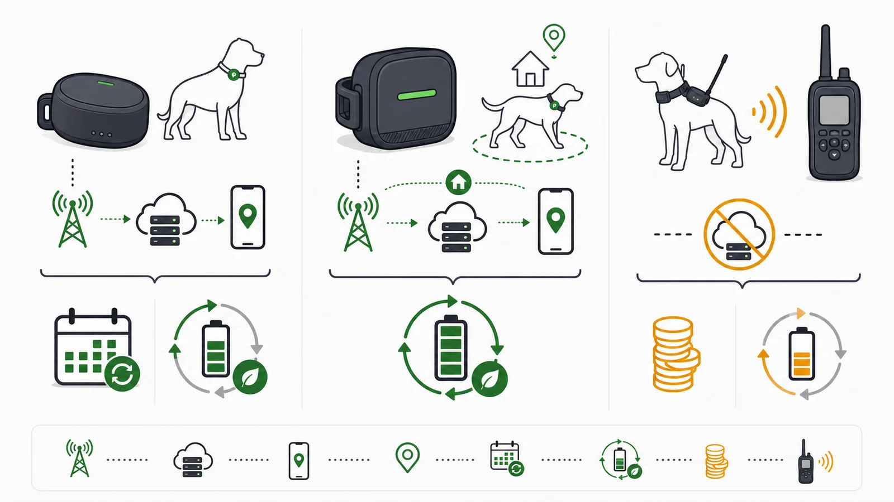

Das Abo finanziert die **Übertragung und den betriebenen Dienst**, nicht die Satellitenposition. Ohne SIM könnte der Tracker zwar rechnen, die Position aber nicht aus der Ferne an deine App liefern.

| Kostenblock | Mobilfunktracker | VHF-System |
|---|---|---|
| Gerät | niedrig bis mittel | Halsbandgerät hoch |
| Empfänger | Smartphone vorhanden | separates Handgerät |
| laufender Funk | Abo | kein Mobilfunkabo |
| Infrastruktur | Cloud und App | lokale Funkkette |

## Tarifmodelle im Vergleich

**Unsere Auswertung (29.09.2026):** Bei 12 aktuell erfassten GPS-Trackern benötigen 10 für die Fernortung einen kostenpflichtigen Dienst, bei keinem ist dieser nur optional. Zwei VHF-Systeme kommen ohne Mobilfunkabo aus, benötigen aber ein eigenes Handgerät. Die Dienstpflicht ist bei keinem Modell ungeklärt; aktuelle Tarifpreise liegen für 9 der 10 dienstpflichtigen Modelle vor. Beim verbleibenden Modell hängt der Preis vom externen SIM-Tarif ab. Enthaltene Nutzungsmonate, etwa bei PAJ, sind paketabhängig und bedeuten keine dauerhaft kostenlose Nutzung.

Längere Laufzeiten verändern etwa bei Weenect den Preis bei gleichem Leistungsumfang. Basic- und Premiumtarife, etwa bei Tractive und Pawfit, unterscheiden zusätzlich Funktionen. Vergleiche deshalb Laufzeit und Leistungsumfang getrennt.

Die Modelle unterscheiden sich darin, wann Dienstkosten entstehen und welche Hardware zusätzlich erforderlich ist.

- **Tractive:** eigenes Abo je Gerät; Tarifumfang und Laufzeit unterscheiden sich.
- **Weenect:** eigenes Abo je Gerät; Laufzeit beeinflusst den Monatspreis.
- **PAJ:** paketabhängige Inklusivphase, anschließend Folgetarif.
- **Garmin Alpha:** VHF-Kernortung ohne Mobilfunkabo; Handgerät erforderlich.

Aktuelle Produktbedingungen stehen auf den Seiten von [Tractive](/hersteller/tractive/), [Weenect](/hersteller/weenect/), [PAJ GPS](/hersteller/paj-gps/) und [Garmin](/hersteller/garmin/). Der [Vergleich ohne Abo](/vergleiche/gps-tracker-ohne-abo/) verhindert den falschen Vergleich mit Bluetooth-Tags.

## Quellen

Die Kostenlogik und Tarifzuordnung stammen aus den aktuellen offiziellen Anbieterinformationen.

- [Tractive – Warum jedes Gerät ein Abo braucht](https://help.tractive.com/hc/de/articles/360001234649-Kann-ich-mehr-als-einen-Tracker-zum-gleichen-Abo-hinzuf%C3%BCgen)
- [Weenect – Abonnements und Funktionsweise](https://www.weenect.com/de/de/abonnements/)
- [PAJ – PET Finder Tarifmodell](https://www.paj-gps.de/store/pet-finder-4g-mini/)
